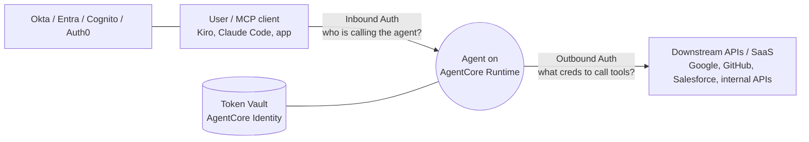
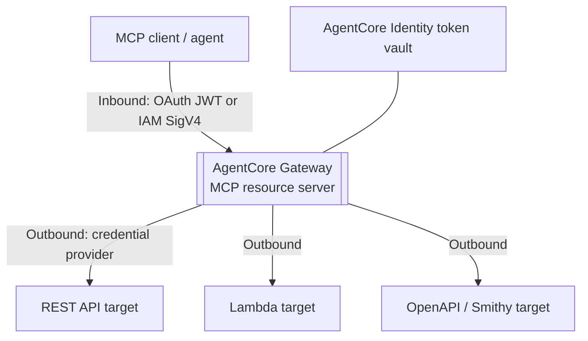
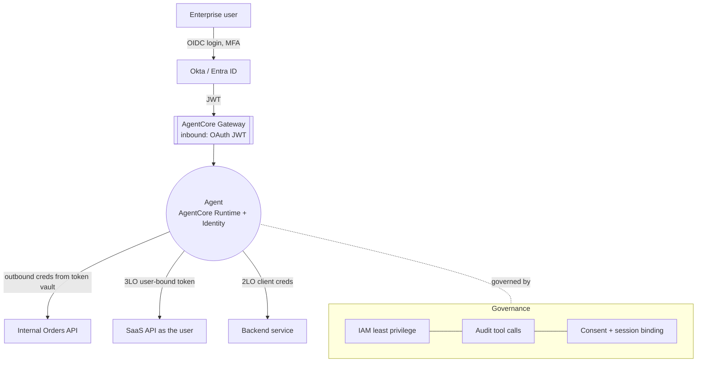

# AgentCore Identity & Gateway (securing agents with enterprise IAM)

The exact pairing enterprise GenAI job specs are asking for: *"Leverage
AgentCore Identity and AgentCore Gateway capabilities to build secure AI
solutions"* on **AWS Bedrock**, with **Okta / Microsoft Entra ID** and
**OAuth/OIDC/OBO** workflows. This page connects the
[identity & API security protocols](identity-api-security.md) to how Amazon
Bedrock **AgentCore** implements them for agents.

!!! abstract "Why agents need this"
    An agent is a **non-human OAuth client** that must (a) prove its own identity,
    (b) sometimes act **on behalf of a user**, and (c) call downstream tools/APIs
    that each need their own credentials — **without ever putting secrets in the
    model's context**. AgentCore Identity centralizes agent identity + credentials;
    AgentCore Gateway turns APIs/Lambda into governed, auth-protected MCP tools.
    *Content was rephrased for compliance with licensing restrictions; verify
    against current AWS docs.*

---

## The two seams: inbound vs outbound

The single most important mental model. Every agent request has **two separate
identity problems**:

- **Inbound Auth** — *who is allowed to invoke this agent/gateway?* Validates an
  incoming OAuth 2.0 **JWT** (or AWS SigV4/IAM). **IdP-agnostic** — works with any
  OAuth 2.0 provider: Okta, Microsoft Entra ID, Cognito, Auth0, or a private
  in-VPC IdP (Keycloak, PingFederate).
- **Outbound Auth** — *what credentials does the agent use to call a tool/API?*
  AgentCore Identity holds these in a **token vault**, keyed to the workload and
  (for user flows) the user, and hands the agent a short-lived token at call time.

!!! tip "Interview soundbite"
    *"Inbound and outbound are two separate seams. Inbound answers 'who's calling
    the agent' with a JWT authorizer; outbound answers 'what token does the agent
    present to each downstream API,' stored in the token vault keyed to
    (workload, user). Keeping them separate is what lets a user's identity flow
    end-to-end while secrets stay out of the prompt."*

---

## AgentCore Identity

A managed capability for **agent identities, credentials, and consent** so you
don't build custom identity infrastructure. It supports **SigV4**, standard
**OAuth 2.0** flows, and **API keys**, and lets agents access resources either
**as themselves** or **on behalf of users** with pre-authorized consent.

### Workload identity + workload access token

- Each agent is a **workload identity**. AgentCore Runtime issues a **workload
  access token** — an AWS-signed opaque token delivered automatically to the
  agent instance as payload headers, so you don't manage it by hand.
- The workload token lets the agent reach first-party AgentCore services,
  including the **outbound credential providers** in the token vault.

### Acting as itself (2LO) vs on behalf of a user (3LO/OBO)

- **As itself (2LO / client credentials):** the agent uses its workload identity
  to get a token scoped to what the *workload* may do — background jobs, no user.
- **On behalf of a user (3LO / authorization code):** when the agent must act for
  a specific end user, it retrieves OAuth tokens **for that user**. In Runtime you
  identify the user with the `X-Amzn-Bedrock-AgentCore-Runtime-User-Id` header
  (internally `GetWorkloadAccessTokenForUserId`), so tokens and consent are bound
  to the right person. This is the AgentCore expression of **3LO + OBO** from the
  [protocols page](identity-api-security.md): the user authenticates once, and
  their identity/consent carries to downstream tools.

### Token vault + session binding + consent

- **Token vault** — securely stores outbound credentials (OAuth tokens, API keys)
  keyed to `(workload_identity, user_id)`. The agent fetches a fresh token per
  call; secrets never enter the model context or logs.
- **Session binding** — associates an OAuth grant with the user who authorized
  it. AgentCore Identity now offers a **managed Consent portal** so you don't
  build the callback/redirect/session-binding infrastructure yourself; the user
  authenticates with your IdP, reviews what the agent can access, and grants
  consent per provider. Useful for MCP/IDE clients (Kiro, Claude Code, Cursor,
  VS Code) — consent once, reuse the stored token on later tool calls.

### Enterprise IdP integration

AgentCore Identity connects to enterprise IdPs as the authorization server:
**Okta**, **Microsoft Entra ID**, **Auth0**, **Amazon Cognito**, and **private
OIDC IdPs inside your VPC** (Keycloak, PingFederate) without exposing them
publicly. So your agent authenticates and authorizes users with the *same* IdP
that governs the rest of the enterprise — exactly what the "integrate Okta /
Entra ID" responsibility means.

---

## AgentCore Gateway

Gateway turns existing **APIs, AWS Lambda functions, and services** into
**MCP-compatible tools** an agent can call — with authentication on both seams,
so you don't hand-build an MCP server per API.

### Inbound authorization types (who may use the gateway)

| Type | Mechanism | Use |
|------|-----------|-----|
| **OAuth (JWT)** | Validate a bearer JWT (`CUSTOM_JWT`) from any OAuth 2.0 IdP | Token-based access from apps/MCP clients |
| **IAM (SigV4)** | AWS Signature v4 | AWS identity-based access |
| **Authenticate only** | Validate the token, delegate authorization to the target | Target enforces fine-grained authz |
| **No auth** | — | Dev/testing only |

The gateway acts as an **MCP resource server**: with an inbound authorization-code
(3LO) OAuth setup it requires a valid identity token before an AI client can
`tools/list` or `tools/call`.

### Outbound authorization (how the gateway calls the target)

On `CreateGatewayTarget` you attach a **credential provider configuration** —
OAuth (client credentials **2LO**, or authorization code **3LO** for
user-scoped), API key, or IAM — so the gateway presents the right credential to
each backend. Credentials come from **AgentCore Identity's token vault**, not
from the agent's prompt.

!!! example "OAuth-protected API end to end (the pattern to describe)"
    1. **Inbound:** MCP client presents a JWT from Okta/Entra → Gateway's JWT
       authorizer validates `iss`/`aud`/`exp`/signature.
    2. Agent calls a tool → **Gateway** looks up the **outbound** credential for
       that target in the **token vault** (keyed to workload + user).
    3. If the target needs the **user's** consent (3LO), the Consent portal /
       session binding ensures a user-bound token exists; otherwise **2LO client
       credentials** for a workload-scoped call.
    4. Gateway calls the target API with the short-lived token; the secret never
       touches the model context. Every call is auditable.

---

## Putting it together: a secure enterprise agent

Mapping the job spec's responsibilities to a concrete design:

| Requirement | How you satisfy it |
|-------------|--------------------|
| Secure authN/authZ frameworks | Inbound JWT authorizer (OAuth) on Runtime + Gateway; validate `iss`/`aud`/`exp` |
| Integrate Okta / Entra ID | Configure them as the IdP for inbound auth and as authorization servers in AgentCore Identity |
| Act for a user (least privilege) | 3LO authorization code + user-id header; OBO-style user-bound tokens in the vault |
| Machine-to-machine calls | 2LO client credentials via a gateway target's credential provider |
| No secrets in the agent | Token vault + workload access token; short-lived tokens fetched per call |
| Expose internal APIs as tools | AgentCore Gateway targets (REST/OpenAPI/Lambda) with inbound+outbound auth |
| Governance / audit | IAM + audit logging of tool calls; consent tracked; tie to [RBAC](../Enterprise/rbac/index.md) |

Layer this with the LLM/agent threat controls from [AI Security](index.md):
inbound/outbound auth handles *identity*, but you still gate write tools, treat
retrieved content as data-not-instructions, and validate outputs.

---

## Interview questions

??? question "Explain inbound vs outbound auth in AgentCore."
    **Inbound** authorizes *who may invoke the agent/gateway* — an IdP-agnostic
    JWT authorizer validates an OAuth 2.0 token (or IAM SigV4) before any tool
    runs. **Outbound** is *what credential the agent presents to each downstream
    tool/API* — stored in AgentCore Identity's token vault keyed to
    (workload, user) and fetched short-lived per call. Keeping them separate lets
    the user's identity flow end-to-end while secrets stay out of the model
    context.

??? question "How does an AgentCore agent call an API on behalf of a specific user?"
    Use the authorization-code (**3LO**) flow: the user authenticates/consents at
    the IdP, and the agent retrieves a **user-bound** token — in Runtime you pass
    the `X-Amzn-Bedrock-AgentCore-Runtime-User-Id` header so tokens/consent bind
    to that user. The token lives in the token vault; the gateway presents it
    outbound. This is the OBO-style pattern that preserves the end user's
    authorization at the downstream API instead of a broad service account.

??? question "What does AgentCore Gateway do, and how is it secured?"
    It turns REST/OpenAPI APIs, Lambda functions, and services into MCP tools an
    agent can call — no hand-built MCP server per API. **Inbound** it supports
    OAuth (JWT), IAM (SigV4), authenticate-only, or no-auth (dev); **outbound**
    each target has a credential provider (OAuth 2LO/3LO, API key, IAM) sourced
    from the Identity token vault. It acts as an MCP resource server that requires
    a valid token before `tools/list`/`tools/call`.

??? question "Where do downstream API secrets live so the model never sees them?"
    In **AgentCore Identity's token vault**, keyed to (workload_identity, user_id).
    The agent gets an AWS-signed **workload access token** automatically and
    exchanges it for the right outbound credential at call time — short-lived,
    fetched per request, never placed in the prompt or logs. Rotation happens in
    the vault, not scattered across code.

??? question "How do you integrate Okta / Microsoft Entra ID with AgentCore?"
    Configure them as the OAuth **IdP** for inbound auth (the JWT authorizer is
    IdP-agnostic) and as authorization servers in AgentCore Identity for outbound
    flows. Users authenticate via OIDC (with MFA/Conditional Access at the IdP);
    the agent validates their JWT inbound and uses 3LO for user-scoped tokens or
    2LO client credentials for workload calls. Private IdPs (Keycloak,
    PingFederate) can be reached inside your VPC without public exposure.

??? question "A security review asks: how do you stop the agent from over-reaching a user's data?"
    Flow the **user's** identity, don't substitute a service account. Inbound JWT
    identifies the user; 3LO + user-bound tokens (OBO-style) carry that identity
    to downstream APIs so each enforces the user's own scope/row access.
    Least-privilege scopes per target, gated write tools, audit every tool call,
    and consent/session binding so access is explicit. Combine with the
    [agent threat controls](index.md) — identity alone isn't the whole story.

---

## Rapid-fire

| Q | A |
|---|---|
| Two auth seams? | **Inbound** (who calls the agent) + **outbound** (creds to call tools) |
| Inbound authorizer? | Validates OAuth **JWT** (or IAM SigV4); **IdP-agnostic** |
| Outbound store? | **Token vault** keyed to (workload, user) |
| Agent's own identity? | **Workload identity** + AWS-signed **workload access token** |
| Act as itself? | **2LO** client credentials (no user) |
| Act for a user? | **3LO** authorization code + user-id header (OBO-style) |
| User consent infra? | Managed **Consent portal** + **session binding** |
| Gateway turns APIs into…? | **MCP tools** (REST/OpenAPI/Lambda targets) |
| Gateway inbound types? | OAuth (JWT), IAM (SigV4), authenticate-only, none |
| Supported IdPs? | Okta, Microsoft Entra ID, Cognito, Auth0, private in-VPC OIDC |
| Secrets in the prompt? | **Never** — vault + short-lived tokens per call |

---

**Sources (verify current):** Amazon Bedrock AgentCore official docs — Inbound/
Outbound Auth (runtime-oauth), Workload access token, AgentCore Identity
(Okta / Entra / Auth0 / private IdP), Gateway core concepts and target
authorization, JWT authorizer, and the AWS ML blog on AgentCore Identity and
end-user OAuth consent. *Content was rephrased for compliance with licensing
restrictions.*

**Back to:** [Enterprise Identity & API Security](identity-api-security.md) ·
[AI Security](index.md) · [AgentCore](../GenAI-Topics/agentcore/index.md)
