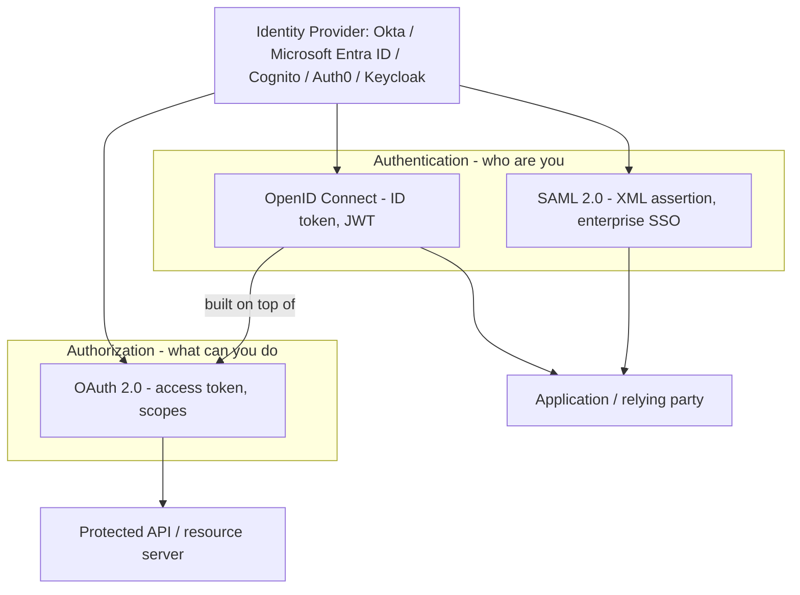
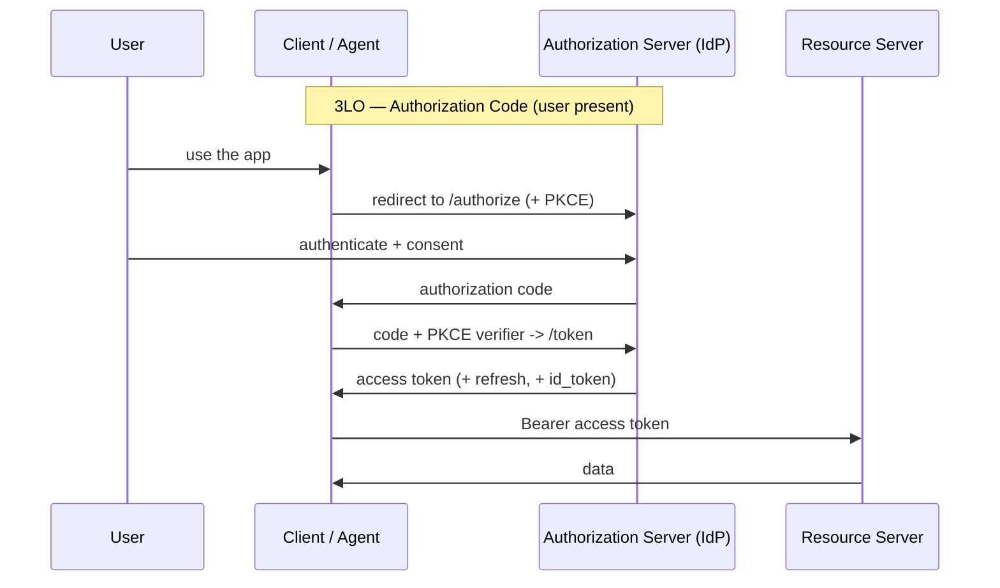

# Enterprise Identity & API Security (OAuth · OIDC · SAML · Okta · Entra)

The identity half of AI security — and increasingly a **hard requirement** on
GenAI/agent job specs. Real postings now ask for *"Authentication & Authorization
(OAuth, OIDC, SAML, 2LO, 3LO, OBO)"*, *"Okta, Microsoft Entra ID or similar
enterprise IdPs"*, and *"API Security & Identity Management"* alongside Bedrock
and Python. This page is the deep dive that turns those bullet points into
things you can design and defend.

!!! abstract "The one-line framing"
    **Authentication** proves *who you are* (identity); **authorization** decides
    *what you may do* (access). OAuth 2.0 is an **authorization** framework, OIDC
    adds an **authentication** layer on top of it, and SAML does both in the
    enterprise SSO world. Agents change the game because now a *non-human*
    workload must carry a user's identity to a downstream API — that's where
    **OBO** and token vaults come in.

---

## The protocol landscape

| Protocol | Does | Token/format | Typical use |
|----------|------|--------------|-------------|
| **OAuth 2.0** | Authorization (delegated access) | Access token (often JWT), refresh token | Let an app/agent call an API *on your behalf* without your password |
| **OIDC** | Authentication (built on OAuth 2.0) | **ID token** (JWT) + access token | "Log in with…" / SSO for modern apps |
| **SAML 2.0** | Authentication + SSO | XML **assertion** | Enterprise web SSO, older/enterprise apps |

!!! tip "Interview soundbite"
    *"OAuth authorizes, OIDC authenticates on top of OAuth, SAML is the older
    XML-based enterprise SSO. If a spec lists all three plus 2LO/3LO/OBO, they
    want someone who can wire an agent to call enterprise APIs as the right
    principal — user or workload — without leaking long-lived secrets."*

---

## OAuth 2.0 — the core you must know cold

### Roles

| Role | Who it is |
|------|-----------|
| **Resource owner** | The user who owns the data |
| **Client** | The app/agent that wants access |
| **Authorization server** | The IdP that issues tokens (Okta, Entra, Cognito…) |
| **Resource server** | The API holding the protected data |

### Tokens

- **Access token** — short-lived credential the client sends to the API
  (`Authorization: Bearer …`). Often a **JWT** (signed, self-describing) but can
  be opaque. Carries **scopes** (`read:orders`) and often audience/subject.
- **Refresh token** — long-lived, used to get new access tokens **without**
  re-prompting the user. Store server-side, never in a browser/agent prompt.
- **ID token** (OIDC only) — a JWT proving *who logged in* (name, email, `sub`).
  For the **app**, not for calling APIs.

### Grant types = "how the client gets a token"

This is where **2LO vs 3LO** lives.

| Grant | Legs | Who's present | When to use |
|-------|------|---------------|-------------|
| **Authorization Code (+ PKCE)** | **3-legged (3LO)** | A **user** consents | Web/mobile/agent acting **for a user**. PKCE is mandatory for public clients. |
| **Client Credentials** | **2-legged (2LO)** | **No user** — app↔API | Machine-to-machine, backend services, an agent acting **as itself** |
| **On-Behalf-Of (OBO)** | token exchange | User's token → downstream token | A service/API that must call *another* API **as the original user** |
| **Device Code** | user on 2nd device | User, no browser on client | CLIs, TVs, IoT |
| ~~Implicit~~ / ~~ROPC~~ | — | — | **Deprecated** — don't propose these |

### 2LO vs 3LO vs OBO — the exact distinction interviewers probe

- **2LO (two-legged / Client Credentials):** two parties — the client and the
  authorization/resource server. **No user.** The agent authenticates *as
  itself* with its own credentials and gets a token scoped to what the workload
  may do. Use for background jobs, service-to-service, an autonomous agent with
  no user context.
- **3LO (three-legged / Authorization Code):** three parties — **user**, client,
  and server. The user is redirected to the IdP, authenticates, and **consents**;
  the client receives a code and exchanges it (with a **PKCE** verifier) for
  tokens. Use whenever the agent acts *for a specific user* and must respect that
  user's permissions.
- **OBO (On-Behalf-Of / token exchange, RFC 8693):** service A holds the user's
  access token, and needs to call service B **as that user**. A exchanges the
  incoming token at the IdP for a new token audience-scoped to B, preserving the
  user identity through the chain. This is the pattern that keeps
  *user-scoped access* intact across a multi-hop agent/API call — critical so a
  downstream API still enforces the **end user's** row/tenant permissions, not a
  broad service account.

!!! danger "The delegation trap (say this unprompted)"
    A common failure: an agent authenticates with **client credentials (2LO)** and
    then reads *any* user's data because it holds a broad service token. If the
    task is "answer for *this* user," you need the **user's** identity to flow
    through — 3LO to get it, **OBO** to carry it to downstream APIs — so the
    resource server enforces that user's access, not the agent's superset.

### PKCE (Proof Key for Code Exchange)

Public clients (SPAs, mobile, CLIs, agents) can't hold a secret. PKCE stops an
intercepted authorization code from being redeemed by an attacker: the client
sends a hashed `code_challenge` on `/authorize` and the plaintext
`code_verifier` on `/token`; only the original client can complete the exchange.
**Always PKCE for public clients.**

---

## OIDC — authentication on top of OAuth

OIDC adds an **ID token** (a JWT with identity claims) and a standard
`/userinfo` endpoint. Key claims to know: `iss` (issuer), `sub` (stable user id),
`aud` (audience — who the token is *for*), `exp`/`iat` (expiry/issued-at),
`nonce`. **Validating a JWT** = verify signature against the IdP's JWKS, check
`iss`, `aud`, `exp`, and (for OIDC) `nonce`. Getting `aud` validation wrong is a
classic vulnerability — a token minted for API-A must not be accepted by API-B.

---

## SAML 2.0 — enterprise SSO

Older, XML-based, still everywhere in the enterprise. An **Identity Provider**
issues a signed **assertion** to a **Service Provider** after the user
authenticates. Compared to OIDC: SAML is XML + browser-redirect/POST binding and
excels at web SSO to enterprise apps; OIDC is JSON/JWT and better for APIs,
mobile, and SPAs. In interviews: *"SAML for legacy enterprise web SSO; OIDC/OAuth
for modern API and agent access. Many orgs run both, federated behind Okta or
Entra."*

---

## Enterprise Identity Providers

The IdP is the authorization server + user directory. Two dominate the specs:

| Capability | Okta | Microsoft Entra ID (formerly Azure AD) |
|-----------|------|----------------------------------------|
| Protocols | OAuth 2.0, OIDC, SAML | OAuth 2.0, OIDC, SAML |
| Directory | Universal Directory | Entra directory, tight M365/Azure integration |
| App integration | Okta Integration Network, custom OIDC/SAML apps | App registrations, enterprise apps |
| Tokens | Access/ID/refresh; custom authz servers, scopes/claims | Access/ID tokens; **app roles**, scopes, **OBO** first-class |
| MFA / policy | Adaptive MFA, sign-on policies | Conditional Access, MFA, PIM |
| Agent/API fit | Custom authorization server per API audience | `azure ad` OBO flow, managed identities for Azure workloads |

**What to know for the job:** register the app/agent as a client in the IdP,
define **scopes/app-roles** (least privilege), pick the right grant (2LO for
workload, 3LO for user), enforce **MFA/Conditional Access**, and validate tokens
(`iss`/`aud`/`exp`, signature via JWKS) at the API. Entra's **OBO** is the
canonical way to carry a user identity from a first API to a downstream one.

---

## API security checklist (the "API Security & Identity Management" pillar)

- **AuthN on every endpoint** — validate the bearer JWT: signature (JWKS), `iss`,
  `aud`, `exp`, not expired/revoked. Reject `alg: none`.
- **AuthZ per request** — enforce **scopes/roles** and **resource ownership**
  (does *this* subject own *this* record?), not just "has a valid token."
- **Least privilege scopes** — narrow (`read:orders`), separate read vs write.
- **Short-lived access tokens + refresh** — minimize blast radius; rotate.
- **Secrets in a vault** (Secrets Manager / Key Vault), never in code, prompts,
  or logs. Prefer **workload identity / managed identity** over static secrets.
- **Transport** — TLS everywhere; HSTS; no tokens in URLs (they leak to logs).
- **Rate limiting + quotas** — per client/subject; protects cost and availability.
- **Input validation** — treat every field as hostile (ties to
  [insecure output handling](index.md)).
- **Audit** — log token subject, scopes, action, result for every call.

---

## Where this meets agents (bridge to AgentCore)

An AI agent is just another OAuth client — but a *non-human* one that may act
**as itself** (2LO) or **for a user** (3LO + OBO). The hard problems are: how does
the agent prove its own identity, how does the **user's** identity flow to the
tools it calls, and where do the downstream credentials live so they're never in
the model context? Amazon Bedrock **AgentCore Identity** and **Gateway** answer
exactly these — see the dedicated deep dive:

> **[AgentCore Identity & Gateway — securing agents with enterprise IAM](agentcore-identity-gateway.md)**

---

## Interview questions

??? question "Explain 2LO vs 3LO, and when you'd use each for an AI agent."
    **2LO = client credentials**: two parties, no user — the agent authenticates
    as itself and gets a workload-scoped token. Use for autonomous/background
    agents with no user context. **3LO = authorization code**: three parties —
    the **user** authenticates and consents at the IdP, the client exchanges the
    code (with PKCE) for tokens. Use when the agent acts for a specific user so
    the downstream API enforces *that user's* permissions. If the answer must
    respect a user's data scope, you need 3LO (to get the identity) plus OBO (to
    carry it downstream), not a broad service token.

??? question "What is the On-Behalf-Of flow and why does it matter for multi-hop agents?"
    OBO (token exchange, RFC 8693) lets a service that received a user's token
    exchange it for a new token scoped to a **downstream** API, preserving the
    user's identity through the chain. It matters because a multi-hop agent
    (agent → API A → API B) must keep the *end user's* authorization intact;
    without OBO you'd fall back to a service account that sees everything, which
    breaks least privilege and tenant isolation.

??? question "How do you validate a JWT access token at an API, and what's commonly done wrong?"
    Verify the **signature** against the IdP's JWKS (rotating keys), then check
    `iss` (trusted issuer), `aud` (this API is the intended audience), `exp`/`nbf`
    (time validity), and revocation if applicable. Enforce **scopes/roles** and
    **resource ownership** per request. Common mistakes: skipping `aud`
    validation (token for API-A accepted by API-B), accepting `alg: none`,
    trusting an expired/unsigned token, or authenticating but never authorizing.

??? question "PKCE — what problem does it solve and who needs it?"
    It protects the authorization-code flow for **public clients** (SPAs, mobile,
    CLIs, agents) that can't keep a secret. The client sends a hashed
    `code_challenge` up front and the plaintext `code_verifier` at token
    exchange, so an intercepted authorization code is useless to an attacker who
    lacks the verifier. Use it for every public client; it's now recommended even
    for confidential ones.

??? question "OIDC vs SAML — which and when?"
    Both do SSO. **SAML** is XML assertions over browser redirects/POST, entrenched
    in legacy/enterprise web apps. **OIDC** is JSON/JWT built on OAuth 2.0, better
    for APIs, SPAs, mobile, and agents. Modern GenAI/API work favors OIDC/OAuth;
    many enterprises federate both behind Okta or Entra, so you support SAML for
    older apps and OIDC/OAuth for new services.

??? question "How do you integrate Okta or Microsoft Entra ID with a Python API + agent?"
    Register the API and the app/agent as clients in the IdP; define scopes
    (Okta custom authorization server) or app roles/scopes (Entra). The user-facing
    app uses **3LO + PKCE** to obtain the user's token; the API validates it
    (JWKS, `iss`/`aud`/`exp`, scopes). For workload calls use **2LO client
    credentials** or a managed/workload identity. For downstream calls as the user,
    use **OBO** (Entra has it first-class). Enforce MFA/Conditional Access at the
    IdP; keep client secrets in a vault.

---

## Rapid-fire

| Q | A |
|---|---|
| OAuth does…? | **Authorization** (delegated access via tokens + scopes) |
| OIDC adds…? | **Authentication** — an ID token (JWT) on top of OAuth |
| SAML is…? | XML assertion-based enterprise **SSO** (authn + SSO) |
| 2LO = ? | Client Credentials — no user, agent acts **as itself** |
| 3LO = ? | Authorization Code — **user** authenticates + consents |
| OBO = ? | Token exchange — carry the **user's** identity to a downstream API |
| PKCE for…? | Public clients (SPA/mobile/CLI/agent) — protects the code flow |
| Validate a JWT? | Signature (JWKS) + `iss` + `aud` + `exp` + scopes/ownership |
| Deprecated grants? | Implicit, Resource Owner Password Credentials (ROPC) |
| Where do secrets live? | Vault / managed identity — never code, prompt, or logs |
| Top IdPs on specs? | **Okta**, **Microsoft Entra ID** |

---

**Sources (verify current):** OAuth 2.0 (RFC 6749), Token Exchange/OBO
(RFC 8693), PKCE (RFC 7636), OpenID Connect Core, SAML 2.0, and Okta /
Microsoft Entra ID official documentation. *Content was rephrased for compliance
with licensing restrictions.*

**Next:** [AgentCore Identity & Gateway](agentcore-identity-gateway.md)
