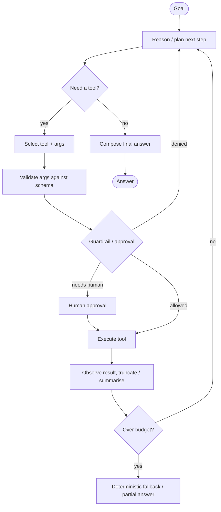
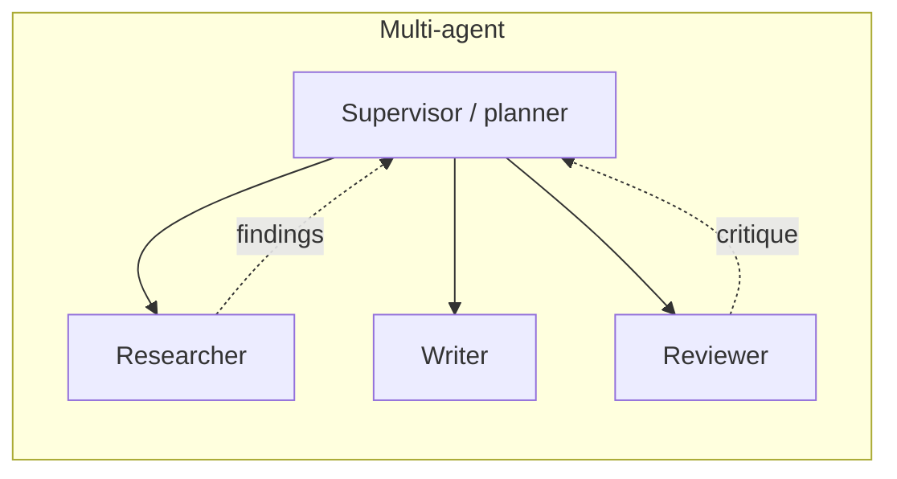

# Agent Workflow

*Last reviewed: October 2026*

How an LLM agent turns a goal into actions, and how to keep that loop
bounded, observable and safe. For patterns and interview prep, see
[Agent Engineering](../../GenAI-Topics/agent-engineering/index.md) and
[Agent Principles](../../GenAI-Topics/agent-principles/index.md).

An agent is a model running in a loop: it picks the next action (usually a tool
call), observes the result, and repeats until it can answer or a limit is hit.
The engineering problem is everything around that loop: tool design, state,
budgets, permissions, and recovery.

## The control loop



## Anatomy

| Component | Role | Production concern |
|-----------|------|--------------------|
| **Planner/reasoner** | The LLM deciding the next step | Model tier and reasoning effort per step |
| **Tools** | Actions: search, DB query, API call (often via MCP) | Typed schemas, scoped credentials, idempotency |
| **Memory** | Short-term (conversation) + long-term (facts) | Compaction, what to persist, privacy |
| **State store** | Checkpoint of the run | Resume after crash, human pauses |
| **Guardrails** | Gate risky or irreversible actions | Policy as code, not prompt text |
| **Controller** | Iteration cap, cost budget, timeouts | Hard limits enforced outside the model |
| **Tracer** | Logs every step for debugging and eval | Span per model call and tool call |

## Workflow or agent?

Start with the least autonomy that solves the problem.

| Pattern | Use when | Example |
|---------|----------|---------|
| Single call | One-shot transformation | Classify a ticket |
| Prompt chain | Fixed, known steps | Extract → validate → summarise |
| Router | A few distinct paths | Billing vs technical vs sales |
| Orchestrator-workers | Subtasks vary but are parallelisable | Research across several sources |
| Evaluator-optimiser | Clear quality criteria to iterate against | Draft → critique → revise |
| Autonomous agent | Path genuinely unknown in advance | Debug a failing build, triage an incident |

Each step down the table adds latency, cost and failure modes. A strong
design often wraps a small agent inside a deterministic workflow.

## Tool design

The tool layer is where most agent reliability is won or lost.

```python
GET_INVOICES = {
    "name": "get_invoices",
    "description": (
        "Return invoices for the authenticated customer. "
        "Use for questions about charges, totals or billing dates. "
        "Does not return payment card details."
    ),
    "input_schema": {
        "type": "object",
        "properties": {
            "months": {"type": "array", "items": {"type": "string",
                       "pattern": "^[0-9]{4}-[0-9]{2}$"}, "maxItems": 12},
            "include_line_items": {"type": "boolean", "default": False},
        },
        "required": ["months"],
    },
}
# customer_id is injected server-side from the session, never a model argument.
```

Rules of thumb:

- **Few, well-named, non-overlapping tools.** Overlapping tools cause wrong
  choices. Describe *when* to use each one, not just what it does.
- **Identity comes from the session**, not from model arguments.
- **Separate read and write tools**, with writes gated and idempotent
  (pass an idempotency key so retries do not double-charge).
- **Return compact, structured results** with clear error messages the model
  can act on ("no invoices for 2026-13: month must be 01 to 12").
- **Paginate or truncate large outputs**; dumping 50k tokens of JSON into the
  context degrades every later step.

## Control and safety

- **Bound the loop**: max iterations, wall-clock timeout and a token or dollar
  budget, enforced by the controller, not requested in the prompt.
- **Least-privilege tools**: separate credentials per tool; read-only by default.
- **Human-in-the-loop**: approval before high-impact or irreversible actions
  (payments, deletes, external emails, production changes).
- **Deterministic fallback**: if the agent stalls, degrade to a fixed flow or
  hand off to a human with the trace attached.
- **Detect loops**: the same tool with the same arguments twice in a row is a
  signal to stop or re-plan.
- **Trace everything**: you cannot debug an agent you cannot see.

```python
class Budget:
    def __init__(self, max_steps=15, max_tokens=200_000, max_seconds=120):
        self.max_steps, self.max_tokens, self.max_seconds = max_steps, max_tokens, max_seconds
        self.steps = self.tokens = 0
        self.start = time.monotonic()

    def charge(self, tokens):
        self.steps += 1
        self.tokens += tokens
        if (self.steps > self.max_steps or self.tokens > self.max_tokens
                or time.monotonic() - self.start > self.max_seconds):
            raise BudgetExceeded(self.steps, self.tokens)
```

The numbers above are illustrative starting points; set them from observed
traces of successful runs plus headroom.

## Durable execution

Long-running agents (minutes to hours, or waiting on a human) need
**checkpointed state**: persist the message history, pending tool calls and
plan after each step, so a crash or deploy resumes rather than restarts.
LangGraph checkpointers, workflow engines (Temporal, Step Functions) and
managed runtimes such as [AgentCore](../../GenAI-Topics/agentcore/index.md)
provide this. Make tool calls idempotent so a resumed step is safe to replay.

## Single vs multi-agent



Start single-agent. Use a supervisor plus specialists only when one agent's
scope and toolset become unreliable, or when subtasks benefit from parallel,
isolated context windows. Coordination adds latency, cost and failure modes:
lost context in hand-offs, duplicated work, and agents agreeing with each
other's errors. For cross-system agent communication, see
[A2A](../../GenAI-Topics/a2a/index.md).

## Evaluating agents

| Level | What to measure |
|-------|-----------------|
| Outcome | Task success rate on a fixed scenario set |
| Trajectory | Right tools, right order, no unnecessary steps |
| Efficiency | Steps, tokens, cost and latency per successful task |
| Safety | Disallowed actions attempted, approvals requested correctly |
| Robustness | Success under tool errors, timeouts and injected content |

Use sandboxed tools or recorded responses so evals are repeatable.

## Common failure modes

| Failure | Cause | Fix |
|---------|-------|-----|
| Infinite or long loops | No stop criteria, ambiguous tool errors | Budgets, loop detection, actionable errors |
| Wrong tool chosen | Overlapping or vague descriptions | Fewer tools, "use when" guidance, examples |
| Hallucinated arguments | Missing data, loose schemas | Strict schemas, enums, lookup tools |
| Context bloat | Raw tool outputs appended verbatim | Truncate, summarise, store artefacts by reference |
| Unsafe side effects | Write tools without gates | Approvals, scoped creds, dry-run mode |
| Injection via tool output | Treating fetched content as instructions | Mark tool output as data; restrict follow-on actions |

## How interviewers probe this

??? question "When would you choose an agent over a fixed workflow?"
    Only when the sequence of steps cannot be known in advance and the value
    justifies extra cost and variance. Strong answers give a concrete example
    of each, and describe hybrids: a workflow with one bounded agentic step.

??? question "How do you stop an agent from taking a harmful action?"
    Layers: least-privilege credentials, read/write separation, policy checks
    in code before execution, human approval for irreversible actions,
    budgets, and audit logs. Prompt instructions are a hint, not a control.

??? question "Your agent succeeds 70 percent of the time. How do you get it higher?"
    Read failing traces and categorise failures (wrong tool, bad args, gave up,
    loop). Fix the largest bucket: tool descriptions, schemas, error messages,
    narrower scope, better context. Re-run the scenario suite after each change.

??? question "How do you handle an agent run that must wait two days for a human approval?"
    Durable state checkpointed after each step, a pause/resume mechanism,
    idempotent tools, timeouts and escalation, and re-validation of state on
    resume because the world may have changed.

??? question "Single agent or multi-agent for this problem?"
    Default to single; split when tool count or context makes one agent
    unreliable, or for parallel independent subtasks. Names coordination costs
    and how you would evaluate whether the split helped.

## Further reading

- [Anthropic: Building effective agents](https://www.anthropic.com/engineering/building-effective-agents)
- [Yao et al., ReAct: Synergizing Reasoning and Acting in Language Models](https://arxiv.org/abs/2210.03629)
- [Model Context Protocol specification](https://modelcontextprotocol.io/)
- [LangGraph documentation](https://docs.langchain.com/oss/python/langgraph/overview)
- [OWASP Top 10 for LLM Applications (Excessive Agency)](https://genai.owasp.org/llm-top-10/)
- Related here: [LangGraph](../../GenAI-Topics/langgraph/index.md) ·
  [MCP](../../GenAI-Topics/mcp/index.md) ·
  [AgentCore](../../GenAI-Topics/agentcore/index.md) ·
  [Agents Interview Q&A](../../Personal-SourceCode/Agents_Interview_QA.md) ·
  [MCP Interview Q&A](../../Personal-SourceCode/MCP_Interview_QA.md)
