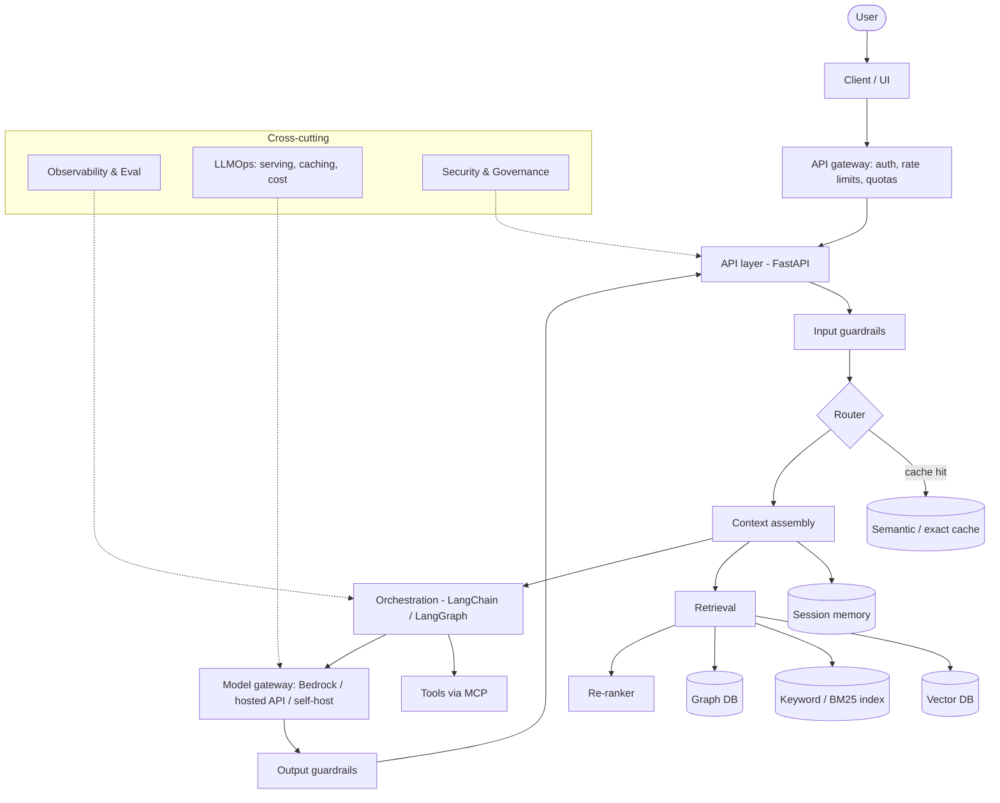
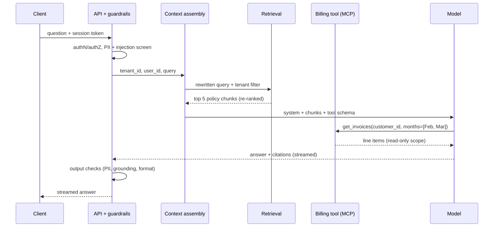
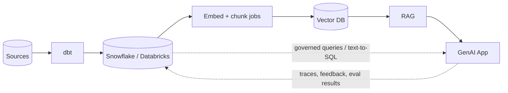

# Architecture Overview

*Last reviewed: October 2026*

A production GenAI application is a **pipeline**, not a single model call. The
model is usually the least differentiated component; the value and most of the
failure modes live in the layers around it: context assembly, retrieval, tool
execution, guardrails, evaluation and operations. This page shows the layers,
what each owns, how a request flows through them, and where to read more.

## Reference architecture

## Layers explained

| Layer | Responsibility | Key design decision | Read more |
|-------|----------------|---------------------|-----------|
| **Client / API** | Request handling, streaming, auth | Streaming (SSE / WebSocket) vs request-response; async job API for long agent runs | [FastAPI](../../Technologies/fastapi/index.md) |
| **Gateway** | Identity, rate limits, per-tenant quotas | Quotas in tokens or dollars, not just requests | [Identity & API security](../../AI-Security/identity-api-security.md) |
| **Guardrails** | Block injection, PII, unsafe I/O | Which checks are blocking vs async/logged | [Security & Governance](../security-governance/index.md) |
| **Router** | Pick cache, model tier or workflow | Rules first, classifier later | [Model Selection](../model-selection/index.md) |
| **Context assembly** | Budget the context window | Fixed token budget per source (system, memory, retrieval, tools) | [Context Engineering](../../GenAI-Topics/context-engineering/index.md) |
| **Retrieval** | Fetch grounding facts | Hybrid search + re-rank; permission filters at query time | [RAG](../../GenAI-Topics/rag/index.md), [Vector DB](../../GenAI-Topics/vector-db/index.md) |
| **Orchestration** | Chains / graphs / tools | Fixed workflow vs agent loop; durable state | [LangChain](../../GenAI-Topics/langchain/index.md), [LangGraph](../../GenAI-Topics/langgraph/index.md) |
| **Agent** | Plan/act/observe loop | Iteration, cost and time budgets | [Agent Workflow](../agent-workflow/index.md) |
| **Tools** | Side effects and live data | Read vs write separation; idempotency | [MCP](../../GenAI-Topics/mcp/index.md) |
| **Model** | Generation | Provider abstraction, fallbacks, version pinning | [LLM Fundamentals](../../GenAI-Topics/llm-fundamentals/index.md), [Bedrock](../../GenAI-Topics/bedrock/index.md) |
| **Observability** | Trace, eval, monitor | Trace every span with prompt version and model ID | [Observability & Eval](../../GenAI-Topics/observability/index.md) |
| **LLMOps** | Serve, scale, cache, cost | Managed API vs self-hosted serving | [LLMOps](../../GenAI-Topics/llmops/index.md), [Cost Optimization](../../GenAI-Topics/cost-optimization/index.md) |

## Request lifecycle: a worked example

A support assistant answers "Why was my March invoice higher than February?"
for a logged-in customer.

What makes this production-grade rather than a demo:

1. **Identity flows end to end.** The tenant and user IDs from the session are
   applied as retrieval filters and tool-call scopes. The model never chooses
   whose data to read.
2. **Two sources of truth.** Policy text comes from RAG; the numbers come from a
   tool call against the system of record. Never ask a model to remember facts
   that a database can return.
3. **Every hop is traced** with prompt version, model ID, retrieved chunk IDs,
   token counts and latency, so a bad answer can be replayed.

## Latency and cost budget

Rule of thumb: users judge chat by **time to first token** and agents by
**time to a useful result**. Budget each stage explicitly.

| Stage | Typical contributor | Levers |
|-------|---------------------|--------|
| Guardrails | Classifier calls, regex | Run cheap checks inline, expensive ones in parallel or async |
| Retrieval | Embedding call + ANN search + re-rank | Cache query embeddings, re-rank fewer candidates, co-locate stores |
| Prefill | Prompt length | Trim context, prompt caching for stable prefixes |
| Decode | Output length, model size | Smaller model, shorter outputs, streaming |
| Tool calls | Downstream APIs | Parallel calls, timeouts, cached reads |
| Agent loop | Number of iterations | Fewer, better tools; iteration caps |

Cost scales with **tokens × calls × model tier**. The biggest wins are usually
routing easy traffic to a cheaper tier, caching stable prompt prefixes, and
cutting needless agent iterations, not micro-optimising prompt wording.

## Design principles

- **Ground, don't guess**: retrieve facts or call tools; instruct "answer only
  from context".
- **Bound everything**: token budgets, iteration caps, timeouts, cost limits.
- **Least privilege**: especially for agent tools that take actions.
- **Observe from day one**: you cannot improve what you cannot trace.
- **Right-size the model**: smallest model that passes eval; route by difficulty.
- **Abstract the provider**: one internal model gateway with retries, fallbacks
  and pinned versions, so changing models is a config change plus an eval run.
- **Prefer workflows to agents** when the steps are known; reach for an agent
  loop only when the path genuinely varies per request.

## Where GenAI meets your data stack

GenAI does not replace the data platform; it sits on top. Retrieval reads from
governed stores, and results and feedback write back to warehouses and lakes.

Platform options worth knowing: in-warehouse AI (for example
[Snowflake Cortex](../../Snowflake-Cortex/index.md) or
[Databricks](../../Technologies/databricks/index.md)) keeps data inside the
governance boundary and reuses existing RBAC, at the cost of less control over
models and serving.

## Common failure modes

| Failure | Root cause | Prevention |
|---------|-----------|------------|
| Demo works, production fails | No eval set built from real traffic | Collect traces early; build a labeled set before launch |
| Cross-tenant data leak | Filters applied in the prompt, not the query | Enforce tenant filters in retrieval and tool auth |
| Costs spike after launch | Unbounded agent loops, no caching | Per-request and per-tenant budgets, alerts on spend |
| Provider outage takes the app down | Single model, no fallback | Gateway with fallback model and graceful degradation |
| Silent quality regression | Model or prompt changed without tests | Pin versions; eval in CI on every change |

## How interviewers probe this

??? question "Walk me through the architecture of a GenAI app you would put in front of customers."
    Strong answers name the layers above in request order, explain *why* each
    exists, and quickly get to the non-obvious parts: identity propagation into
    retrieval and tools, context budgeting, guardrails placement, tracing, and
    eval gates in CI. Weak answers stop at "vector DB plus LLM".

??? question "Where would you put the boundary between deterministic code and the model?"
    Deterministic code owns auth, data access, calculations, side effects and
    validation. The model owns language understanding, synthesis and choosing
    among well-defined tools. A strong answer gives an example of moving
    something *out* of the prompt into code.

??? question "How do you make the system resilient to a model provider outage or deprecation?"
    Internal model gateway, pinned model versions, a tested fallback model with
    its own eval results, timeouts and circuit breakers, and degraded modes
    (cached answers, search-only results). Mentions that prompts often need
    per-model tuning, so fallbacks must be evaluated, not assumed.

??? question "The p95 latency is 9 seconds. How do you break it down?"
    Trace spans per stage, then attack the biggest: prefill (trim context,
    prompt caching), decode (shorter outputs, smaller model), agent iterations,
    and serial tool calls (parallelise). Streaming improves perceived latency
    but not total time.

??? question "How does this design change for multi-tenant SaaS?"
    Tenant isolation in indexes (namespace or filter, enforced server-side),
    per-tenant quotas and cost attribution, per-tenant configuration of
    models and data residency, and audit logs keyed by tenant.

## Further reading

- [Anthropic: Building effective agents](https://www.anthropic.com/engineering/building-effective-agents)
- [OpenTelemetry semantic conventions for GenAI](https://github.com/open-telemetry/semantic-conventions-genai)
- [Model Context Protocol](https://modelcontextprotocol.io/)
- [AWS Well-Architected Generative AI Lens](https://docs.aws.amazon.com/wellarchitected/latest/generative-ai-lens/generative-ai-lens.html)
- Related here: [Reliability](../../GenAI-Topics/reliability/index.md) ·
  [AI Engineer Interview Q&A](../../Personal-SourceCode/AI_Engineer_Interview_QA.md) ·
  [Staff / Principal Architect path](../../Personal-SourceCode/Path_Staff_Principal_Architect.md)
