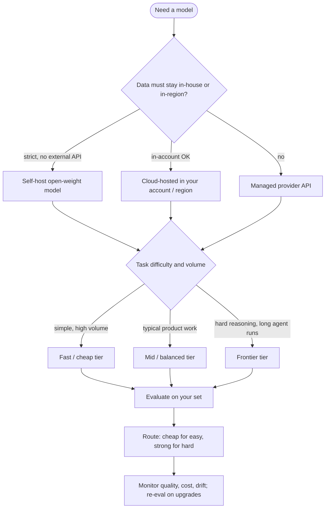

# Model Selection Guide

*Last reviewed: October 2026*

Choosing a model is a trade-off between **quality, cost, latency, context
window, tool-use reliability and data governance**. Model names change every
few months; the selection method does not. This guide gives the method first,
then a snapshot of the October 2026 landscape.

## Decision flow



## What to weigh

| Factor | Question | How to check |
|--------|----------|--------------|
| **Quality** | Does it pass your eval set on real tasks? | Your labeled set, not public leaderboards |
| **Reasoning control** | Can you trade thinking depth for speed? | Effort / thinking-budget settings per request |
| **Tool use** | Does it call tools correctly and stop when done? | Agent scenario suite, schema-error rate |
| **Cost** | Price per million input and output tokens × your volume | Model with real token counts; output tokens usually cost several times input |
| **Latency** | Time to first token and total; streaming? | p50 / p95 under realistic load |
| **Context window** | Do your prompts or documents fit? | Bigger is not always better; quality can fall off long before the limit |
| **Max output** | Can it emit the length you need? | Provider docs |
| **Governance** | Where does data go? Region, retention, training use | Provider data terms, cloud region availability |
| **Modality** | Text only, or vision, audio, realtime voice? | Provider docs |
| **Customisation** | Need fine-tuning, LoRA or distillation? | Open weights or provider fine-tuning support |
| **Lifecycle** | How long will this version be supported? | Deprecation schedule; pin versions |

## The landscape in October 2026

Every major provider now ships a **tiered family**: a frontier model for the
hardest work, a balanced default, and a fast/cheap model for volume. Most
current models are reasoning-capable with adjustable effort, support tool use,
and the frontier and mid tiers commonly offer context windows in the hundreds
of thousands to around one million tokens.

=== "Proprietary APIs"

    | Provider | Frontier | Balanced / default | Fast / cheap | Notes |
    |----------|----------|--------------------|--------------|-------|
    | **Anthropic** | Claude Fable 5.1 | Claude Opus 5.5 (Anthropic's suggested default), Claude Sonnet 5.5 | Claude Haiku 5.5 | All listed with 1M-token context, tool use, vision, adaptive thinking |
    | **OpenAI** | GPT-6 Astra | GPT-6.1 Sol | GPT-6 Luna | Adjustable reasoning effort; separate GPT-Realtime models for voice |
    | **Google** | Gemini 3.1 Pro (preview) | Gemini 3.8 Flash | Gemini 3.5 Flash-Lite | Google recommends 3.8 Flash or 3.5 Flash-Lite for new projects |

=== "Open-weight"

    | Family | Current releases | Notes |
    |--------|------------------|-------|
    | **DeepSeek** | DeepSeek-V4-Pro, DeepSeek-V4.1-Flash | Large MoE models; thinking and non-thinking modes; 1M-token context on DeepSeek's API |
    | **Qwen** (Alibaba) | Qwen3.8 (very large MoE and a 27B dense model), Qwen3.8-Flash-Next | Wide size range; FP8 variants published |
    | **Mistral** | Mistral Large 4, Mistral Medium 3.5, Mistral Small 4, Ministral 3 (3B/8B/14B) | Most open models Apache 2.0; check each licence |
    | **Meta Llama** | Llama 4 Scout, Llama 4 Maverick | MoE, natively multimodal; Llama community licence |
    | **OpenAI** | gpt-oss-120b, gpt-oss-20b | Open-weight reasoning models; gpt-oss-safeguard for policy classification |

!!! warning "Verify before you quote"
    This table reflects provider documentation and model hubs as checked in
    early October 2026. Names, preview status and context limits change
    quickly. In an interview, the selection *criteria* matter far more than
    reciting the newest model name. Always check the provider's models page
    and deprecation schedule before committing.

## Tier selection by workload

| Workload | Starting tier | Why |
|----------|---------------|-----|
| Classification, extraction, routing, PII tagging | Fast / cheap | High volume, narrow task, easy to eval |
| Customer-facing RAG chat | Balanced | Good grounding and tone at acceptable latency |
| Long-horizon coding or research agents | Frontier or balanced at high effort | Tool-use reliability compounds over many steps |
| Complex analysis, planning, hard maths | Frontier with high reasoning effort | Quality dominates cost |
| Realtime voice | Dedicated realtime/voice models | Latency budget is the constraint |
| Strict residency, air-gapped, or heavy fine-tuning | Open-weight, self-hosted | Control over data and weights |
| Batch offline processing | Balanced or fast via batch APIs | Batch discounts and no latency constraint |

## Managed API vs cloud-hosted vs self-hosted

| Option | Pros | Cons |
|--------|------|------|
| Provider API | Newest models first, no infra | Data leaves your boundary (check terms), rate limits |
| Cloud platform (Bedrock, Vertex AI, Azure AI Foundry) | In-account, regional, existing IAM and billing | Model availability lags, regional gaps |
| Self-hosted open weights (vLLM, SGLang, TGI) | Full control, fixed capacity cost, fine-tuning | GPU capacity planning, ops burden, you own safety tuning |

Self-hosting pays off at sustained high utilisation or when governance requires
it. At low or spiky volume, per-token APIs are usually cheaper than idle GPUs.

## Practical strategy

1. **Start with a strong general model** to prove the use case is achievable.
2. **Build an eval set** from real or realistic inputs (50 to a few hundred
   cases), with automated scoring where possible.
3. **Down-size and route**: try each cheaper tier against the set; send easy
   traffic to the cheapest model that passes, keep the strong model for the rest.
4. **Tune reasoning effort** before switching models; a mid-tier model at
   higher effort can match a frontier model on some tasks, and vice versa.
5. **Pin versions and re-evaluate on upgrades**; prompts tuned for one model
   often need adjustment for its successor.

### Worked example: routing

```python
ROUTES = {
    "simple":  {"model": "fast-tier",     "effort": "low"},
    "default": {"model": "balanced-tier", "effort": "medium"},
    "hard":    {"model": "frontier-tier", "effort": "high"},
}

def route(request):
    if request.task in {"classify", "extract", "tag"}:
        return ROUTES["simple"]
    if request.needs_multi_step_tools or request.est_difficulty > 0.7:
        return ROUTES["hard"]
    return ROUTES["default"]
```

Start with rules; graduate to a trained classifier only when rules stop
scaling. Log the route decision so you can measure quality and cost per route,
and escalate on failure (for example, a failed JSON validation retries one tier up).

## Rules of thumb

- Prototyping: strong hosted model, fast to ship.
- Production, cost-sensitive, high volume: route, cache, right-size.
- Strict data control: in-account cloud hosting or self-hosted open weights.
- Need knowledge: add **RAG**, do not fine-tune. Need behaviour or style: fine-tune.
- Do not choose on leaderboard rank; public benchmarks rarely match your task
  distribution.

## Common failure modes

| Failure | Prevention |
|---------|-----------|
| Silent regression after a provider alias moves to a new version | Pin dated or versioned IDs; eval before switching |
| Costs dominated by output tokens or hidden reasoning tokens | Track usage by token type; cap output and effort |
| Fallback model never tested | Run the eval set on fallbacks too |
| Context window treated as free | Measure quality and cost at realistic prompt lengths |
| Licence surprise on open weights | Legal review of each model's licence before shipping |

## How interviewers probe this

??? question "How would you choose a model for a new product feature?"
    Criteria first (quality bar, latency, cost envelope, governance), then an
    eval set, then candidates across tiers, then routing. Strong answers say
    who owns the eval set and how often it is re-run.

??? question "When is self-hosting an open-weight model worth it?"
    Governance or residency requirements, sustained high utilisation, need to
    fine-tune deeply, or latency control. Weighs GPU cost, utilisation, ops
    staffing and safety responsibilities against API pricing.

??? question "Your provider deprecates the model you depend on in 90 days. What do you do?"
    Inventory usages via the gateway, run the eval set on candidate
    replacements, adjust prompts per model, shadow-test on live traffic, roll
    out gradually with monitoring and a rollback path.

??? question "How do you control the cost of reasoning models?"
    Route by difficulty, set effort per task, cap output tokens, cache stable
    prefixes, use batch APIs offline, and track reasoning tokens separately in
    cost dashboards.

??? question "How do you compare two models fairly?"
    Same eval set, same prompts tuned reasonably for each, multiple runs for
    variance, blind human or calibrated judge scoring, and cost/latency
    reported alongside quality.

## Further reading

- [Anthropic models overview](https://platform.claude.com/docs/en/models/overview)
- [OpenAI models](https://developers.openai.com/api/docs/models)
- [Gemini API models](https://ai.google.dev/gemini-api/docs/models)
- [Mistral models overview](https://docs.mistral.ai/getting-started/models/models_overview/)
- [DeepSeek API docs](https://api-docs.deepseek.com/)
- [Qwen on Hugging Face](https://huggingface.co/Qwen) · [Meta Llama on Hugging Face](https://huggingface.co/meta-llama)
- [vLLM documentation](https://docs.vllm.ai/)
- Related here: [LLM Fundamentals](../../GenAI-Topics/llm-fundamentals/index.md) ·
  [LLMOps](../../GenAI-Topics/llmops/index.md) ·
  [Cost Optimization](../../GenAI-Topics/cost-optimization/index.md) ·
  [Bedrock](../../GenAI-Topics/bedrock/index.md) ·
  [Observability & Eval](../../GenAI-Topics/observability/index.md) ·
  [Trends](../../GenAI-Topics/trends/index.md)
