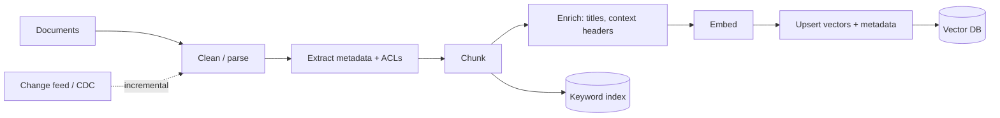
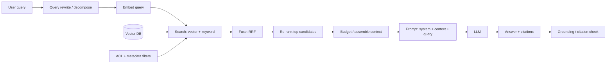

# RAG Flow

*Last reviewed: October 2026*

A step-by-step walkthrough of Retrieval-Augmented Generation: the **indexing
phase** (offline, continuous) and the **query phase** (online, per request),
plus how to evaluate and tune each step. For concepts and interview prep, see
the [RAG topic](../../GenAI-Topics/rag/index.md) and
[Retrieval Tuning](../../GenAI-Topics/retrieval-tuning/index.md).

The core idea: the model answers from evidence you put in its context window,
so answer quality is capped by retrieval quality. Most RAG problems are
retrieval problems.

## Indexing (offline, continuous)



1. **Clean / parse**: extract text from PDFs, HTML and office docs; keep
   structure (headings, tables, lists). Layout-aware parsing matters more than
   embedding choice for PDF-heavy corpora.
2. **Extract metadata and ACLs**: source, URL, owner, updated date, tenant,
   document type, and who may read it. You cannot filter on what you did not store.
3. **Chunk**: split into self-contained passages. Prefer structure-aware
   splitting (by heading or section) with modest overlap (around 10 to 20 percent
   as a starting point).
4. **Enrich**: prepend the document title and section path to each chunk
   ("contextual" chunk headers) so a chunk still makes sense in isolation.
5. **Embed**: one embedding model per index, versioned. Changing it means a
   full re-embed.
6. **Upsert**: store vectors plus metadata, and index the same chunks for
   keyword (BM25) search. Use stable chunk IDs so updates and deletes are clean.

Treat indexing as a **data pipeline**: incremental updates from a change feed,
deletes that actually propagate, backfills on schema or model change, and data
quality checks (empty chunks, duplicate content, parse failures).

### Chunking decision table

| Content | Strategy | Starting size (rule of thumb) |
|---------|----------|-------------------------------|
| Prose docs, wikis | Heading-aware recursive split | A few hundred tokens, small overlap |
| FAQs, tickets | One Q&A or ticket per chunk | Natural unit |
| Legal / policy | Section or clause boundaries, keep numbering | Section, split if very long |
| Code | Function or class boundaries | Natural unit |
| Tables | Keep header with rows; or serialise row groups | Small row groups |
| Long transcripts | Time or speaker windows plus a summary chunk | Windows plus parent summary |

Tune size on your eval set. Small chunks improve precision but lose context;
a **parent-child** pattern (retrieve small chunks, return their larger parent
section) often gets both.

## Query (online, per request)



1. **Query rewrite**: resolve follow-ups ("what about it?") into standalone
   queries; split multi-part questions into sub-queries.
2. **Embed query**: same model and version as indexing (must match).
3. **Hybrid search with filters**: vector (semantic) plus keyword (BM25), with
   ACL and metadata filters applied *inside* the search, not after it.
4. **Fuse**: merge the ranked lists, commonly with Reciprocal Rank Fusion.
5. **Re-rank**: a cross-encoder or re-rank model orders a few dozen candidates
   by true relevance.
6. **Budget and assemble**: keep the top few, deduplicate, order them (best
   evidence first and last, since mid-context material is used less reliably),
   and fit the token budget.
7. **Prompt**: system instructions + context + query; "answer only from
   context, cite chunk IDs, say you don't know otherwise".
8. **Answer, citations, check**: return the grounded answer with sources;
   optionally verify citations point to chunks that support the claim.

### Worked example: hybrid search with RRF

```python
def rrf(ranked_lists, k=60):
    """Reciprocal Rank Fusion: score = sum(1 / (k + rank))."""
    scores = {}
    for results in ranked_lists:
        for rank, doc_id in enumerate(results, start=1):
            scores[doc_id] = scores.get(doc_id, 0.0) + 1.0 / (k + rank)
    return sorted(scores, key=scores.get, reverse=True)

filters = {"tenant_id": user.tenant_id, "acl": {"$in": user.groups}}
vec = vector_index.search(embed(q), top_k=50, filter=filters)
kw  = bm25_index.search(q, top_k=50, filter=filters)
candidates = rrf([vec.ids, kw.ids])[:40]
top = reranker.rank(q, candidates)[:6]     # what actually goes to the model
```

Why hybrid: embeddings miss exact identifiers (error codes, SKUs, names) that
BM25 catches; BM25 misses paraphrases that embeddings catch. RRF needs no
score normalisation, which is why it is a common default.

## RAG vs alternatives

| Need | Better fit |
|------|-----------|
| Fresh, private or changing facts with citations | RAG |
| Small, stable corpus that fits in context | Long-context prompt (with prompt caching) |
| Exact numbers from structured data | Tool call or text-to-SQL, not vector search |
| Multi-hop relationship questions | GraphRAG or agentic retrieval |
| Consistent style, format or behaviour | Fine-tuning |

Long context windows (hundreds of thousands to around a million tokens on
current frontier models) reduce the need for RAG on small corpora, but RAG
still wins on cost per query, freshness, access control and citations.

## Evaluating RAG

Measure retrieval and generation **separately**, or you cannot tell which to fix.

| Metric | Measures | How |
|--------|----------|-----|
| Recall@k / hit rate | Is the right chunk in the top k? | Labeled query → relevant chunk IDs |
| MRR / nDCG | Is it ranked near the top? | Same labels |
| Context precision | How much of the context is relevant? | LLM judge or labels |
| Faithfulness | Is every claim supported by context? | LLM judge, calibrated on human labels |
| Answer relevance | Does it answer the question? | LLM judge or human |
| Abstention | Does it say "I don't know" when it should? | Include unanswerable questions |

Start with 50 to 200 real queries labeled with their relevant chunks. Run the
set in CI whenever you change chunking, embeddings, retrieval parameters,
prompts or models.

## Where each step can fail

| Symptom | Likely step | Fix |
|---------|-------------|-----|
| Right docs not retrieved | Chunking / embedding / search | Better chunks, hybrid search, query rewrite |
| Exact IDs or codes not found | Vector-only search | Add BM25; index identifiers as metadata |
| Retrieved but ignored | Prompt / ordering | Tighten "only from context", put best evidence first, lower temperature |
| Stale or deleted content returned | Indexing pipeline | Incremental sync, propagate deletes, freshness filters |
| User sees content they shouldn't | Filtering | ACL filters at query time, tested per tenant |
| Slow / expensive | Budget | Cap chunks and tokens, cache, re-rank fewer |
| Confidently wrong | Grounding | Require citations, add faithfulness eval, allow abstention |

## How interviewers probe this

??? question "Your RAG system's answers got worse after re-indexing. How do you investigate?"
    Diff the index: chunk counts, sizes, parse failures, embedding model
    version. Re-run the retrieval eval (recall@k) on old vs new index before
    looking at the model. Strong answers mention keeping the old index for
    side-by-side comparison and blue/green index swaps.

??? question "How do you enforce document-level permissions in RAG?"
    Store ACLs as metadata at index time, apply them as pre-filters in the
    search, derive them from the authenticated identity (never from the
    prompt), and keep them in sync when permissions change. Post-filtering
    after top-k can starve results; prompt-level instructions are not a control.

??? question "When would you not use RAG?"
    Small stable corpus (long-context plus caching), structured numeric
    questions (SQL/tools), behaviour change (fine-tune), or when latency
    budgets cannot absorb retrieval. Shows judgement rather than defaulting.

??? question "How do you choose chunk size and top-k?"
    Empirically: sweep a few values against recall@k and faithfulness on a
    labeled set, considering content structure. Mentions parent-child
    retrieval and that re-ranking lets you retrieve wide and pass narrow.

??? question "How do you evaluate faithfulness at scale without humans labeling everything?"
    LLM-as-judge with a clear rubric, calibrated against a human-labeled
    sample, with agreement tracked over time; spot checks; judge model
    different from or stronger than the generator where possible.

## Further reading

- [Lewis et al., Retrieval-Augmented Generation for Knowledge-Intensive NLP Tasks](https://arxiv.org/abs/2005.11401)
- [Liu et al., Lost in the Middle: How Language Models Use Long Contexts](https://arxiv.org/abs/2307.03172)
- [Cormack et al., Reciprocal Rank Fusion (SIGIR 2009)](https://plg.uwaterloo.ca/~gvcormac/cormacksigir09-rrf.pdf)
- [Anthropic: Contextual Retrieval](https://www.anthropic.com/news/contextual-retrieval)
- [Ragas documentation](https://docs.ragas.io/)
- Related here: [Vector DB](../../GenAI-Topics/vector-db/index.md) ·
  [Embeddings](../../GenAI-Topics/embeddings/index.md) ·
  [Graph DB](../../GenAI-Topics/graph-db/index.md) ·
  [Context Engineering](../../GenAI-Topics/context-engineering/index.md) ·
  [Observability & Eval](../../GenAI-Topics/observability/index.md) ·
  [GenAI Interview Q&A](../../Personal-SourceCode/GenAI_Interview_QA.md)
