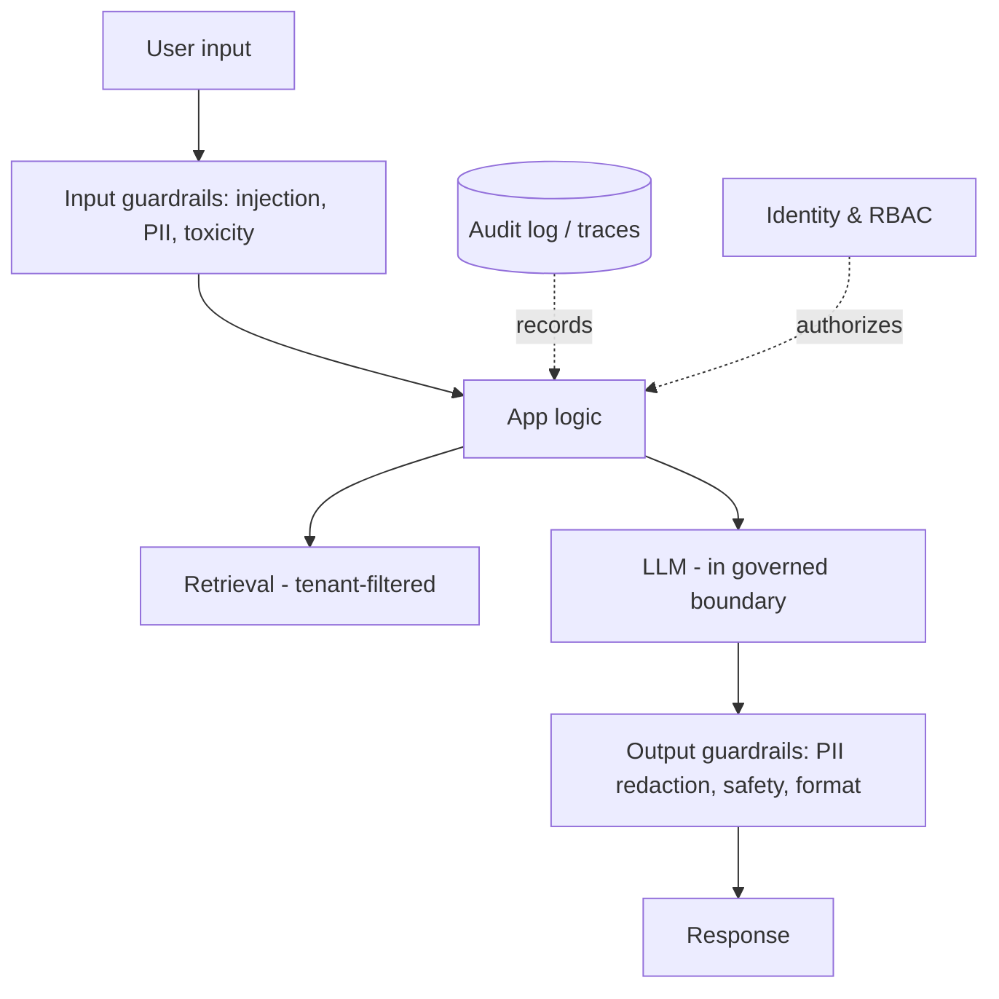

# Security & Governance

GenAI adds new risks on top of normal app security: prompt injection, data
leakage through prompts, hallucinated actions, and unclear data flows. This
guide covers the controls.

## Defense-in-depth

## Key controls

| Risk | Control |
|------|---------|
| **Prompt injection** | Treat retrieved/user content as data, not instructions; least-privilege tools; output checks |
| **Data leakage** | Don't put secrets/PII in prompts; redact; keep data in-boundary (e.g. Bedrock in-account, Snowflake Cortex) |
| **Unauthorized access** | RBAC; row/column security on retrieval; tenant filters in vector search |
| **Hallucinated actions** | Human-in-the-loop for writes; confirmation + limits |
| **Unsafe output** | Output guardrails (PII, toxicity, denied topics) |
| **No accountability** | Audit logging + tracing of prompts, tools, decisions |

## Data governance

- **Know your data flow** — what leaves your boundary, to which region, retained
  how long. Prefer in-VPC/in-account inference (Bedrock) or in-platform
  (Snowflake Cortex, Databricks) to avoid egress.
- **Classification & masking** — tag PII; mask in retrieval sources; carry
  classification through to outputs.
- **Least privilege** — scope model, tool, and data access to the minimum.

## Guardrails options

- **Bedrock Guardrails** — denied topics, content filters, PII redaction.
- **NeMo Guardrails / custom** — programmable rails for open frameworks.
- **Your own checks** — regex/format/validity + an LLM safety classifier.

## Compliance touchpoints

Map to your obligations: **GDPR/CCPA** (PII handling, right to delete),
**SOC 2 / ISO 27001** (access, logging), industry rules (e.g. FERC/finance).
Keep humans in the loop for regulated decisions.

## Related

- [Observability & Eval](../../GenAI-Topics/observability/index.md)
  · [Bedrock](../../GenAI-Topics/bedrock/index.md)
  · [Snowflake governance](../../Technologies/snowflake/index.md)
  · [AWS security (Interview Q&A)](../../Personal-SourceCode/AWS_Interview_QA.md)
