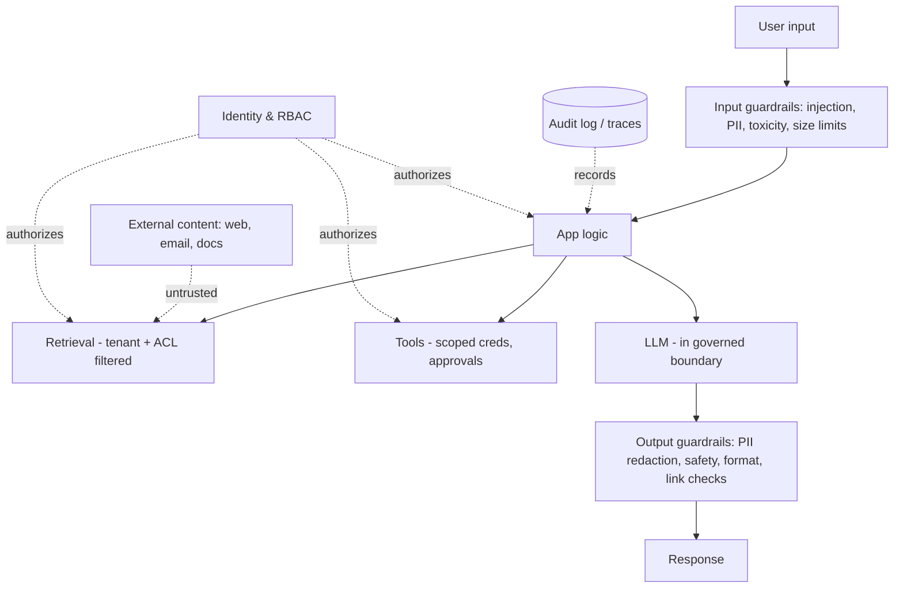

# Security & Governance

*Last reviewed: October 2026*

GenAI adds new risks on top of normal application security: prompt injection,
data leakage through prompts and retrieval, agents taking unintended actions,
unbounded consumption, and unclear data flows to third-party models. This page
covers the threat model, the controls, and how they map to the frameworks
auditors and interviewers ask about. For identity-specific depth, see
[AI Security](../../AI-Security/index.md).

The organising principle: **the model is not a security boundary.** Anything
the model can be talked into, an attacker can talk it into. Enforce controls in
code, identity and infrastructure, and use the model only as one layer.

## Defence in depth


```mermaid
flowchart TB
    IN[User input] --> G1[Input guardrails: injection, PII, toxicity, size limits]
    G1 --> APP[App logic]
    APP --> RET[Retrieval - tenant + ACL filtered]
    APP --> TOOLS[Tools - scoped creds, approvals]
    APP --> LLM[LLM - in governed boundary]
    EXT[External content: web, email, docs] -. untrusted .-> RET
    LLM --> G2[Output guardrails: PII redaction, safety, format, link checks]
    G2 --> OUT[Response]
    AUDIT[(Audit log / traces)] -.records.-> APP
    IAM[Identity & RBAC] -.authorizes.-> APP
    IAM -.authorizes.-> TOOLS
    IAM -.authorizes.-> RET
```

## Threat model: OWASP Top 10 for LLM applications

The OWASP list (2025 edition) is the most common shared vocabulary.

| OWASP risk | What it looks like | Primary controls |
|------------|-------------------|------------------|
| LLM01 Prompt injection | Direct ("ignore previous instructions") or indirect via retrieved docs, emails, web pages | Treat content as data, least-privilege tools, approvals, output checks |
| LLM02 Sensitive information disclosure | Model reveals PII, secrets or another tenant's data | Don't put secrets in prompts; ACL-filtered retrieval; output redaction |
| LLM03 Supply chain | Compromised models, packages, MCP servers, datasets | Pin and verify artefacts, vet third-party tools and servers |
| LLM04 Data and model poisoning | Malicious content enters the index or fine-tuning data | Source allow-lists, ingestion review, provenance metadata |
| LLM05 Improper output handling | Model output executed as SQL, shell, HTML | Treat output as untrusted input; parameterise, sandbox, escape |
| LLM06 Excessive agency | Agent has more tools, permissions or autonomy than needed | Scoped tools, read/write split, human approval |
| LLM07 System prompt leakage | Prompt reveals internal rules or credentials | Assume the system prompt is public; no secrets in it |
| LLM08 Vector and embedding weaknesses | Cross-tenant retrieval, embedding inversion | Per-tenant namespaces or enforced filters, access control on the store |
| LLM09 Misinformation | Confident, wrong answers acted on by users | Grounding, citations, abstention, human review for high stakes |
| LLM10 Unbounded consumption | Cost or resource exhaustion, model extraction | Rate limits, token quotas, budgets, abuse monitoring |

## Key controls

| Risk | Control |
|------|---------|
| **Prompt injection** | Treat retrieved/user content as data, not instructions; least-privilege tools; output checks |
| **Data leakage** | No secrets/PII in prompts unless required; redact; keep data in-boundary (e.g. Bedrock in-account, Snowflake Cortex) |
| **Unauthorized access** | RBAC; row/column security on retrieval; tenant filters enforced in vector search |
| **Hallucinated actions** | Human-in-the-loop for writes; confirmation + limits; idempotent tools |
| **Unsafe output** | Output guardrails (PII, toxicity, denied topics); escape before rendering |
| **Exfiltration via output** | Block or proxy images and links to unknown domains in rendered output |
| **Cost abuse** | Per-user and per-tenant token quotas, max output, agent budgets |
| **No accountability** | Audit logging and tracing of prompts, retrieved docs, tool calls, decisions |

### The "lethal trifecta" for agents

Simon Willison's framing: an agent becomes high risk when it combines **access to private data**,
**exposure to untrusted content**, and **a way to send data out** (email, HTTP,
writing to shared locations). If all three are present, assume injection will
eventually succeed and remove at least one leg, or require human approval on
the outbound path.

## Agent and tool permissions

```yaml
# Example policy for an MCP tool server (illustrative)
tools:
  search_kb:        { access: read,  scope: "tenant:{session.tenant_id}" }
  get_invoice:      { access: read,  scope: "customer:{session.user_id}" }
  issue_refund:
    access: write
    max_amount_usd: 100
    requires_approval: true          # human in the loop above this tool
    idempotency_key: required
  send_email:
    access: write
    allowed_domains: ["@acme.com"]   # removes the exfiltration leg
```

Principles: the session identity, not the model, decides scope; credentials are
per tool and short-lived; write tools are explicit, limited and logged; third-
party MCP servers are reviewed like any dependency.

## Data governance

- **Know your data flow**: what leaves your boundary, to which provider and
  region, how long it is retained, and whether it is used for training. Prefer
  in-account (Bedrock, Vertex AI, Azure) or in-platform inference
  (Snowflake Cortex, Databricks) to reduce egress.
- **Classification and masking**: tag PII at the source; mask in retrieval
  sources; carry classification through to outputs and logs.
- **Least privilege**: scope model, tool and data access to the minimum.
- **Logs are sensitive data too**: traces contain prompts and outputs. Apply
  retention limits, access control and redaction to observability stores.
- **Right to delete**: deletion must propagate to vector indexes, caches,
  traces and any fine-tuning datasets.

## Guardrail options

- **Cloud-native**: Amazon Bedrock Guardrails (denied topics, content filters,
  PII redaction, contextual grounding checks); equivalent safety filters on
  Vertex AI and Azure.
- **Open frameworks**: NVIDIA NeMo Guardrails for programmable rails; open
  safety classifiers such as Llama Guard or gpt-oss-safeguard.
- **Your own checks**: regex and format validation, allow-lists, schema
  validation, and an LLM safety classifier.

Place cheap deterministic checks inline; run expensive model-based checks in
parallel with generation or on a sample, depending on risk.

## Compliance and frameworks

| Framework | What it asks for | GenAI touchpoints |
|-----------|-----------------|-------------------|
| GDPR / CCPA | Lawful basis, minimisation, rights to access and delete | PII in prompts, retention, deletion from indexes and logs |
| SOC 2 / ISO 27001 | Access control, logging, change management | Prompt and model versioning, audit trails, vendor review |
| ISO/IEC 42001 | AI management system | Risk assessment, roles, lifecycle controls |
| NIST AI RMF | Govern, Map, Measure, Manage | Risk register, eval evidence, incident response |
| EU AI Act | Risk-tiered obligations, phased in over several years | Use-case classification, transparency, documentation for high-risk systems |
| Sector rules (finance, health, energy) | Domain-specific | Human review for regulated decisions, explainability |

Keep humans in the loop for regulated or consequential decisions, and keep the
evidence (eval results, approvals, logs) that shows you did.

## Common failure modes

| Failure | Why it happens | Fix |
|---------|---------------|-----|
| "The system prompt says don't reveal X" as the only control | Treating the model as a boundary | Enforce in code; assume prompts leak |
| Tenant filter applied after retrieval | Convenience | Filter inside the query; test with cross-tenant probes |
| Agent with a broad service account | Fast prototyping | Per-tool, per-user scoped credentials |
| Full prompts logged forever | Default observability settings | Redact, retain briefly, restrict access |
| Unreviewed third-party MCP server | Treated as config, not code | Vendor and code review, pinning, sandboxing |

## How interviewers probe this

??? question "How would you defend an email-reading agent against indirect prompt injection?"
    Accept that detection is imperfect. Break the trifecta: restrict outbound
    actions (allow-listed recipients, approval for sends), keep read and write
    tools separate, mark email content as data, monitor for anomalous tool
    sequences, and red-team with injected emails in the eval suite.

??? question "How do you prevent cross-tenant data leakage in a RAG system?"
    Server-side tenant identity, per-tenant namespaces or mandatory filters in
    the search call, ACL sync on permission changes, cache keys that include
    tenant, and automated cross-tenant tests in CI.

??? question "Legal asks what happens to customer data sent to the model. What do you need to know?"
    Provider data terms (retention, training use, zero-retention options),
    region of processing, sub-processors, what is logged on your side, and
    deletion paths. A strong answer produces a data-flow diagram.

??? question "Where do guardrails go, and what do they cost?"
    Input and output, plus tool-call policy checks. Trade-offs: latency,
    false positives blocking legitimate users, and cost of model-based
    classifiers. Mentions tuning thresholds against labeled data.

??? question "How would you prepare a GenAI system for an audit?"
    Inventory of models and use cases with risk classification, versioned
    prompts and models, eval evidence, access controls, audit logs, incident
    process, and mapping to NIST AI RMF or ISO/IEC 42001 controls.

## Further reading

- [OWASP Top 10 for LLM Applications](https://genai.owasp.org/llm-top-10/)
- [NIST AI Risk Management Framework](https://www.nist.gov/itl/ai-risk-management-framework)
- [MITRE ATLAS](https://atlas.mitre.org/)
- [EU AI Act (Regulation (EU) 2024/1689)](https://eur-lex.europa.eu/eli/reg/2024/1689/oj)
- [ISO/IEC 42001](https://www.iso.org/standard/81230.html)
- [Amazon Bedrock Guardrails](https://docs.aws.amazon.com/bedrock/latest/userguide/guardrails.html)
- [Greshake et al., Indirect Prompt Injection](https://arxiv.org/abs/2302.12173)
- Related here: [AI Security](../../AI-Security/index.md) ·
  [Identity & API security](../../AI-Security/identity-api-security.md) ·
  [AgentCore Identity & Gateway](../../AI-Security/agentcore-identity-gateway.md) ·
  [Snowflake Cortex governance](../../Snowflake-Cortex/governance-cost-observability.md) ·
  [Snowflake governance](../../Technologies/snowflake/index.md) ·
  [Bedrock](../../GenAI-Topics/bedrock/index.md) ·
  [Observability & Eval](../../GenAI-Topics/observability/index.md) ·
  [AWS security (Interview Q&A)](../../Personal-SourceCode/AWS_Interview_QA.md)
