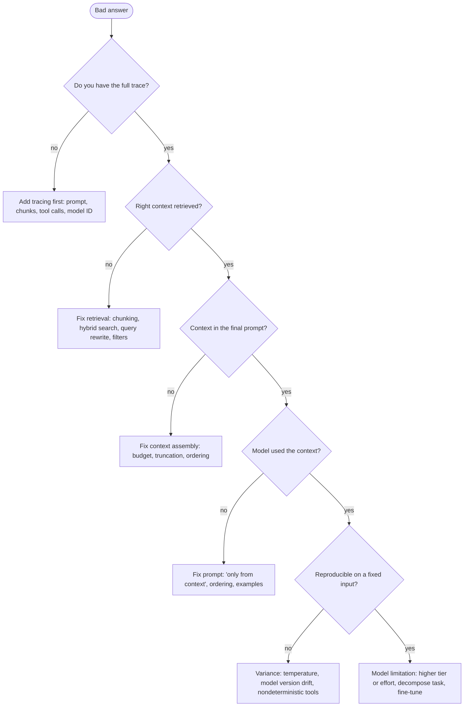

# Troubleshooting Guide

*Last reviewed: October 2026*

Common GenAI failure modes and how to diagnose them. The golden rule:
**trace the pipeline**. Most "the model is dumb" problems are actually
retrieval, context, tool or prompt problems, and you can only tell which by
looking at what the model actually received.

## Diagnosis flow

## First five minutes

1. **Pull the trace** for a failing request: the exact final prompt, retrieved
   chunk IDs, tool calls and results, model ID and version, prompt version,
   token counts, latency per span.
2. **Check what changed**: deploys, prompt versions, model alias updates, index
   rebuilds, upstream data, provider status page.
3. **Reproduce** with the same input at temperature 0 (or several samples) to
   separate bugs from variance.
4. **Isolate the layer**: retrieval vs context vs prompt vs model vs tool.
5. **Change one thing at a time**, and add the case to the eval set.

## RAG

| Symptom | Likely cause | Fix |
|---------|-------------|-----|
| Confidently wrong (hallucination) | Missing or ignored grounding | Ground with RAG, allow "I don't know", require citations, check faithfulness |
| Right docs not retrieved | Chunking or vocabulary mismatch | Better chunks, hybrid search, query rewrite, re-rank |
| Exact codes, SKUs, names missed | Vector-only search | Add BM25 / keyword; index identifiers as metadata |
| Follow-up questions fail | Query not standalone | Rewrite the query with conversation context |
| Stale answers | Index not refreshed, deletes not propagated | Incremental sync, freshness metadata and filters |
| Quality dropped after re-index | Parser or embedding model changed | Diff chunk stats; re-run retrieval eval; keep old index for A/B |
| Answer cites the wrong source | Citations generated, not bound to chunks | Cite chunk IDs from context; validate IDs exist |
| User sees other tenant's content | Filter missing or post-applied | Mandatory server-side filter in the query; cross-tenant tests |
| Answers degrade in long chats | Context overflow | Compaction, sliding window, retrieval-based memory |

## Agents and tools

| Symptom | Likely cause | Fix |
|---------|-------------|-----|
| Agent loops or burns tokens | No stop criteria, unclear errors | Iteration and cost caps, loop detection, actionable error messages |
| Wrong tool called | Vague or overlapping tool descriptions | Fewer, narrow, typed tools with "use when" guidance |
| Invalid tool arguments | Loose schema, missing data | Strict JSON schema, enums, lookup tools, return validation errors to the model |
| Agent gives up early | Tool error looked fatal | Distinguish retryable vs fatal errors in tool responses |
| Context fills with tool output | Raw payloads appended | Truncate, paginate, summarise, store by reference |
| Duplicate side effects | Retries without idempotency | Idempotency keys on write tools |
| Unexpected action after reading a doc | Indirect prompt injection | Treat tool output as data, gate writes, restrict outbound tools |
| MCP tool missing or failing | Server not connected, auth expired, schema change | Health checks, versioned tool schemas, clear startup errors |

## Latency and cost

| Symptom | Likely cause | Fix |
|---------|-------------|-----|
| Slow time to first token | Long prompt prefill, cold start, queueing | Trim context, prompt caching, warm pools, check rate limits |
| Slow total response | Long outputs, large model, serial steps | Cap output, smaller tier, parallel tool calls, stream |
| Latency spikes at peak | Rate limits or provisioned capacity exhausted | Backoff with jitter, request quota increase, fallback model, provisioned throughput |
| Reasoning model is slow and costly | High effort on easy tasks | Route by difficulty, lower effort per task |
| High cost overall | No routing or caching | Model routing, prompt caching, response caching, token budgets |
| Cost spike on one tenant | Abuse or runaway agent | Per-tenant quotas and alerts, budget enforcement |
| Prompt cache hit rate low | Variable content at the start of prompt | Move stable content first; keep the prefix byte-identical |

## Evals

| Symptom | Likely cause | Fix |
|---------|-------------|-----|
| Eval scores good, users unhappy | Eval set unrepresentative | Sample real traffic into the set; add failure cases from feedback |
| Scores fluctuate between runs | Sampling variance, small set | Multiple runs, larger set, report confidence intervals |
| LLM judge disagrees with humans | Vague rubric, biased judge | Specific rubric, calibrate on human labels, check position/length bias |
| Regression shipped anyway | Evals not gating deploys | Run evals in CI; block on threshold drops per slice |
| Can't tell what got worse | Only an aggregate score | Separate retrieval and generation metrics; slice by intent |

## Deployment and operations

| Symptom | Likely cause | Fix |
|---------|-------------|-----|
| Behaviour changed with no deploy | Provider alias moved to a new model version | Pin versioned model IDs; monitor quality continuously |
| Inconsistent JSON | Free-form output | Structured output / function calling + validation + bounded retry |
| 429 / throttling errors | Rate or token limits | Client-side rate limiting, backoff, quota increase, spread across regions |
| Works locally, fails in prod | Different model, region, prompt version or env vars | Config parity, log effective config per request |
| Self-hosted model OOM or slow | KV cache pressure, batch size, context length | Tune max sequence length and concurrency, quantise, scale GPUs |
| Outage takes the feature down | Single provider, no fallback | Gateway with tested fallback and degraded mode |
| Prompt injection | Untrusted content treated as instructions | Separate data and instructions, output checks, least privilege |

## Worked example: "answers got worse last Tuesday"

1. Traces show no prompt or code deploy that day.
2. Model ID in traces changed: the app used a moving alias that now points to
   a newer version.
3. Re-running the eval set on old vs new versions shows formatting regressions
   in one intent slice; grounding is unchanged.
4. Fix: pin the previous version immediately; adjust the prompt for the new
   version; pass the eval; roll forward behind a canary.
5. Prevention: versioned model IDs in config, eval in CI, alert on model-ID
   changes in traces.

## How interviewers probe this

??? question "A user reports a wrong answer. Walk me through your debugging."
    Trace first, then isolate the layer with the diagnosis flow, reproduce on a
    fixed input, fix one thing, add to the eval set. Strong answers make it
    systematic and mention checking what changed recently.

??? question "Latency doubled overnight. What do you check?"
    Provider status and rate-limit errors, model version changes, prompt length
    growth (for example, retrieval returning more chunks), cache hit rate,
    agent step counts, and downstream tool latency, all from span-level traces.

??? question "How do you debug an agent that works in testing but loops in production?"
    Compare trajectories; look for tool errors or data shapes absent from test
    fixtures; check budgets; add loop detection; record real tool responses for
    replay in the eval suite.

??? question "Your LLM-as-judge says quality is up, but CSAT is down. What now?"
    Suspect the eval: judge calibration, rubric mismatch with what users value,
    unrepresentative set. Sample real conversations, label them, and
    re-calibrate before trusting either signal.

??? question "How do you make GenAI incidents less likely to recur?"
    Blameless review, a regression case per incident in the eval set, alerting
    on the leading indicator, and guardrails or budgets that bound the blast
    radius next time.

## Further reading

- [OpenTelemetry semantic conventions for GenAI](https://github.com/open-telemetry/semantic-conventions-genai)
- [Google SRE book: Effective troubleshooting](https://sre.google/sre-book/effective-troubleshooting/)
- [vLLM documentation](https://docs.vllm.ai/)
- [Ragas documentation](https://docs.ragas.io/)
- Related here: [Observability & Eval](../../GenAI-Topics/observability/index.md) ·
  [RAG Flow](../rag-flow/index.md) ·
  [Agent Workflow](../agent-workflow/index.md) ·
  [Context Engineering](../../GenAI-Topics/context-engineering/index.md) ·
  [Reliability](../../GenAI-Topics/reliability/index.md) ·
  [Production Incidents (Interview)](../../Personal-SourceCode/Interview_Production_Incidents.md)
