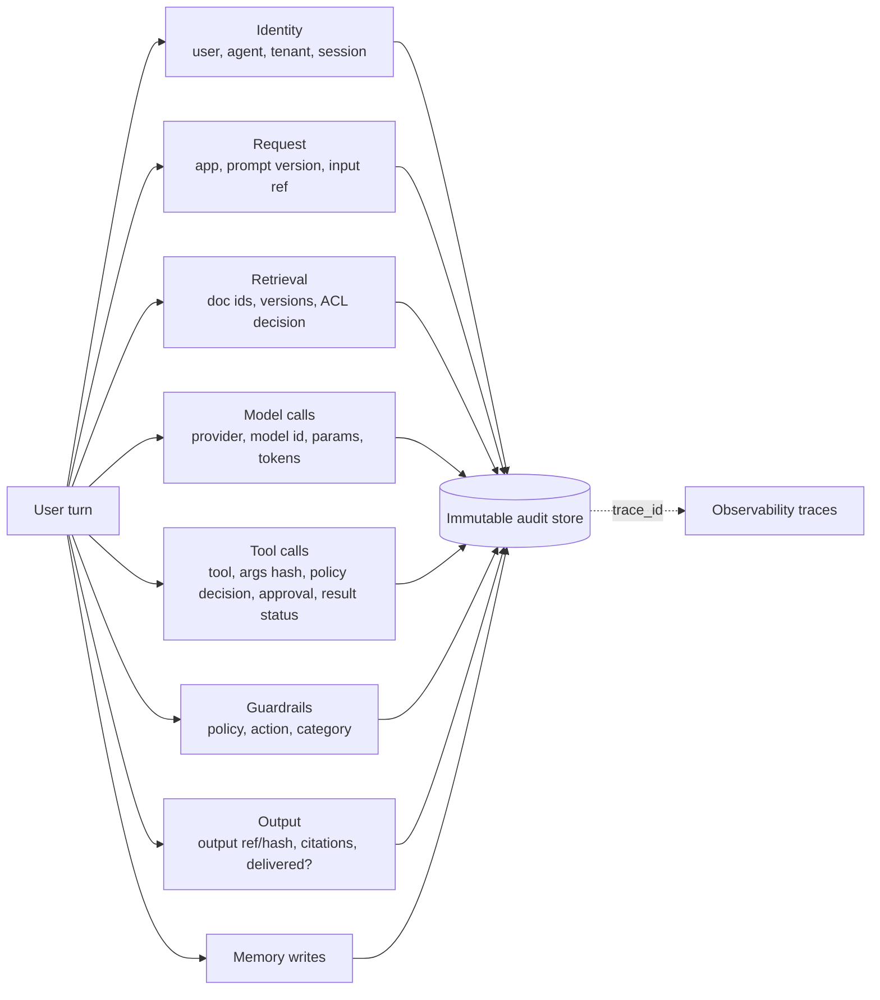

# Audit Logging

*Last reviewed: October 2026*

An audit log answers one question months after the fact: **who caused the system to do what, using which data, and what came out?** For a classic API this means one record per call. For a GenAI system, one user turn can fan out into retrieval over dozens of documents, several model calls, tool calls with side effects, guardrail interventions and memory writes. If you cannot reconstruct that chain, you cannot answer a customer complaint, a data-subject request, a security investigation or an auditor.

Audit logging is **not** the same as observability, even though they often share a pipeline.

| | Observability (traces, metrics) | Audit log |
|---|---|---|
| Purpose | Debug, operate, optimize | Accountability, investigation, evidence |
| Completeness | Sampling is fine | Every security-relevant event, no sampling |
| Integrity | Best effort | Append-only, tamper-evident |
| Retention | Days to weeks | Set by policy and regulation, often years |
| Access | Engineering | Restricted: security, compliance, named investigators |
| Content | May include full prompts in dev | Minimized; content by reference where possible |

## What to capture



The **minimum useful unit** is the agent step. Log each retrieval, model invocation, tool decision and guardrail action as its own event, all sharing a `trace_id` and `session_id`, so you can replay the sequence.

## Reference event schema

Use one envelope for all event types. Aligning field names with the OpenTelemetry GenAI conventions (`gen_ai.*`) and with your SIEM's schema (OCSF is a common choice) saves mapping work later.

```json
{
  "event_id": "01J9Z6Q3V4H8K2M7N5P0R1S3T6",
  "event_type": "tool.call.decision",
  "timestamp": "2026-10-07T14:03:22.418Z",
  "trace_id": "4bf92f3577b34da6a3ce929d0e0e4736",
  "session_id": "sess_8f2c",
  "tenant_id": "acme-eu",
  "actor": {
    "user_id": "u_1932",
    "user_roles": ["finance_viewer"],
    "agent_id": "invoice-assistant",
    "agent_version": "2026.10.02-3",
    "auth_method": "oidc+mfa"
  },
  "app": { "name": "finance-copilot", "env": "prod", "prompt_version": "sys-v41" },
  "model": { "provider": "aws.bedrock", "request_model": "<model-id>", "input_tokens": 3120, "output_tokens": 412 },
  "retrieval": { "doc_ids": ["inv-2026-0912#v3", "policy-ap-07#v12"], "filtered_out_count": 4 },
  "tool": {
    "name": "payments.create",
    "args_sha256": "9c1e…",
    "args_redacted": { "amount": 1800, "currency": "EUR", "payee_id": "p_77" },
    "policy_decision": "deny",
    "policy_id": "payments-approval-threshold",
    "human_approval": null
  },
  "guardrail": { "stage": "input", "action": "none" },
  "content_ref": "s3://audit-content-eu/2026/10/07/4bf92f…json.enc",
  "prev_hash": "b7d4…",
  "record_hash": "e21a…"
}
```

Design notes:

- **Content by reference.** Store full prompts and responses, if you store them at all, in a separate encrypted store with stricter access and shorter retention. The audit event holds a pointer and a hash, so you can prove what was said without spreading it.
- **Record denials and approvals, not just executions.** "The agent proposed a €1,800 payment and policy denied it" is exactly the evidence that your controls work.
- **Version everything.** Prompt template, agent build, model ID, guardrail policy version and index snapshot. "Why did it answer differently last month?" usually comes down to a version change.
- **Include document versions** in retrieval events. A document ID alone cannot show what the model actually read.

## Implementation details

### Integrity and immutability

| Option | Notes |
|---|---|
| Object storage with WORM retention (Amazon S3 Object Lock compliance mode, Azure immutable blob storage, Google Cloud Storage bucket lock) | Standard choice; retention cannot be shortened, even by admins, in compliance mode |
| Hash chaining (`prev_hash` / `record_hash`) per stream, with periodic signed checkpoints | Shows deletion or reordering; cheap to add |
| Separate account or project for audit storage, writable only by the log pipeline | Limits blast radius if the app account is compromised |
| Ship copies to the SIEM | For detection, not as the system of record |

### Use what the platform already emits

- **Control plane**: AWS CloudTrail, Azure Activity Log and Google Cloud Audit Logs record who changed guardrails, prompts, knowledge bases, agents and model access.
- **Data plane**: Amazon Bedrock model invocation logging can send request and response bodies to CloudWatch Logs or S3. Azure and Google have diagnostic and data-access logs with different coverage, so check what each service records before you rely on it. Snowflake exposes Cortex usage through account usage views and the access history.
- These are inputs. They don't replace your application-level event, because only your application knows the end user, the tenant, the policy decision and the business context.

### Redaction pipeline

Redact or tokenize PII **before** events leave the service, for example with a sidecar or an OpenTelemetry Collector processor. Keep a reversible token vault only if investigators need re-identification, and keep that vault under separate control.

### Retention and erasure

GDPR's right to erasure and audit-retention duties can conflict. Common resolutions:

- Keep **identifiers and metadata** in the audit log under a documented legal basis and retention period. Keep **content** separately, with shorter retention.
- **Crypto-shredding**: encrypt content with a per-subject or per-tenant key and destroy the key to erase it, while the integrity chain stays intact.
- Write the retention matrix down (event type × data class × jurisdiction) and have legal sign it off. Don't let engineers guess.

## Failure modes and anti-patterns

!!! warning "Common gaps"
    - **Only logging the final answer.** You cannot tell whether a leak came from retrieval, a tool result or the model.
    - **Sampling audit events** because the tracing SDK samples by default.
    - **Full prompts in the general log index**, searchable by hundreds of engineers and kept indefinitely.
    - **No end-user identity**, because the app called the model with a service credential and never passed the user's identity down.
    - **Logs in the same account the agent can write to.** A compromised agent can cover its tracks.
    - **Unversioned prompts and indexes.** The log says what happened but not under which configuration.
    - **Nobody has ever run a query against it.** Untested audit logs fail on the day they are needed.

## How interviewers probe this

??? question "A customer says your assistant showed them another customer's invoice. Walk through the investigation."
    Find the session, then follow the `trace_id` through the retrieval events (which doc IDs and versions, what filter was applied), the tool events and the output reference. Then decide whether the leak came from retrieval (ACL or filter bug), a cache, a tool, or memory. Check other affected sessions with the same pattern. A strong answer also covers containment, notification duties and adding a regression test.

??? question "What exactly would you log for a multi-step agent, and what would you leave out?"
    Log an event per step with identity, versions, policy decisions and content references. Leave out raw secrets and, by default, raw content in the main stream. Explain hashing so the record can be verified without exposing content.

??? question "How do you make the log tamper-evident without a blockchain?"
    WORM storage in a separate account, hash chains with signed periodic checkpoints, a write-only pipeline role, and alerts on gaps in sequence numbers.

??? question "Legal requires seven-year retention; a user invokes GDPR erasure. What happens?"
    Separate metadata from content, have counsel document the legal basis for what is retained, crypto-shred the content, and keep pseudonymous identifiers only where the basis allows. The wrong answer is choosing one requirement and ignoring the other.

??? question "How is this different from LangSmith or Langfuse traces?"
    Tracing tools are built for debugging and evaluation, and they sample and expire data. Audit needs completeness, integrity, restricted access and policy-driven retention. They can share instrumentation and a `trace_id`, but they need different storage and governance.

## Checklist

- [ ] One event per agent step, linked by `trace_id` and `session_id`
- [ ] User, agent, tenant and authentication method on every event
- [ ] Prompt, agent, model, guardrail and index versions recorded
- [ ] Policy denials, approvals and guardrail actions logged
- [ ] Content stored by reference, encrypted, with shorter retention
- [ ] WORM storage in a separate account; hash chain plus checkpoints
- [ ] Redaction before export; access to content is audited break-glass
- [ ] Retention matrix approved by legal; erasure procedure tested
- [ ] Quarterly investigation drill using only the audit log

## Further reading

- [Amazon Bedrock model invocation logging](https://docs.aws.amazon.com/bedrock/latest/userguide/model-invocation-logging.html)
- [Amazon S3 Object Lock](https://docs.aws.amazon.com/AmazonS3/latest/userguide/object-lock.html)
- [Open Cybersecurity Schema Framework (OCSF)](https://schema.ocsf.io/)
- [OpenTelemetry GenAI semantic conventions](https://github.com/open-telemetry/semantic-conventions-genai)
- [NIST SP 800-92: Guide to Computer Security Log Management](https://csrc.nist.gov/pubs/sp/800/92/final)

## Related

- [Monitoring & Observability](../monitoring/index.md) · [Compliance](../compliance/index.md) · [RBAC Model](../rbac/index.md)
- [Observability & Eval](../../GenAI-Topics/observability/index.md)
- [Production Incidents (Interview)](../../Personal-SourceCode/Interview_Production_Incidents.md)
