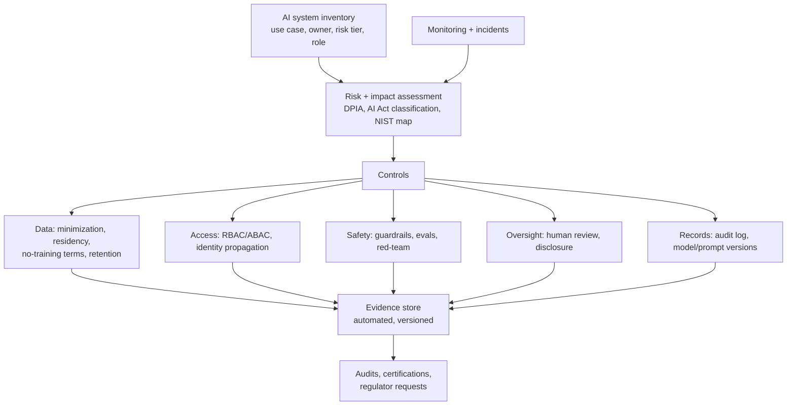

# Compliance

*Last reviewed: October 2026*

!!! info "Not legal advice"
    This page is an engineering map from obligations to controls and evidence. Regulations change and their interpretation depends on your role, sector and jurisdiction. Confirm scope with counsel and your compliance team.

Compliance for GenAI is mostly not new law. Data protection, security attestations and sector rules already apply to any system that processes personal or regulated data, and an LLM pipeline is such a system. What is new is a set of **AI-specific regimes** (the EU AI Act, ISO/IEC 42001, the NIST AI RMF and its Generative AI Profile) that ask for risk management, documentation, transparency and human oversight of the AI itself.

For engineers, the work is the same each time: **know your role, know your data flows, implement controls, and produce evidence continuously** instead of rebuilding it before every audit.

## The landscape in October 2026

### EU AI Act

The AI Act (Regulation (EU) 2024/1689) entered into force on 1 August 2024 and applies in stages. In 2026 the EU adopted a targeted amendment through the "Digital Omnibus" package. It was agreed politically in May 2026, adopted by Parliament and Council in June 2026, and in force before August 2026. It postponed the high-risk deadlines and adjusted several other provisions.

| Date | What applies |
|---|---|
| 2 Feb 2025 | Prohibited practices (Art. 5); AI literacy (Art. 4). The Omnibus softened Art. 4 to a duty to *support* staff AI literacy |
| 2 Aug 2025 | General-purpose AI (GPAI) model obligations for providers; governance and penalty provisions. GPAI models already on the market before this date have until 2 Aug 2027 |
| 2 Aug 2026 | Article 50 transparency obligations (telling people they are interacting with AI, labelling deepfakes and certain AI-generated text); Commission enforcement powers over GPAI providers |
| 2 Dec 2026 | End of the Art. 50(2) machine-readable marking grace period for generative systems placed on the market before 2 Aug 2026; new Omnibus prohibition on AI systems generating non-consensual intimate imagery or CSAM |
| 2 Dec 2027 | High-risk obligations for **Annex III** systems (e.g. employment, credit scoring, essential services, education), postponed from 2 Aug 2026 |
| 2 Aug 2028 | High-risk obligations for **Annex I** systems (AI in products under EU product-safety law), postponed from 2 Aug 2027 |

What matters for a typical enterprise building on foundation models:

- You are usually a **deployer**, and sometimes a **provider** if you put an AI system on the market under your name or substantially modify one. Most heavy GPAI obligations fall on model providers. You will rely on their documentation, for example their adherence to the GPAI Code of Practice.
- A general internal assistant is usually **not high-risk**. The **use case** decides that, not the model. An LLM that screens CVs or decides creditworthiness is in Annex III territory.
- **Article 50 already applies**: chatbots must disclose that they are AI, and synthetic media needs labelling or marking.

### Frameworks and standards

| Framework | What it is | Engineering implication |
|---|---|---|
| **NIST AI RMF 1.0** (Jan 2023) and **NIST AI 600-1 Generative AI Profile** (Jul 2024) | Voluntary risk framework (Govern, Map, Measure, Manage); the profile lists GenAI-specific risks such as confabulation, information integrity and data privacy, with suggested actions | Use it as the risk register structure. NIST has said the AI RMF is being revised under the White House AI Action Plan, so watch for updates |
| **ISO/IEC 42001:2023** | Certifiable AI management system standard (AIMS), structured like ISO 27001 | Policies, AI risk and impact assessments, lifecycle controls (Annex A), internal audit. Pairs with ISO/IEC 23894 (AI risk) and ISO/IEC 42005 (AI system impact assessment) |
| **SOC 2** (AICPA Trust Services Criteria) | Attestation on security, availability, confidentiality, processing integrity, privacy | No AI-specific criteria. Your LLM pipeline is in scope like any other system: access control, change management, logging, vendor management |
| **ISO/IEC 27001:2022** | Information security management system | Same as above; add AI suppliers to supplier controls |
| **GDPR / UK GDPR** | Personal data protection | Lawful basis, minimization, DPIA (Art. 35), rights including erasure, Art. 22 limits on solely automated decisions, processor agreements, international transfers. The EDPB's Opinion 28/2024 addresses AI models and personal data |
| **HIPAA** (US health) | Protects PHI | Business Associate Agreement with every vendor touching PHI, including the model provider, and only on services the vendor lists as HIPAA-eligible. HHS proposed major Security Rule updates in January 2025; the regulatory agenda now targets a final rule in 2027 |
| **Sector rules** (e.g. US bank model-risk guidance SR 11-7, EU DORA for financial ICT risk) | Model governance, third-party ICT risk | Model inventory, validation, ongoing monitoring, exit plans for critical AI vendors |

US state AI laws are changing quickly. Track them through counsel instead of hard-coding assumptions.

## Reference design: controls that serve many regimes



The **AI system inventory** is the piece most organizations lack. Every regime above assumes you know which AI systems you run, what each one is for, who owns it, which models and data it uses, and its risk tier.

## Implementation details

### Obligation-to-control mapping

| Requirement (source) | Control | Evidence an auditor accepts |
|---|---|---|
| Disclose AI interaction (AI Act Art. 50) | UI disclosure; label generated media; C2PA or watermark where applicable | Screenshots, config, release checklist |
| Human oversight (AI Act high-risk, GDPR Art. 22) | Review queue for consequential outputs; override and escalation paths | Workflow logs showing reviewer, decision, timestamp |
| Record-keeping / logging (AI Act high-risk, SOC 2 CC7) | Immutable audit log of runs and decisions | Log samples, retention config, integrity checks |
| Data minimization (GDPR Art. 5) | PII redaction before prompts; scoped retrieval | Redaction tests, DPIA |
| Accuracy and robustness (AI Act high-risk, NIST Measure) | Eval suite, red-team suite, regression gates | Versioned eval reports per release |
| Vendor management (SOC 2, ISO 27001, DORA) | Provider due diligence: data use, retention, region, certifications, sub-processors | Vendor register, DPAs, BAAs |
| Change management (SOC 2 CC8) | Prompts, guardrail configs and model versions deployed through CI/CD with approval | PR history, deployment records |
| Right to erasure (GDPR Art. 17) | Deletable stores; crypto-shredding for logs; re-index on deletion | Erasure runbook and test records |

### Model card / system record (minimum fields)

```yaml
system: finance-copilot
owner: ap-platform-team
purpose: Answer AP policy questions; draft vendor emails (no payments)
ai_act: { role: deployer, risk_tier: limited, art50_disclosure: true }
models: [{ provider: <vendor>, id: <model-id>, region: eu-central-1, training_on_data: false }]
data: { sources: [ap-policies, vendor-master-masked], pii: minimized, residency: EU }
human_oversight: email drafts require user send; no autonomous actions
evals: { suite: ap-qa-v7, last_run: 2026-09-30, groundedness: pass }
dpia: DPIA-2026-114
review_cycle: quarterly
```

Keep these as code next to the application, so the inventory updates when the system changes.

## Failure modes and anti-patterns

!!! warning "Where compliance programs fail"
    - **Classifying the model instead of the use case.** "We use GPT-class models, so we're high-risk" (or "so we're exempt") is the wrong frame.
    - **Point-in-time evidence.** Screenshots gathered the week before an audit, not generated by the pipeline.
    - **Shadow AI.** Teams call public model APIs with customer data outside the platform and the inventory.
    - **Assuming the vendor is compliant for you.** A provider's SOC 2 report or BAA covers its controls, not your configuration.
    - **Human oversight as a rubber stamp.** Reviewers approve 99.8% of items in two seconds. Regulators look at whether oversight is effective.
    - **Ignoring residency for derived data.** Prompts stay in-region but embeddings, caches or traces are exported elsewhere.

## How interviewers probe this

??? question "Is our internal HR assistant high-risk under the EU AI Act?"
    It depends on the use case. A policy Q&A bot is likely limited-risk with Art. 50 disclosure. If it ranks candidates, evaluates performance or influences promotion, it falls within Annex III employment uses, now due 2 December 2027 after the Omnibus. Explain deployer versus provider duties and recommend getting legal confirmation.

??? question "How do you make a GenAI platform audit-ready for SOC 2 and ISO 42001 at the same time?"
    Use one control set mapped to both frameworks. Start from an AI system inventory, then add risk and impact assessments, change management for prompts and models, access control, logging and vendor management. Evidence should be generated automatically by CI/CD and the platform.

??? question "A hospital wants to use a hosted LLM on clinical notes. What do you check first?"
    Check that a BAA is in place and that the specific service is HIPAA-eligible. Confirm data use and retention terms and the region. Use minimum-necessary data, apply access controls and audit, and decide where human review sits. Note that Security Rule updates are pending.

??? question "How do you reconcile 'log everything' with GDPR?"
    Purpose limitation and minimization: log metadata broadly, keep content restricted with short retention, crypto-shred to erase, and document the legal basis in the DPIA. See [Audit Logging](../audit-logging/index.md).

??? question "What does NIST AI 600-1 add over the base AI RMF?"
    It is a profile with GenAI-specific risk categories (confabulation, information integrity, harmful content, data privacy, IP, value chain) and suggested actions mapped to Govern, Map, Measure and Manage. Use it to seed the risk register and the eval plan.

## Checklist

- [ ] AI system inventory with owner, purpose, risk tier and AI Act role
- [ ] DPIA and AI impact assessment for each system with personal data or consequential outputs
- [ ] Art. 50 disclosure and content marking in place
- [ ] Vendor register: data use, retention, region, certifications, DPA or BAA
- [ ] Prompts, models and guardrails under change management
- [ ] Human oversight designed, measured and staffed for consequential decisions
- [ ] Evidence generated automatically and versioned
- [ ] Regulatory tracker owned by legal, reviewed quarterly

## Further reading

- [EU AI Act, Regulation (EU) 2024/1689 (EUR-Lex)](https://eur-lex.europa.eu/eli/reg/2024/1689/oj)
- [European Commission: AI Act policy page](https://digital-strategy.ec.europa.eu/en/policies/regulatory-framework-ai)
- [NIST AI Risk Management Framework](https://www.nist.gov/itl/ai-risk-management-framework)
- [NIST AI 600-1: Generative AI Profile](https://www.nist.gov/publications/artificial-intelligence-risk-management-framework-generative-artificial-intelligence)
- [ISO/IEC 42001:2023](https://www.iso.org/standard/81230.html)
- [HHS: HIPAA Security Rule](https://www.hhs.gov/hipaa/for-professionals/security/index.html)
- [EDPB Opinion 28/2024 on AI models](https://www.edpb.europa.eu/our-work-tools/our-documents/opinion-board-art-64/opinion-282024-certain-data-protection-aspects_en)

## Related

- [Security Architecture](../security-architecture/index.md) · [Audit Logging](../audit-logging/index.md) · [RBAC Model](../rbac/index.md)
- [Security & Governance](../../Documentation/security-governance/index.md)
- [GenAI Procurement Architecture](../../Personal-SourceCode/genai-procurement-architecture.md)
