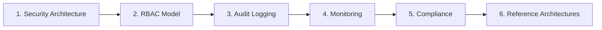

# Enterprise

*Last reviewed: October 2026*

A prototype RAG app or agent can run on a laptop with one API key. Running the same system for 20,000 employees in a bank, insurer, hospital or public agency is a different job. You have to prove who can see which data, show what the agent did and why, keep prompts and responses inside the right boundary, and give auditors evidence they will accept.

This section is for engineers going for **senior, staff and principal** roles where you own that gap: platform engineers building a shared GenAI platform, AI engineers shipping agents into regulated business units, and data or security architects asked to sign off on them. It assumes you already understand RAG, tool calling and agents. The focus is on the controls around them.

After working through it you should be able to:

- Draw a layered security architecture for an LLM platform and say where each OWASP LLM risk is mitigated.
- Design authorization that carries the **end user's** identity through retrieval and tool calls, so the agent never acts with more privilege than the person it serves.
- Specify an audit record for a multi-step agent run that an investigator, or a regulator, can use months later.
- Instrument a GenAI service with OpenTelemetry GenAI conventions and alert on cost, latency, quality and safety.
- Map the EU AI Act, NIST AI RMF, ISO/IEC 42001, SOC 2, HIPAA and GDPR to specific engineering controls and evidence.
- Pick and defend a reference architecture on AWS, Azure, Google Cloud or Snowflake.

## Suggested reading order

1. **Security Architecture** gives you the threat model and trust boundaries. The other pages hang off it.
2. **RBAC Model** covers identity propagation and permission-aware retrieval, which is the control most often missing in real systems.
3. **Audit Logging** covers what you must be able to reconstruct after the fact.
4. **Monitoring & Observability** covers what you watch in real time. Read it right after audit logging, because the two share a pipeline but have different requirements.
5. **Compliance** maps regulations and frameworks to the controls from pages 1 to 4.
6. **Reference Architectures** assembles everything on a specific cloud. Use it last, and when practising whiteboard rounds.

## Pages in this section

-   :material-security: __Security Architecture__

    ---

    Layered controls, trust boundaries, prompt-injection defense and the agent tool gateway, mapped to the OWASP Top 10 for LLM and Agentic Applications.

    [:octicons-arrow-right-24: Security Architecture](security-architecture/index.md)

-   :material-account-key: __RBAC Model__

    ---

    Roles, attributes and relationships for models, data, tools and logs, plus on-behalf-of identity and permission-aware RAG.

    [:octicons-arrow-right-24: RBAC Model](rbac/index.md)

-   :material-file-document-multiple: __Audit Logging__

    ---

    An audit record schema for prompts, retrievals and tool calls, with tamper evidence, retention and the conflict with right-to-erasure.

    [:octicons-arrow-right-24: Audit Logging](audit-logging/index.md)

-   :material-monitor-dashboard: __Monitoring & Observability__

    ---

    OpenTelemetry GenAI spans and metrics, SLOs, cost attribution, online quality signals and the alerts worth paging on.

    [:octicons-arrow-right-24: Monitoring & Observability](monitoring/index.md)

-   :material-scale-balance: __Compliance__

    ---

    The EU AI Act timeline after the 2026 Digital Omnibus, NIST AI RMF, ISO/IEC 42001, SOC 2, HIPAA and GDPR, turned into controls and evidence.

    [:octicons-arrow-right-24: Compliance](compliance/index.md)

-   :material-cloud-braces: __Reference Architectures__

    ---

    Governed RAG and agent blueprints on AWS, Microsoft Foundry, Google Cloud and Snowflake Cortex, with a decision table.

    [:octicons-arrow-right-24: Reference Architectures](reference-architectures/index.md)

## How this shows up in interviews

!!! tip "Where these topics appear"
    - **System design rounds.** "Design an internal assistant over HR and finance documents" is really a question about permission-aware retrieval, audit and data boundaries. Candidates who only draw the RAG pipeline usually stop at senior.
    - **Staff and principal architecture rounds.** Expect pushback such as "Legal says prompts can't leave the EU", "Security wants every tool call approved" or "The auditor asks you to prove the agent never saw salary data". You are judged on trade-offs and evidence, not on product names.
    - **Incident and behavioral rounds.** Expect stories about a prompt-injection near miss, a cost blow-up or a data-leak review. See [Production Incidents](../Personal-SourceCode/Interview_Production_Incidents.md).
    - **Platform-specific loops** for AWS, Azure, GCP or Snowflake partner and FDE roles go deep on the native services on the [Reference Architectures](reference-architectures/index.md) page.

    A strong signal at every level is naming the **enforcement point** for each control: where it runs, what it trusts, and what happens when it fails.

## Related

- [Security & Governance](../Documentation/security-governance/index.md)
- [AI Security: Identity & API Security](../AI-Security/identity-api-security.md)
- [Snowflake Cortex Governance, Cost & Observability](../Snowflake-Cortex/governance-cost-observability.md)
- [Staff / Principal Architect path](../Personal-SourceCode/Path_Staff_Principal_Architect.md)
