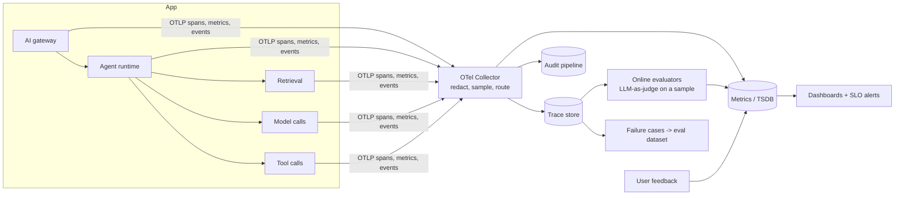

# Monitoring & Observability

*Last reviewed: October 2026*

A GenAI service fails in ways a normal service doesn't. It can return HTTP 200 with a confident, wrong answer. It can stay fast while a prompt change doubles token spend. A retrieval index can go stale and quietly lower answer quality. An agent can loop through tools for four minutes before timing out. Standard RED metrics (rate, errors, duration) are necessary but they don't catch most of these.

Production monitoring for LLM systems therefore has **five signal families**: operational, cost, quality, safety and change. They share one tracing backbone. This page covers the run-time side. For offline evaluation design see [Observability & Eval](../../GenAI-Topics/observability/index.md).

## Reference design



Points to defend in a design review:

- **One trace per user turn**, with child spans for retrieval, every model call, every tool call and guardrail checks. Without this, cost and latency can't be attributed to a step.
- **The Collector is the policy point.** It redacts content, applies tail-based sampling (keep all errors, slow traces and guardrail hits; sample the rest), and routes complete security events to the audit pipeline without sampling.
- **Quality is measured online, on a sample.** Run cheap heuristics on all traffic, and run LLM-as-judge or rubric graders on a sample. Feed bad cases back into the offline eval set.

## OpenTelemetry GenAI semantic conventions

OpenTelemetry defines GenAI conventions for spans, metrics and events. They have since moved out of the main semantic-conventions docs into a dedicated repository, `open-telemetry/semantic-conventions-genai`. Most of the GenAI conventions are still pre-stable, and names have changed between releases. For example, `gen_ai.system` was superseded by `gen_ai.provider.name`. Pin your instrumentation versions and check the spec before you build dashboards on attribute names.

| Kind | Name | Use |
|---|---|---|
| Span attribute | `gen_ai.operation.name` | `chat`, `embeddings`, `execute_tool`, `invoke_agent`, `create_agent`, … |
| Span attribute | `gen_ai.provider.name`, `gen_ai.request.model`, `gen_ai.response.model` | Which provider and model; the response model catches silent aliasing |
| Span attribute | `gen_ai.usage.input_tokens`, `gen_ai.usage.output_tokens` | Cost attribution per span |
| Span attribute | `gen_ai.response.finish_reasons` | Spot truncation (`length`) and filter stops |
| Span attribute | `gen_ai.conversation.id`, `gen_ai.agent.name`, `gen_ai.tool.name` | Group by session, agent and tool |
| Metric | `gen_ai.client.token.usage` | Histogram of tokens, split by `gen_ai.token.type` |
| Metric | `gen_ai.client.operation.duration` | Client-side latency histogram |
| Metric | `gen_ai.server.time_to_first_token`, `gen_ai.server.time_per_output_token` | Streaming latency on self-hosted serving |

Message content (prompts, completions, tool arguments) is **opt-in**. Instrumentations typically gate it behind a flag, for example `OTEL_INSTRUMENTATION_GENAI_CAPTURE_MESSAGE_CONTENT` in the OpenTelemetry Python GenAI instrumentations. Keep it off in production unless content goes to a governed store.

### Collector: strip content before it reaches shared backends

```yaml
processors:
  attributes/strip_genai_content:
    actions:
      - key: gen_ai.input.messages
        action: delete
      - key: gen_ai.output.messages
        action: delete
      - key: gen_ai.system_instructions
        action: delete
  tail_sampling:
    policies:
      - name: errors
        type: status_code
        status_code: { status_codes: [ERROR] }
      - name: slow
        type: latency
        latency: { threshold_ms: 15000 }
      - name: baseline
        type: probabilistic
        probabilistic: { sampling_percentage: 10 }
service:
  pipelines:
    traces/shared:
      receivers: [otlp]
      processors: [attributes/strip_genai_content, tail_sampling, batch]
      exporters: [otlp/apm]
```

Add your own platform attributes alongside the standard ones: `tenant.id`, `app.name`, `prompt.version`, `index.snapshot`, `guardrail.action`, `cost.usd`.

## What to measure and alert on

| Family | Metrics | Alert when |
|---|---|---|
| **Operational** | TTFT p50/p95, total latency, error rate by `error.type`, provider throttling (HTTP 429), timeouts, agent steps per turn | SLO burn rate (multi-window); throttling sustained; steps per turn p95 jumps |
| **Cost** | Tokens and $ per request, user, tenant, app; cache hit rate; cost per *successful* task | Daily spend above forecast; per-user anomaly; cache hit rate drops after a deploy |
| **Quality** | Groundedness or faithfulness score (sampled), citation coverage, thumbs-down rate, retrieval empty-result rate, task success rate for agents | Week-over-week drop beyond threshold; empty retrievals spike (often an index or filter bug) |
| **Safety** | Guardrail interventions by category, prompt-attack detections, PII redactions, tool-policy denials, approval rejections | Sudden surge (attack or bad deploy); a new category appears |
| **Change** | Model ID served, prompt version, index snapshot age, guardrail config version | Unplanned change; index older than freshness SLO |

Two practical rules:

- **Page on symptoms users feel** (latency SLO, error rate, availability). Quality and cost drift go to tickets or daytime alerts unless they are severe. LLM-judge scores are noisy, and paging on them burns out the on-call.
- **Normalize cost by outcome.** "$0.04 per request" is less useful than "$0.31 per resolved ticket". A cheaper prompt that needs three retries isn't cheaper.

### Example SLOs

| SLO | Target (example) | Measured from |
|---|---|---|
| Chat availability | 99.9% of turns return a non-error response | Gateway spans |
| Interactive latency | p95 TTFT < 2 s | `invoke_agent` / `chat` spans |
| Agent completion | 95% of agent tasks finish under the step budget | Agent spans |
| Index freshness | 99% of source changes searchable within 1 h | Ingestion pipeline |

The targets are illustrative. Set yours from measured baselines and product needs.

## Failure modes and anti-patterns

!!! warning "What teams get wrong"
    - **Dashboards with averages only.** LLM latency is long-tailed; use p95 and p99 and split by model and prompt version.
    - **No `response.model`.** A provider alias moves to a new model version and quality shifts with no visible change.
    - **Head-based sampling at 1%**, which throws away almost every rare failure you care about.
    - **Content capture on by default** in a shared APM tool. The observability vendor now holds your customers' PII.
    - **Quality measured only offline.** The eval set passes while production traffic has drifted to topics it doesn't cover.
    - **No canary comparison.** Prompt and model changes go to 100% at once, so you can't separate a regression from noise.
    - **Agent loops are invisible**, because each model call succeeds. Track steps, repeated tool calls and wall-clock time per task.

## How interviewers probe this

??? question "Thumbs-down rate doubled overnight. Latency and errors are flat. How do you debug?"
    Check change signals first: model served, prompt version, index snapshot, guardrail config. Then segment by tenant, topic and channel. Pull sampled traces of thumbs-down turns and compare retrieval results and groundedness scores with a baseline week. Typical causes are a stale or partially rebuilt index, a filter bug returning empty context, or a provider model update.

??? question "How do you attribute LLM cost to teams and customers?"
    Tag every span with tenant, app and cost center at the gateway. Compute cost from token usage and a versioned price table, including cached-token and batch discounts. Reconcile monthly against the provider invoice. Cover showback dashboards, budgets with soft and hard limits, and alerts on anomalies.

??? question "What would you sample, and what must never be sampled?"
    Tail-sample traces: keep errors, slow traces, guardrail hits and negative feedback, and sample the rest. Never sample audit events, policy denials or security detections. Those go through a separate unsampled path.

??? question "How do you monitor quality without labels?"
    Use proxy signals: groundedness and citation checks, LLM-as-judge on a sample against a rubric, retrieval health (empty or low-score results), refusal rate, explicit and implicit feedback (rephrasing, abandonment). Calibrate judges against periodic human review.

??? question "How do you roll out a new model safely?"
    Run an offline eval gate first, then shadow traffic or a canary on a small slice. Compare quality, latency, cost and safety metrics with statistical thresholds. Promote in stages, keep automatic rollback, and pin model versions so the provider can't change them under you.

## Checklist

- [ ] One trace per turn with spans for retrieval, model, tool and guardrail steps
- [ ] OTel GenAI attributes plus tenant, app, prompt version and index snapshot
- [ ] Content capture off in shared backends; redaction in the Collector
- [ ] Tail-based sampling; audit and security events unsampled
- [ ] SLOs for availability, TTFT and agent completion, with burn-rate alerts
- [ ] Cost per outcome, per tenant, with budgets and anomaly alerts
- [ ] Online quality sampling with calibrated judges, and failures fed into the eval set
- [ ] Canary comparison for every model, prompt or index change

## Further reading

- [OpenTelemetry GenAI semantic conventions repository](https://github.com/open-telemetry/semantic-conventions-genai)
- [OpenTelemetry Collector documentation](https://opentelemetry.io/docs/collector/)
- [Google SRE Workbook: Alerting on SLOs](https://sre.google/workbook/alerting-on-slos/)
- [AWS Well-Architected Generative AI Lens](https://docs.aws.amazon.com/wellarchitected/latest/generative-ai-lens/generative-ai-lens.html)

## Related

- [Observability & Eval](../../GenAI-Topics/observability/index.md) · [LLMOps](../../GenAI-Topics/llmops/index.md)
- [Reliability](../../GenAI-Topics/reliability/index.md) · [Cost Optimization](../../GenAI-Topics/cost-optimization/index.md)
- [Audit Logging](../audit-logging/index.md) · [Snowflake Cortex Governance, Cost & Observability](../../Snowflake-Cortex/governance-cost-observability.md)
