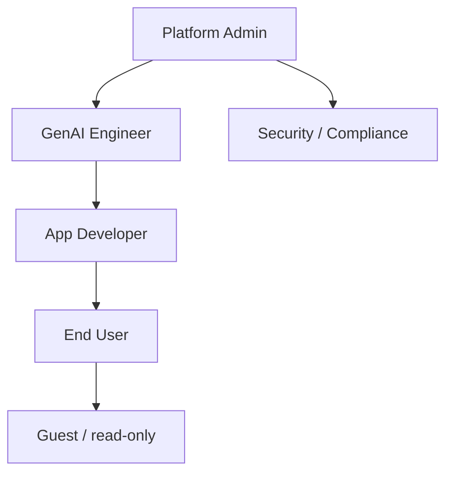

# RBAC Model

Role-Based Access Control for a GenAI platform: who can call which models, see
which data, and use which tools.

## Role hierarchy (example)

## What RBAC governs in GenAI

| Resource | Example permissions |
|----------|--------------------|
| **Models** | Which foundation models a role may invoke; token/cost limits |
| **Data / retrieval** | Which sources, rows, columns a role sees (tenant isolation) |
| **Tools** | Which agent tools a role may trigger (esp. write/actions) |
| **Prompts / configs** | Who can edit system prompts, guardrails, deployments |
| **Logs / traces** | Who can view potentially sensitive prompt/response data |

## Principles

- **Grant to roles, not individuals** — assign users to roles; manage the role.
- **Least privilege + separation of duties** — devs deploy, security reviews;
  no single role does everything sensitive.
- **Propagate identity to retrieval** — the *user's* permissions must constrain
  what RAG returns (row/column security, tenant filter) — not just the app's.
- **Gate actions** — write-capable tools require elevated roles + approval.

## Implementation notes

- Map to your platform: **AWS IAM** roles, **Snowflake** role hierarchies +
  row-access/masking policies, **Databricks Unity Catalog**, **Azure RBAC**.
- Enforce at the **retrieval layer**, not just the UI — otherwise a clever prompt
  can surface unauthorized data.

## Related

- [Security Architecture](../security-architecture/index.md)
  · [Snowflake governance](../../Technologies/snowflake/index.md)
  · [AWS IAM (Interview Q&A)](../../Personal-SourceCode/AWS_Interview_QA.md)
