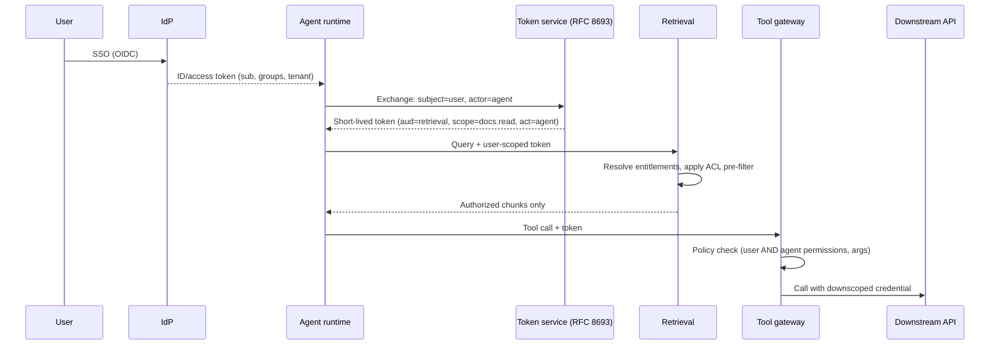

# RBAC Model

*Last reviewed: October 2026*

Authorization for a GenAI platform answers four questions on every request. **Who** is asking, a human, a service, or an agent acting for a human? **Which models** may they use, and with what budget? **Which data** may retrieval return to them? **Which actions** may an agent take for them?

Classic RBAC handles the first two well. The second two are where GenAI systems break. A RAG assistant that searches an index built by a privileged pipeline returns whatever is semantically closest, regardless of who asked. An agent with tools inherits whatever its service account can do. The core rule of this page is:

> **An agent must never be able to do or see more than the human it is acting for, intersected with what the agent itself is allowed to do.**

## Roles, attributes and relationships

Pure RBAC rarely survives contact with enterprise data. In practice you combine three models:

| Model | Good for | GenAI example |
|---|---|---|
| **RBAC** (roles) | Coarse platform permissions | `genai_developer` may deploy prompts to staging; `genai_admin` may change guardrail configs |
| **ABAC** (attributes) | Data classification, region, tenant, purpose | User with `clearance=confidential` and `region=EU` may retrieve chunks tagged `confidential` and `residency=EU` |
| **ReBAC** (relationships) | Document-level sharing that mirrors source systems | User may read a chunk if they can read the source SharePoint, Drive or Confluence page |

Use roles to grant platform capabilities, attributes to scope data, and relationships to keep RAG consistent with source-system ACLs.

### Example platform roles

| Role | Models | Data | Tools | Prompts/configs | Logs and traces |
|---|---|---|---|---|---|
| End user | Approved chat models within quota | Own entitlements only (propagated) | Read tools; write tools with approval | None | Own history |
| App developer | Approved models in dev/staging | Synthetic or masked data in non-prod | Register tools in dev | Edit in dev, propose to prod | Metadata only |
| GenAI platform engineer | All approved models | None by default | Operate the gateway | Promote via change control | Metadata; content via break-glass |
| Security / compliance | None needed | None by default | None | Approve guardrail and policy changes | Full audit, read-only |
| Agent identity (workload) | Models bound to that agent | Intersection with the user it serves | Its declared tool set only | None | None |

Separation of duties: the person who writes a system prompt or a tool policy should not be the only approver of its production rollout. Guardrail and policy configuration is production code.

## Reference design: identity propagation


```mermaid
sequenceDiagram
    participant U as User
    participant IDP as IdP
    participant APP as Agent runtime
    participant STS as Token service (RFC 8693)
    participant RET as Retrieval
    participant TG as Tool gateway
    participant API as Downstream API
    U->>IDP: SSO (OIDC)
    IDP-->>APP: ID/access token (sub, groups, tenant)
    APP->>STS: Exchange: subject=user, actor=agent
    STS-->>APP: Short-lived token (aud=retrieval, scope=docs.read, act=agent)
    APP->>RET: Query + user-scoped token
    RET->>RET: Resolve entitlements, apply ACL pre-filter
    RET-->>APP: Authorized chunks only
    APP->>TG: Tool call + token
    TG->>TG: Policy check (user AND agent permissions, args)
    TG->>API: Call with downscoped credential
```

The key pieces:

- **On-behalf-of token exchange.** OAuth 2.0 Token Exchange (RFC 8693) issues a token whose subject is the user and whose `act` claim names the agent. Downstream services can then authorize the intersection and log both identities. Entra ID's on-behalf-of flow, Amazon Bedrock AgentCore Identity and Google's Agent Identity in the Gemini Enterprise Agent Platform are platform implementations of the same idea.
- **Agents are first-class principals.** Give each agent its own workload identity, never a person's credentials or a shared key. The agent's identity caps what it may do, even for an administrator user.
- **Downscoped, short-lived credentials** per call, minted at the gateway. The model never handles tokens.

## Implementation details

### Permission-aware retrieval

Pre-filter **inside the search query**, not after it:

```python
# Resolve once per request, cache briefly (minutes), never per index build
principals = entitlements.resolve(user_id)   # user id + group ids + tenant
filter = {
    "and": [
        {"tenant_id": {"eq": user.tenant_id}},
        {"acl_principals": {"in": principals}},
        {"classification": {"in": user.allowed_classifications}},
    ]
}
hits = vector_store.search(query_embedding, top_k=20, filter=filter)
```

Decision table for where to enforce:

| Situation | Approach |
|---|---|
| Few large tenants, strict isolation | Separate index or namespace per tenant, plus filter |
| Many small tenants | Shared index with a mandatory tenant filter added by the retrieval service (never by the caller) |
| Document-level ACLs from source systems | Store ACL principals as chunk metadata and sync on permission change, not only on content change |
| Data already governed in a warehouse | Retrieve through the warehouse so row access and masking policies apply (e.g. Snowflake, Databricks Unity Catalog) |
| Very dynamic permissions | Pre-filter on coarse attributes, then check fine-grained access per candidate against the source of truth before generation |

### Warehouse-native enforcement (Snowflake example)

```sql
CREATE ROW ACCESS POLICY rap_region AS (region STRING) RETURNS BOOLEAN ->
  EXISTS (
    SELECT 1 FROM security.user_regions ur
    WHERE ur.role_name = CURRENT_ROLE() AND ur.region = region
  );

ALTER TABLE support.tickets ADD ROW ACCESS POLICY rap_region ON (region);
```

If a Cortex Search service or agent runs with the **caller's** role, these policies apply to the LLM path exactly as they do to BI. If it runs with an owner's role, they do not. Check which execution context your service uses. The same reasoning applies to Unity Catalog row filters and column masks.

### Tool permissions (OPA/Rego, illustrative)

```rego
package agent.tools

default allow := false

allow if {
  input.tool == "crm.update_contact"
  "sales_rep" in input.user.roles
  input.agent.id in data.agents_allowed["crm.update_contact"]
  input.args.account_owner == input.user.id
}
```

Give tools **scopes**, not just names: `crm.read`, `crm.update_own`, `crm.update_any`. Map scopes to roles, and require approval for scopes marked irreversible.

### Model and budget permissions

Enforce at the AI gateway: an allow-list of model IDs per role or app, per-user and per-tenant token quotas, and a maximum context size. Tag requests with cost-center attributes so spend can be charged back. See [Monitoring](../monitoring/index.md).

## Failure modes and anti-patterns

!!! warning "What goes wrong in real systems"
    - **Index built with a superuser, queried without filters.** This is the classic RAG data leak. The UI hides nothing, because the leak is in the answer text.
    - **ACLs synced only at ingestion.** Someone loses access to a folder, and the assistant keeps quoting it for weeks.
    - **Filters supplied by the client.** If the front end sends `tenant_id`, an attacker can change it. The retrieval service must derive filters from the verified token.
    - **Semantic caches shared across users.** A cached answer built from user A's documents is served to user B. Scope cache keys by entitlement set, or cache only retrieval-free responses.
    - **Agent memory without ownership.** Long-term memory written in one user's session is retrieved in another's.
    - **Role explosion.** Hundreds of `rag_reader_<dept>_<project>` roles. Move to attributes or relationships.
    - **Logs and traces readable by everyone.** Traces contain retrieved chunks. Access to traces needs the same governance as access to the data.

## How interviewers probe this

??? question "A user asks the HR assistant, 'What is my manager's salary?' Walk me through why it can't answer."
    The assistant's identity has no blanket HR access. Retrieval runs with the user's token, so compensation documents are filtered out before ranking. If the structured HR API is a tool, its policy allows only the caller's own record. Output DLP is a backstop. Mention that the attempt is audited.

??? question "How do you keep permissions in the vector store consistent with SharePoint or Google Drive?"
    Store ACL principals per chunk. Subscribe to permission-change events, or run frequent permission-only syncs separate from content re-embedding. Resolve group membership at query time. For high-sensitivity sources, recheck against the source API before generation. Mention a measured staleness SLO.

??? question "An admin uses the agent. Does the agent get admin powers?"
    No. Effective permission is the intersection of the user's and the agent's permissions. Admin-only actions require explicit elevation with approval and are logged with both identities. This prevents the confused-deputy problem.

??? question "RBAC or ABAC for a multi-tenant GenAI platform?"
    Both. RBAC for platform capabilities, and ABAC (tenant, classification, region, purpose) for data and retrieval. Explain the role-explosion risk of pure RBAC, and where ReBAC fits for document sharing.

??? question "How do you test that authorization works?"
    Cover a seeded test corpus with known ACLs, automated cross-tenant and cross-role probes that run in CI, and red-team prompts that try to extract restricted content. Add policy unit tests (OPA/Cedar) and production canaries that alert on any cross-tenant retrieval.

## Checklist

- [ ] Every agent has its own workload identity; no shared keys or human credentials
- [ ] User identity propagated with on-behalf-of tokens; downstream logs both subject and actor
- [ ] Retrieval filters derived server-side from verified claims and applied before ranking
- [ ] Source ACL changes reach the index within a defined SLO
- [ ] Tool scopes defined; write and irreversible scopes need elevated roles and approval
- [ ] Model allow-lists and token quotas per role, app and tenant
- [ ] Caches and agent memory scoped by user or entitlement set
- [ ] Access to traces and prompt logs governed like the underlying data
- [ ] Authorization regression tests in CI

## Further reading

- [RFC 8693: OAuth 2.0 Token Exchange](https://www.rfc-editor.org/rfc/rfc8693)
- [NIST SP 800-162: Guide to ABAC](https://csrc.nist.gov/pubs/sp/800/162/upd2/final)
- [Snowflake row access policies](https://docs.snowflake.com/en/user-guide/security-row-intro)
- [Open Policy Agent documentation](https://www.openpolicyagent.org/docs/latest/)
- [Cedar policy language](https://www.cedarpolicy.com/)
- [Amazon Bedrock AgentCore Developer Guide](https://docs.aws.amazon.com/bedrock-agentcore/latest/devguide/what-is-bedrock-agentcore.html)

## Related

- [Security Architecture](../security-architecture/index.md) · [Audit Logging](../audit-logging/index.md)
- [AgentCore Identity & Gateway](../../AI-Security/agentcore-identity-gateway.md)
- [Snowflake governance](../../Technologies/snowflake/index.md) · [Snowflake Cortex Governance](../../Snowflake-Cortex/governance-cost-observability.md)
- [AWS IAM (Interview Q&A)](../../Personal-SourceCode/AWS_Interview_QA.md)
