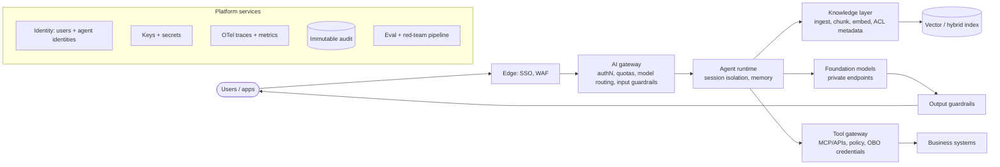

# Reference Architectures

*Last reviewed: October 2026*

Every enterprise RAG or agent platform has the same logical shape. The cloud only changes the product names and where the hard edges are. Learn the logical architecture first, then map it to each platform. In an interview you will usually be asked for the logical design before anyone cares which vector store you picked.

## The logical architecture



The components that separate an enterprise design from a demo are the **AI gateway**, the **tool gateway**, **agent identities** and the **audit and eval pipelines**. Detail on each is in [Security Architecture](../security-architecture/index.md), [RBAC](../rbac/index.md), [Audit Logging](../audit-logging/index.md) and [Monitoring](../monitoring/index.md).

## Platform mappings

!!! note "Names change quickly"
    All four vendors renamed or restructured their AI platforms during 2025 and 2026. Microsoft renamed Azure AI Foundry to **Microsoft Foundry**. Google introduced the **Gemini Enterprise Agent Platform** at Cloud Next in April 2026 as the evolution of Vertex AI, and many APIs and SDKs still use `vertexai` names. AWS added **Bedrock AgentCore**, and Snowflake added **Cortex Agents** and **Snowflake Intelligence**. Check current documentation for preview and GA status in your region.

=== "AWS"

    ```mermaid
    flowchart LR
        U([User]) --> CF[CloudFront + WAF]
        CF --> APIGW[API Gateway / ALB<br/>Cognito or IdP]
        APIGW --> RT[AgentCore Runtime]
        RT --> KB[Bedrock Knowledge Bases]
        KB --> VEC[(OpenSearch Serverless / Aurora pgvector / S3 Vectors)]
        RT --> BR[Bedrock models<br/>via VPC endpoint]
        BR --> GR[Bedrock Guardrails]
        RT --> GW[AgentCore Gateway + Policy]
        GW --> TOOLS[Lambda / APIs / MCP servers]
        ID[AgentCore Identity] -.-> RT
        ID -.-> GW
        RT -.-> OBS[AgentCore Observability / CloudWatch]
        BR -.-> LOG[Invocation logging -> S3 Object Lock]
    ```

    | Layer | Service |
    |---|---|
    | Models | Amazon Bedrock (first- and third-party models), cross-region inference profiles where residency allows |
    | Retrieval | Bedrock Knowledge Bases, metadata filtering for ACLs; OpenSearch, Aurora pgvector or S3 Vectors |
    | Agents | Bedrock AgentCore, a set of modular services that includes Runtime, Memory, Gateway, Identity, Policy (GA March 2026, Cedar-based), Code Interpreter, Browser, Observability, Evaluations and Registry |
    | Guardrails | Bedrock Guardrails: content filters, prompt attacks, denied topics, word filters, sensitive information filters, contextual grounding, Automated Reasoning checks. Also usable standalone via the `ApplyGuardrail` API |
    | Security | IAM, KMS, Secrets Manager, PrivateLink VPC endpoints, SCPs to restrict models and regions |
    | Evidence | CloudTrail (control plane), Bedrock invocation logging, S3 Object Lock |

    **Watch for:** cross-region inference profiles can route requests to other regions in the same geography. Confirm this matches your residency commitments.

=== "Azure"

    ```mermaid
    flowchart LR
        U([User]) --> FD[Front Door + WAF]
        FD --> APIM[API Management<br/>AI gateway: token limits, routing]
        APIM --> AG[Foundry Agent Service]
        AG --> AIS[(Azure AI Search<br/>hybrid + vector, security filters)]
        AG --> FM[Foundry Models<br/>incl. Azure OpenAI, private endpoint]
        FM --> CS[Guardrails / Content Safety<br/>Prompt Shields]
        AG --> TOOLS[MCP servers / Functions / Logic Apps]
        ENT[Entra ID + agent identities] -.-> AG
        AG -.-> AI[Application Insights / Azure Monitor]
        PV[Purview] -.-> AIS
    ```

    | Layer | Service |
    |---|---|
    | Models | Microsoft Foundry Models, including Azure OpenAI; regional or data-zone deployments for residency |
    | Retrieval | Azure AI Search (hybrid, semantic ranking, security-trimming filters) |
    | Agents | Foundry Agent Service: per-agent Entra identities, MCP tools, private networking, tracing to Application Insights |
    | Guardrails | Foundry guardrails and content filters built on Azure AI Content Safety, including Prompt Shields for direct and indirect (cross-prompt) injection |
    | Gateway | Azure API Management AI gateway policies: token rate limits, load balancing across deployments, semantic caching |
    | Security | Entra ID RBAC and on-behalf-of flow, Key Vault, Private Link, Azure Policy, Microsoft Purview for data governance |

    **Watch for:** global deployment types can process requests outside your chosen region. Pick regional or data-zone deployments when residency matters.

=== "Google Cloud"

    ```mermaid
    flowchart LR
        U([User]) --> LB[Cloud Load Balancing + Cloud Armor]
        LB --> RUN[Cloud Run / GKE<br/>IAP or IdP]
        RUN --> AR[Agent Runtime<br/>ADK agents]
        AR --> VS[(Vector Search / RAG Engine / AlloyDB)]
        AR --> GEM[Gemini + Model Garden models]
        AR --> AGW[Agent Gateway<br/>+ Model Armor]
        AGW --> TOOLS[MCP / APIs / A2A agents]
        AID[Agent Identity] -.-> AR
        AR -.-> OBS[Cloud Trace / Logging / Monitoring]
        VPCSC[VPC Service Controls] -.-> GEM
    ```

    | Layer | Service |
    |---|---|
    | Platform | Gemini Enterprise Agent Platform (evolution of Vertex AI): Build, Scale, Govern, Optimize |
    | Models | Gemini models and Model Garden partner and open models |
    | Retrieval | Vector Search, RAG Engine, or AlloyDB / BigQuery vector search for governed data |
    | Agents | Agent Development Kit (ADK), Agent Runtime, Memory Bank |
    | Governance | Agent Identity (per-agent cryptographic identity), Agent Gateway (policy between agents and tools; check release status), Model Armor (prompt injection, tool poisoning, sensitive data leakage) |
    | Security | Cloud IAM, VPC Service Controls perimeters, CMEK, Private Service Connect, organization policies restricting models and locations |
    | Evidence | Cloud Audit Logs (enable Data Access logs explicitly), Cloud Logging buckets with retention locks |

    **Watch for:** Data Access audit logs are off by default for most services. Turn them on for AI services in scope.

=== "Snowflake"

    ```mermaid
    flowchart LR
        U([User]) --> SI[Snowflake Intelligence / Streamlit / API]
        SI --> CAG[Cortex Agents]
        CAG --> CSS[Cortex Search<br/>unstructured RAG]
        CAG --> CAN[Cortex Analyst<br/>semantic views -> SQL]
        CSS --> DATA[(Governed tables + stages)]
        CAN --> DATA
        CAG --> AISQL[Cortex AISQL functions / LLMs]
        GRD[Cortex AI Guardrails] -.-> CAG
        HZN[Horizon: RBAC, row access, masking, tags] -.-> DATA
        CAG -.-> OBS[AI observability + account usage]
    ```

    | Layer | Service |
    |---|---|
    | Models | Cortex LLM functions and AISQL (e.g. `AI_COMPLETE`) on models hosted inside Snowflake's boundary |
    | Retrieval | Cortex Search (hybrid search over text), Cortex Analyst for text-to-SQL over semantic views |
    | Agents | Cortex Agents orchestrate Search, Analyst and custom tools; Snowflake Intelligence is the end-user surface |
    | Guardrails | Cortex AI Guardrails (GA April 2026, run-time prompt-injection and jailbreak protection) |
    | Governance | Existing RBAC, row access and masking policies, tags, access history: the LLM path inherits them when it runs with the caller's rights |
    | Evidence | Account usage views for Cortex consumption, access history, query history |

    **Watch for:** the account parameter `CORTEX_ENABLED_CROSS_REGION` controls whether Cortex can route inference to other regions. Snowflake's 2026_06 behavior-change bundle sets a geography-scoped default (for example `AWS_EU`) for accounts that have never set the parameter, with some regulated account types excluded. Set it explicitly at the account level, either `DISABLED` or the geography you have approved, rather than relying on the default.

## Choosing a platform

| Situation | Lean | Why |
|---|---|---|
| Workloads and data already on AWS; need model choice | **AWS Bedrock + AgentCore** | Broad model catalog, IAM-native, managed agent runtime and tool policy |
| Microsoft 365 / Entra estate; OpenAI models; Copilot integration | **Microsoft Foundry** | Entra identity end to end, APIM AI gateway, Purview |
| BigQuery-centric analytics; Gemini; Google Workspace | **Gemini Enterprise Agent Platform** | Gemini models, agent identity and gateway, VPC Service Controls |
| Governed data lives in Snowflake; no-egress requirement | **Snowflake Cortex** | Inference next to governed data; existing policies apply |
| Multi-cloud or strict portability | Cloud-neutral runtime (e.g. LangGraph on Kubernetes) + gateway + OTel | You give up managed security features for portability; budget for building them |

Hybrid is common: governed analytics on Snowflake or Databricks, plus agents on a hyperscaler calling them through a tool gateway. The design question is **where identity and policy are enforced** at each hop.

## Failure modes and anti-patterns

!!! warning "Architecture smells"
    - **Choosing by model leaderboard alone.** Identity, network isolation, residency and evidence usually matter more for an enterprise than a few benchmark points.
    - **Managed agent runtime without a tool policy layer.** The runtime is isolated, but the agent can still call anything its role allows.
    - **A vector store outside the governance perimeter.** Data is copied from a governed warehouse into an unmanaged index with none of its policies.
    - **Assuming "in-account" means "in-region"** without checking cross-region routing settings.
    - **Building on preview services** for regulated production without an exit plan.

## How interviewers probe this

??? question "Design an enterprise knowledge assistant on AWS for 30,000 employees across the EU and US."
    Cover SSO, an AI gateway with per-user quotas, regional deployments for EU and US data, Knowledge Bases with ACL metadata filters, Guardrails, AgentCore Identity and Gateway for tools, invocation logging to Object Lock buckets, and OTel tracing. Then the trade-offs: per-region indexes against a global index, and how ACL sync works.

??? question "Why would you put an LLM workload inside Snowflake instead of calling a hyperscaler model?"
    Governance comes for free: row access and masking policies apply, no data copy or egress, one bill. Costs: smaller model and tool catalog, credit-based pricing and less control over serving. Mention the cross-region inference setting.

??? question "The bank's security team will only approve one entry point for all model traffic. Draw it."
    An AI gateway (APIM, a self-hosted gateway, or an equivalent) with authentication, model allow-list, quotas, input guardrails, logging and routing to regional endpoints. Direct provider access is blocked with org policies and network rules. Explain how agents' tool calls go through a separate tool gateway.

??? question "How would you make this portable across clouds?"
    Use an open agent framework, OTel conventions, MCP for tools, an abstraction at the gateway, and data contracts for retrieval. Be honest about what you give up: managed identity, guardrails and evaluations, which you then have to build or buy.

## Checklist

- [ ] Logical architecture agreed before choosing services
- [ ] Single AI gateway for model traffic; direct access blocked
- [ ] Tool gateway with policy and on-behalf-of credentials
- [ ] Residency verified for inference, embeddings, caches, traces and logs
- [ ] Guardrails on input and output; prompt-attack detection for indirect injection
- [ ] Audit evidence in immutable storage; OTel traces
- [ ] Preview-service dependencies listed, with exit plans

## Further reading

- [Amazon Bedrock AgentCore Developer Guide](https://docs.aws.amazon.com/bedrock-agentcore/latest/devguide/what-is-bedrock-agentcore.html)
- [AWS Well-Architected Generative AI Lens](https://docs.aws.amazon.com/wellarchitected/latest/generative-ai-lens/generative-ai-lens.html)
- [Microsoft Foundry Agent Service overview](https://learn.microsoft.com/azure/foundry/agents/overview)
- [Azure AI Content Safety](https://learn.microsoft.com/azure/ai-services/content-safety/overview)
- [Google Cloud: The new Gemini Enterprise Agent Platform](https://cloud.google.com/blog/products/ai-machine-learning/the-new-gemini-enterprise-one-platform-for-agent-development/)
- [Google Cloud Model Armor](https://cloud.google.com/security/products/model-armor)
- [Snowflake Cortex Agents](https://docs.snowflake.com/en/user-guide/snowflake-cortex/cortex-agents)
- [Snowflake Cortex Search](https://docs.snowflake.com/en/user-guide/snowflake-cortex/cortex-search/cortex-search-overview)

## Related

- [Architecture Overview](../../Documentation/architecture-overview/index.md) · [Bedrock](../../GenAI-Topics/bedrock/index.md) · [AgentCore](../../GenAI-Topics/agentcore/index.md)
- [Snowflake](../../Technologies/snowflake/index.md) · [Snowflake Cortex](../../Snowflake-Cortex/index.md) · [Databricks](../../Technologies/databricks/index.md)
- [Security Architecture](../security-architecture/index.md) · [AWS Interview Q&A](../../Personal-SourceCode/AWS_Interview_QA.md)
