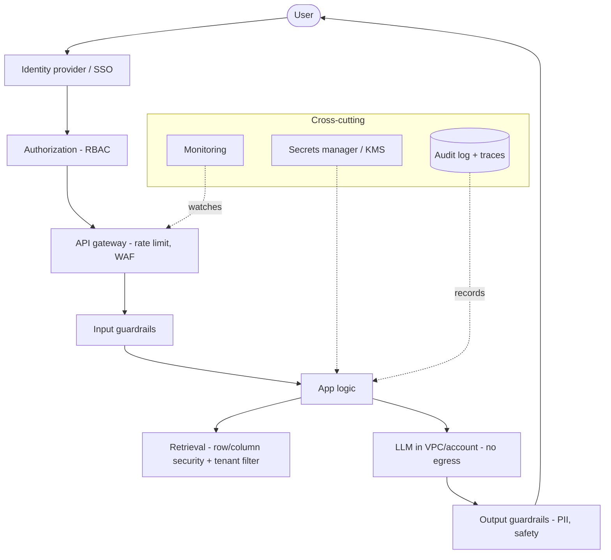

# Security Architecture

A layered security model for an enterprise GenAI platform — every request passes
through identity, guardrails, governed retrieval, in-boundary inference, and
audit.

## Trust boundaries

| Boundary | Control |
|----------|---------|
| **User → app** | SSO/OIDC, MFA, session management |
| **App → data** | RBAC, row/column security, tenant isolation |
| **App → model** | In-VPC/in-account inference, no data egress |
| **Model → output** | Guardrails: PII redaction, safety, format |
| **Everywhere** | Secrets in a vault (KMS/Secrets Manager), TLS, audit |

## Principles

- **Zero trust** — authenticate and authorize every call; assume breach.
- **Least privilege** — scope data, model, and tool access to the minimum.
- **Data stays in-boundary** — prefer Bedrock (in-account), Snowflake Cortex,
  Databricks — inference where the data is governed.
- **Untrusted content** — treat retrieved/user text as data, never instructions
  (prompt-injection defense).
- **Defense in depth** — input + output guardrails, not one gate.

## Related

- [Security & Governance](../../Documentation/security-governance/index.md)
  · [RBAC](../rbac/index.md) · [Audit Logging](../audit-logging/index.md)
  · [AWS Interview Q&A](../../Personal-SourceCode/AWS_Interview_QA.md)
