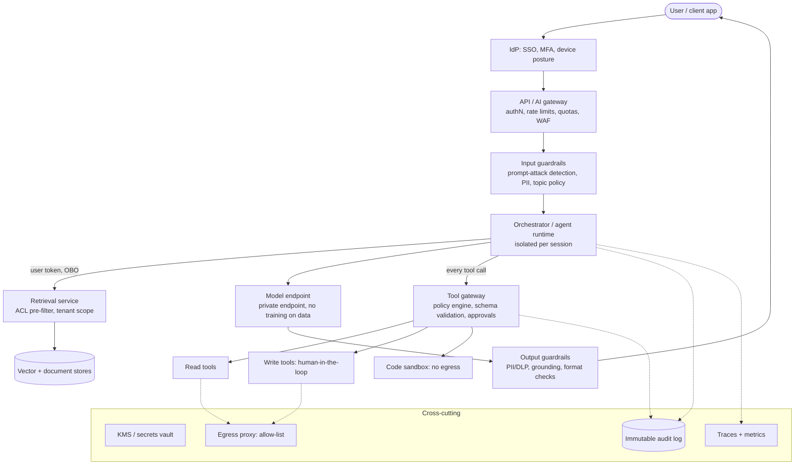

# Security Architecture

*Last reviewed: October 2026*

A GenAI platform is a normal distributed system with one awkward property: **its control plane and data plane share a channel.** Instructions (system prompt, user request) and data (retrieved documents, tool results, emails, web pages) reach the model as one stream of tokens, and the model cannot reliably tell them apart. Every security decision on this page follows from that.

The practical consequence is that you **cannot make the model secure, only the system around it.** Assume the model can be talked into anything. Then make sure that anything it is talked into is bounded by identity, authorization, network boundaries and deterministic checks that run outside the model.

## Threat model

Use the OWASP lists as your shared vocabulary with security teams. The **OWASP Top 10 for LLM Applications 2025** covers model-centric risks. The **OWASP Top 10 for Agentic Applications for 2026** (published December 2025, IDs ASI01 to ASI10) covers what changes when the model can plan, remember and act.

!!! note "Edition check"
    OWASP's GenAI Security Project reportedly released a 2026 edition of the LLM Top 10 in August 2026, with reordered entries. Industry write-ups say Excessive Agency moved up and System Prompt Leakage was broadened into "Hidden Context Exposure". The IDs below are from the 2025 edition. Check [genai.owasp.org](https://genai.owasp.org/llm-top-10/) for the current numbering before you quote IDs in a document.

| Risk (OWASP ID) | What it looks like in a GenAI system | Primary control (outside the model) |
|---|---|---|
| Prompt injection (LLM01) / Agent goal hijack (ASI01) | Instructions hidden in a retrieved PDF, email or web page redirect the agent | Privilege separation, tool gateway policy, human approval for high-impact actions |
| Sensitive information disclosure (LLM02) | RAG returns a document the user may not read; the model echoes PII | Permission-aware retrieval, output DLP/PII filters |
| Supply chain (LLM03) / Agentic supply chain (ASI04) | Unvetted model weights, poisoned fine-tune data, a malicious or drifting MCP server | Model and tool allow-lists, pinned versions, signed artifacts, AI-BOM |
| Improper output handling (LLM05) | Model output rendered as HTML, run as SQL or passed to a shell | Treat output as untrusted input: encode, parameterize, sandbox |
| Excessive agency (LLM06) / Tool misuse (ASI02) | Agent has a write-capable tool it never needed | Least-privilege tool scopes, per-action authorization |
| System prompt leakage (LLM07) | Secrets or business rules placed in the prompt are extracted | Never put secrets in prompts; assume the prompt is public |
| Vector and embedding weaknesses (LLM08) | Cross-tenant vectors in one index; embeddings inverted to recover text | Per-tenant indexes or mandatory filters, encryption, access control on the store |
| Identity and privilege abuse (ASI03) | Agent runs as a shared service account with admin rights | On-behalf-of identity, short-lived scoped tokens |
| Unexpected code execution (ASI05) | Code-interpreter tool reaches the network or host | Ephemeral sandbox, no egress, resource limits |
| Memory and context poisoning (ASI06) | Attacker plants an instruction in long-term memory that fires later | Memory write policies, provenance tags, expiry, review |
| Unbounded consumption (LLM10) | Agent loops, token floods, denial-of-wallet | Step and token budgets, rate limits, circuit breakers |

## Reference design


```mermaid
flowchart TB
    U([User / client app]) --> IDP[IdP: SSO, MFA, device posture]
    IDP --> GW[API / AI gateway<br/>authN, rate limits, quotas, WAF]
    GW --> IN[Input guardrails<br/>prompt-attack detection, PII, topic policy]
    IN --> ORCH[Orchestrator / agent runtime<br/>isolated per session]
    ORCH -->|user token, OBO| RET[Retrieval service<br/>ACL pre-filter, tenant scope]
    RET --> VS[(Vector + document stores)]
    ORCH --> LLM[Model endpoint<br/>private endpoint, no training on data]
    ORCH -->|every tool call| TG[Tool gateway<br/>policy engine, schema validation, approvals]
    TG --> T1[Read tools]
    TG --> T2[Write tools: human-in-the-loop]
    TG --> SB[Code sandbox: no egress]
    LLM --> OUT[Output guardrails<br/>PII/DLP, grounding, format checks]
    OUT --> U
    subgraph Cross-cutting
      KMS[KMS / secrets vault]
      AUD[(Immutable audit log)]
      OBS[Traces + metrics]
      EG[Egress proxy: allow-list]
    end
    ORCH -.-> AUD
    TG -.-> AUD
    ORCH -.-> OBS
    T1 -.-> EG
    T2 -.-> EG
```

Three design decisions carry most of the weight:

1. **The tool gateway is the real security boundary for agents.** The model proposes an action, and a deterministic policy engine decides. The engine sees the authenticated user, the agent identity, the tool, the arguments and the session context. Managed versions of this pattern exist, for example Amazon Bedrock AgentCore Gateway with AgentCore Policy, which reached general availability in March 2026 and uses Cedar policies evaluated outside the agent loop. Google's Agent Gateway and the Microsoft Foundry Agent Service tool controls are the equivalents on those clouds.
2. **Identity flows end to end.** The orchestrator passes the user's identity, or a token exchanged on the user's behalf, to retrieval and tools. It does not use a platform superuser. See [RBAC Model](../rbac/index.md).
3. **Guardrails are layered but are not the boundary.** Classifiers for prompt attacks and PII reduce risk, but they are probabilistic. Design as if they will miss some attacks.

## Implementation details

### Tool authorization policy (Cedar-style, illustrative)

```text
// Agents may read invoices only for the tenant of the user they act for.
permit (
  principal is Agent,
  action == Action::"invoices.read",
  resource is Invoice
) when {
  context.onBehalfOf.tenantId == resource.tenantId &&
  context.onBehalfOf.roles.contains("finance_viewer")
};

// Payments above a threshold always need an explicit human approval.
forbid (
  principal is Agent,
  action == Action::"payments.create",
  resource
) when {
  context.args.amount > 1000 && !context.humanApproval.granted
};
```

Write policies against the **tool arguments**, not only the tool name. "Can call `send_email`" is far weaker than "can send email only to internal domains, with no attachments from restricted folders".

### Prompt-injection controls that actually help

| Control | Effect | Limitation |
|---|---|---|
| Privilege separation (a planner that sees untrusted content cannot call write tools directly) | Bounds blast radius | More complex orchestration |
| Spotlighting / delimiting untrusted content | Lowers success rate | Not a guarantee |
| Prompt-attack classifiers (e.g. Bedrock Guardrails prompt attacks, Azure Prompt Shields, Google Model Armor, Snowflake Cortex AI Guardrails) | Catches known patterns, including indirect injection in documents | Probabilistic; adds latency |
| Human approval on irreversible actions | Strong | Approval fatigue if overused |
| Egress allow-list on tools and sandbox | Stops exfiltration via URLs or webhooks | Needs maintenance |
| Rendering controls (no auto-loading of model-generated image URLs or links) | Closes the markdown-image exfiltration channel | UX trade-off |

### Network and data boundary

- Reach model endpoints over private connectivity (AWS PrivateLink VPC endpoints, Azure Private Link, Google Private Service Connect). Block public endpoints with an organization policy.
- Confirm in the provider terms that prompts and completions are **not used for training** and check how long, and where, they are retained for abuse monitoring. Record the answer in your vendor register.
- Encrypt vector stores and prompt caches with customer-managed keys. Embeddings are derived data and get the classification of their source.
- Keep secrets in a vault and inject them at the tool layer. The model never sees credentials.

## Failure modes and anti-patterns

!!! warning "Patterns that fail security review"
    - **One service account for everything.** The agent can read every document the platform can, so retrieval ACLs become decoration.
    - **"The system prompt says don't do X."** That is not a control. Anything enforced only in the prompt will eventually be bypassed.
    - **Post-filtering after top-k.** Retrieving across all tenants and then dropping unauthorized chunks leaks through timing, counts and summaries, and it starves recall.
    - **Unpinned MCP servers.** A remote tool whose description or behavior changes silently can rewrite the agent's instructions (tool poisoning).
    - **Model output piped into `eval`, SQL or a shell** without parameterization or a sandbox.
    - **Full prompts and responses in general-purpose logs** readable by every engineer. The observability stack becomes the breach.
    - **No budget limits.** One looping agent can exhaust a monthly quota in an afternoon.

## How interviewers probe this

??? question "An agent reads customer emails and can issue refunds. How do you stop an email from making it refund an attacker?"
    Strong answers do not depend on detecting the injection. They cover: refunds go through a tool gateway with a policy tied to the case's verified customer and an amount cap; above the cap, a human approves; the component that reads raw email content cannot call the refund tool directly (privilege separation); and every proposed and executed action is audited. Classifiers are mentioned as a secondary layer.

??? question "Where exactly is the trust boundary in your RAG system?"
    Name each one: user to gateway (authentication), orchestrator to retrieval (user-scoped authorization), orchestrator to model (private network, provider data terms), model to tools (policy engine), and output to user (DLP, rendering rules). Explain what each side trusts and what is untrusted. Retrieved content is always untrusted.

??? question "How do you secure third-party MCP servers your teams want to use?"
    Cover a registry and allow-list, version pinning, and review of tool descriptions as code. Add per-server credentials with minimal scopes, egress restrictions, gateway mediation so policy and audit apply, and monitoring for changes in tool schemas.

??? question "Security wants all prompts logged; privacy wants none. What do you build?"
    Cover a split pipeline. Metadata and hashes go to broad observability. Full content goes to a restricted, encrypted store with short retention, purpose-limited access and break-glass auditing. Redact before storage where you can. Connect this to [Audit Logging](../audit-logging/index.md).

??? question "Your guardrail vendor claims a 99% prompt-injection block rate. How does that change your design?"
    It doesn't change the boundary. Ask what dataset the number was measured on, and remember that adaptive attackers are not a benchmark. Keep deterministic controls on high-impact actions, and use the classifier for detection, telemetry and to lower risk on low-impact paths.

## Checklist

- [ ] Threat model mapped to the OWASP LLM and Agentic Top 10, reviewed each release
- [ ] End-user identity propagated to retrieval and tools; no shared superuser
- [ ] Tool gateway with argument-level policies, log-only mode before enforcement
- [ ] Human approval on irreversible or high-value actions
- [ ] Private connectivity to models; provider no-training and retention terms recorded
- [ ] Code execution sandboxed with no network egress
- [ ] Token, step and cost budgets per request, user and tenant
- [ ] Prompt and response content stored separately from general logs, with restricted access
- [ ] Red-team suite (direct and indirect injection) run in CI and before model upgrades

## Further reading

- [OWASP Top 10 for LLM Applications](https://genai.owasp.org/llm-top-10/)
- [OWASP Top 10 for Agentic Applications for 2026](https://genai.owasp.org/resource/owasp-top-10-for-agentic-applications-for-2026/)
- [NIST AI 600-1: Generative AI Profile](https://www.nist.gov/publications/artificial-intelligence-risk-management-framework-generative-artificial-intelligence)
- [MITRE ATLAS](https://atlas.mitre.org/)
- [Amazon Bedrock Guardrails components](https://docs.aws.amazon.com/bedrock/latest/userguide/guardrails-components.html)
- [Cedar policy language](https://www.cedarpolicy.com/)

## Related

- [RBAC Model](../rbac/index.md) · [Audit Logging](../audit-logging/index.md) · [Compliance](../compliance/index.md)
- [Security & Governance](../../Documentation/security-governance/index.md)
- [AgentCore Identity & Gateway](../../AI-Security/agentcore-identity-gateway.md) · [Identity & API Security](../../AI-Security/identity-api-security.md)
- [MCP](../../GenAI-Topics/mcp/index.md) · [AWS Interview Q&A](../../Personal-SourceCode/AWS_Interview_QA.md)
