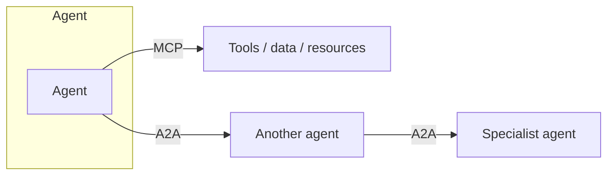

# A2A — Agent-to-Agent Communication

*Last reviewed: October 2026*

!!! info "What's changed recently"
    - **A2A is a Linux Foundation project now.** Google created it and donated it
      in mid-2025. In August 2025 IBM's **ACP** (Agent Communication Protocol)
      merged into A2A instead of competing with it.
    - **v1.0 is the first stable specification** (the Linux Foundation marked
      A2A's first year in April 2026). It adds **signed Agent Cards**,
      multi-tenancy, and modernized security flows.
    - **Multiple protocol bindings.** A2A defines JSON-RPC, gRPC, and HTTP+JSON/REST
      bindings, with SSE streaming and webhook push notifications for long tasks.
    - **Platform support.** Azure AI Foundry / Copilot Studio and Amazon Bedrock
      AgentCore Runtime support A2A, and more than 150 organizations back it.

As systems move from a single agent to **teams of agents**, they need a way to
talk to each other: delegate tasks, share results, and coordinate. A2A is the
protocol/pattern layer for that — complementary to [MCP](../mcp/index.md) (which
connects an agent to *tools/data*).

<!-- RELATED-MODULE -->

## MCP vs A2A (don't confuse them)

| | MCP | A2A |
|-|-----|-----|
| Connects | Agent → tools/data | Agent → agent |
| Purpose | Give an agent capabilities | Let agents delegate & coordinate |
| Analogy | "USB-C for tools" | "Agents calling colleagues" |

## Multi-agent coordination patterns

| Pattern | Idea |
|---------|------|
| **Supervisor / orchestrator** | One agent plans and delegates to specialists |
| **Peer / hand-off** | Agents pass a task along a pipeline (research → write → review) |
| **Blackboard** | Agents read/write a shared state/store |
| **Marketplace / bidding** | Agents claim tasks they're suited for |

## What an A2A exchange needs

- **Identity & discovery** — who is this agent, what can it do (a capability
  card/manifest).
- **Task messages** — structured request + inputs + expected output.
- **Status & results** — progress, completion, errors, artifacts.
- **Trust & auth** — agents must authenticate; least privilege applies.

The **A2A protocol** (created by Google, now governed by the Linux Foundation)
standardizes these pieces. Frameworks like LangGraph, CrewAI, and AutoGen
implement multi-agent coordination *inside* one system; A2A is for agents that
talk *across* system, team, or vendor boundaries.

| A2A concept | What it is |
|-------------|-----------|
| **Agent Card** | JSON metadata at a well-known URL: identity, skills, endpoint, supported bindings, and security schemes. It can be signed. |
| **Task** | The unit of delegated work, with a lifecycle: e.g. working, input-required, auth-required, then a terminal completed / failed / canceled / rejected |
| **Message / Part** | A turn from the `user` or `agent` role, made of Parts (text, file reference, structured data) |
| **Artifact** | An output the remote agent produces, also built from Parts |
| **Streaming / push** | SSE for live updates; webhooks for long-running tasks |

The remote agent stays **opaque**: you see its card, task status, and artifacts,
not its prompts, tools, or memory. That is the main difference from MCP, where
the client sees every tool's schema.

## When to go multi-agent

Default to **single-agent**. Introduce A2A/multi-agent when one agent's scope,
tools, or context become unreliable — e.g. distinct specialties (retrieval vs
coding vs review). Coordination adds latency, cost, and new failure modes, so
justify it.

## Interview deep dive

### Talking points
- **"MCP connects an agent to tools; A2A connects agents to each other."**
- **"Start single-agent; go multi-agent only when scope demands it."**
- **"A2A needs identity, discovery, structured tasks, and trust."**

### Scenario questions

??? question "When would you split one agent into multiple communicating agents?"
    When responsibilities/tools become too broad for reliable single-agent
    behavior — e.g. a planner delegating to a researcher, a coder, and a reviewer.
    Use a supervisor pattern; keep each agent's scope tight.

??? question "How is A2A different from just calling a function?"
    A2A treats the other party as an autonomous agent with its own reasoning and
    capability discovery, exchanging tasks/results — not a deterministic function
    call. It needs identity, negotiation, and trust between agents.

### Rapid-fire

| Q | A |
|---|---|
| MCP vs A2A? | Agent→tools vs agent→agent |
| Common pattern? | Supervisor delegating to specialists |
| A2A needs? | Identity, discovery, task messages, trust |
| Default? | Single-agent; multi-agent only when justified |
| Who governs A2A? | Linux Foundation (ACP merged in, Aug 2025); v1.0 is stable |
| Agent Card? | Discoverable, optionally signed, metadata: skills, endpoint, auth schemes |

## How interviewers probe this

??? question "Walk me through one A2A delegation end to end."
    A strong answer covers: **discovery** (fetch and verify the Agent Card, check
    its signature, pick a supported binding), **auth** against the security scheme
    the card declares, sending a Message that creates a **Task**, following state
    changes (including input-required / auth-required interruptions) over SSE
    or push notifications, and collecting **Artifacts**. It also says the remote
    agent is opaque, so you depend on its contract, not its internals.

??? question "How do you secure agent-to-agent calls across an org boundary?"
    Verify identity (signed Agent Cards, mTLS or OAuth/OIDC per the declared
    scheme), use least-privilege scopes, and decide whether the call carries the
    **end user's** identity (token exchange) or the **calling agent's** identity.
    Treat everything the remote agent returns as untrusted input, because it can
    carry prompt injection. Rate-limit and audit every task. OWASP's Agentic Top 10
    lists insecure inter-agent communication (ASI07) as its own risk.

??? question "MCP or A2A for this integration? Where do you draw the line?"
    MCP fits when the other side is a **tool or data source** with a schema and
    predictable behavior. A2A fits when the other side is an **autonomous agent**
    owned by another team or vendor, with its own reasoning, long-running tasks,
    and a need for clarification. One agent is often both: an A2A server to its
    callers and an MCP client to its own tools.

??? question "A delegated task runs for an hour and needs human input halfway. How do you design it?"
    Model it as a Task that moves to input-required. Use push notifications
    instead of holding a stream open, store orchestrator state durably
    (checkpointer), make resume idempotent, and set timeouts and cancellation. Show
    the pending question to a human through your own approval workflow.

??? question "What breaks first in a multi-agent system in production, and how do you contain it?"
    Cascading failures and loops between agents, lost context at hand-offs, cost
    multiplying with each delegation, and unclear accountability. Contain them with
    delegation-depth limits, per-task budgets, trace-context propagation across
    agents, contract tests against each Agent Card, and evaluation of the whole
    trajectory, not each agent alone.
