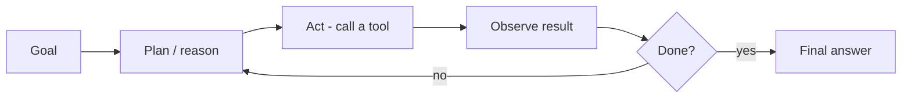

# AgentCore

*Last reviewed: October 2026*

!!! info "What's changed recently"
    - **AgentCore went GA in October 2025** as modular services you can adopt one
      at a time: Runtime, Memory, Gateway, Identity, Code Interpreter, Browser, and
      Observability. It works with any agent framework (Strands, LangGraph,
      CrewAI, and others) and any model, not only Bedrock-hosted ones.
    - **Policy** (December 2025 preview, GA March 2026) intercepts Gateway tool
      calls and enforces rules written in **Cedar** or in natural language. It can
      log decisions before enforcing them.
    - **Evaluations** (GA March 2026) scores live agent traffic with built-in
      evaluators (correctness, faithfulness, tool-selection accuracy, goal success
      rate, and more) or custom LLM judges, and sends results to CloudWatch.
    - **Memory added episodic memory**, Runtime added bidirectional streaming for
      voice agents, Runtime can host A2A agents, and Identity added a managed
      consent portal (September 2026).

Agentic AI is about LLMs that **plan, act, observe, and iterate** — using tools
and memory to complete multi-step goals rather than answering a single prompt.
Amazon Bedrock AgentCore provides runtime, memory, tools/gateway, identity, and
observability to run such agents in production.

<!-- RELATED-MODULE -->

## The agent loop

An agent reasons about what to do, calls a tool, observes the result, and repeats
until the goal is met (the ReAct pattern).

## Building blocks

| Component | Role |
|-----------|------|
| **Runtime** | Serverless, session-isolated hosting for the agent loop (any framework, any model) |
| **Memory** | Short-term (session events) + long-term strategies (semantic facts, summaries, preferences, episodes) |
| **Gateway** | Turns APIs, Lambda functions, and existing MCP servers into governed MCP tools |
| **Identity** | Agent workload identity, inbound auth, and a token vault for outbound credentials |
| **Code Interpreter / Browser** | Managed sandboxes for running code and driving a web browser |
| **Policy** | Deterministic rules (Cedar) enforced on Gateway tool calls |
| **Observability / Evaluations** | OpenTelemetry traces in CloudWatch, plus online quality scoring |

Content safety comes from **Bedrock Guardrails**, which you attach to model
calls. It is not an AgentCore component. For the identity and gateway details,
see [AgentCore Identity & Gateway](../../AI-Security/agentcore-identity-gateway.md).

## Production concerns

- **Guardrails & least privilege** — constrain what tools can do; enforce hard
  limits with AgentCore Policy at the Gateway, not in the prompt.
- **Observability** — trace every step; you can't debug what you can't see.
- **Cost & loops** — cap iterations; agents can spin.
- **Evaluation** — task success rate, not just token quality.

## Single-agent vs multi-agent

Start single-agent. Move to multi-agent (a planner delegating to specialists)
only when one agent's tool set and context get unwieldy — coordination adds
complexity.

## Interview questions

??? question "What makes a system 'agentic'?"
    The LLM decides the steps: it plans, chooses and calls tools, observes results,
    and iterates toward a goal — versus a fixed prompt→answer flow.

??? question "How do you keep production agents safe and reliable?"
    Least-privilege tools, guardrails, iteration/cost caps, full tracing/
    observability, and task-level evaluation.

??? question "When do you go multi-agent?"
    When a single agent's responsibilities/tools become too broad; split into a
    planner + specialists. Otherwise the coordination overhead isn't worth it.

---

## Interview deep dive

### 60-second talking points

- **"Agentic = the model decides the steps."** Plan → act (tool) → observe →
  repeat, versus a fixed prompt→answer flow.
- **"Production agents live or die on guardrails, observability, and eval."**

### Scenario & system-design questions

??? question "Design a customer-support agent that can look up orders and issue refunds."
    Tools: `get_order`, `get_policy` (read), `issue_refund` (write, **guarded**).
    Runtime runs the plan→act→observe loop; **memory** for the conversation;
    **least-privilege** so refunds require checks/limits; **human approval** for
    refunds over a threshold; full **tracing** of every tool call; eval on task
    success rate.

??? question "Your agent occasionally takes wrong/expensive actions. How do you contain it?"
    Cap iterations and cost; scope tools tightly (read vs write); add confirmation/
    human-in-the-loop for high-impact actions; validate tool args; and trace
    everything so you can debug and evaluate. Guardrails on inputs/outputs.

??? question "Single-agent vs multi-agent — how do you decide?"
    Default single-agent. Split into a **planner + specialists** only when one
    agent's tools/context get unwieldy; multi-agent adds coordination overhead and
    failure modes, so justify it.

### Pitfalls interviewers probe

- No iteration/cost cap → runaway loops.
- Over-privileged write tools with no approval.
- No observability → can't debug agent behavior.
- Evaluating on token quality instead of **task success**.

### Rapid-fire

| Q | A |
|---|---|
| What makes it agentic? | Model plans, calls tools, observes, iterates |
| The loop? | Plan → act → observe → repeat until done |
| Contain a bad agent? | Least-privilege tools, caps, human approval, tracing |
| Multi-agent when? | One agent's scope/tools become too broad |

## How interviewers probe this

??? question "Why AgentCore instead of running LangGraph on ECS yourself?"
    A strong answer weighs the trade honestly. AgentCore gives you session-isolated
    serverless hosting, managed identity with a token vault, a Gateway that turns
    APIs into MCP tools, memory, OpenTelemetry observability, and Policy and
    Evaluations, all without building them. You give up some control, accept
    region availability and per-service pricing, and couple to AWS. Self-hosting
    can win when you already run a mature platform or need portability.

??? question "How do you guarantee the agent never refunds more than $500 without approval?"
    Not with prompt instructions. Put a **Policy** on the Gateway target (Cedar
    rule on the tool's amount parameter) so calls over the limit are denied
    deterministically, and route them to a human approval flow. Run the policy in
    log-only mode first to see what it would block. Keep the server-side check in
    the refund API as defense in depth.

??? question "How does AgentCore Memory work, and what can go wrong?"
    Short-term memory stores session events. Long-term strategies extract
    semantic facts, summaries, user preferences, and episodes into namespaces you
    scope per user or tenant. Risks: **memory poisoning** (an attacker plants a
    "fact" that steers later sessions), cross-tenant leakage from bad namespacing,
    and retention or PII obligations. Validate what gets written, scope namespaces
    tightly, and set retention.

??? question "How do you evaluate and monitor an AgentCore agent in production?"
    Trace every step with OpenTelemetry into CloudWatch. Attach online
    **Evaluations** (built-in evaluators such as goal success and tool-selection
    accuracy, plus custom judges) with alarms. Keep an offline golden-task set in
    CI, and track cost and latency per session.

??? question "You need to expose 30 internal APIs to agents. How?"
    Use Gateway targets (OpenAPI, Smithy, Lambda, or existing MCP servers) with
    inbound JWT or IAM auth, outbound credentials from the Identity token vault,
    Policy rules on sensitive tools, and tool search or filtering so the agent
    isn't handed all 30 schemas on every turn.
