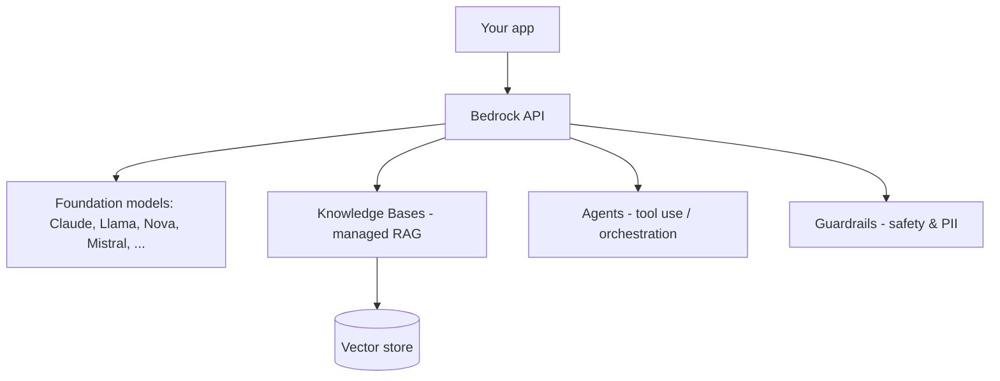

# Amazon Bedrock

*Last reviewed: October 2026*

!!! info "What's changed recently"
    - **The Converse API is the default interface.** It is one request shape
      across models, with tool use and streaming. Newer models are usually called
      through **cross-region inference profiles** (IDs prefixed `us.`, `eu.`,
      `global.` and so on) rather than single-region model IDs.
    - **More ways to pay.** Priority, Standard, and Flex **service tiers**
      (November 2025) sit alongside batch inference and provisioned throughput.
    - **Amazon Nova** is now Amazon's first-party model family (successor to the
      Titan text models). The catalog also includes OpenAI's open-weight
      `gpt-oss` models alongside Claude, Llama, Mistral, DeepSeek and others.
    - **Guardrails added Automated Reasoning checks** (GA August 2025). Knowledge
      Bases can store vectors in **Amazon S3 Vectors** (GA December 2025) and use
      Neptune Analytics for GraphRAG.
    - **Agents split in two.** Bedrock Agents is the managed, configuration-driven
      option. [AgentCore](../agentcore/index.md) (GA October 2025) is the runtime
      for agents you build with your own framework.

Bedrock is AWS's managed service for foundation models — call multiple providers
(Anthropic Claude, Meta Llama, Amazon Nova, Mistral, DeepSeek, etc.) through one API, with
enterprise security, and add RAG, agents, and guardrails.

<!-- RELATED-MODULE -->

## What Bedrock provides



| Feature | Purpose |
|---------|---------|
| **Model access** | One API across providers; no infra to manage |
| **Knowledge Bases** | Managed RAG: ingest → embed → retrieve |
| **Agents** | Multi-step tool use / orchestration |
| **Guardrails** | Content filtering, PII redaction, denied topics |
| **Service tiers / batch** | Priority, Standard, Flex tiers; batch inference for offline jobs |
| **Provisioned throughput** | Reserved capacity (and required for some custom models) |
| **Custom models** | Fine-tuning / distillation and Custom Model Import for open-weight models |

```python
import boto3
rt = boto3.client("bedrock-runtime")
resp = rt.converse(                      # model-agnostic request/response shape
    # A cross-region inference profile ID. Check the console for current models.
    modelId="us.anthropic.claude-sonnet-4-5-20250929-v1:0",
    messages=[{"role": "user", "content": [{"text": "Summarize RAG in 2 lines."}]}],
    inferenceConfig={"maxTokens": 300},
)
print(resp["output"]["message"]["content"][0]["text"])
```

`invoke_model` with a provider-specific JSON body still works, but `converse`
lets you swap models without rewriting the payload.

## Why enterprises pick Bedrock

Data stays in your AWS account, integrates with IAM/VPC/CloudWatch, no model
hosting to manage, and you can swap models without rewriting the app.

## Interview questions

??? question "What does Bedrock give you over calling an LLM API directly?"
    Managed multi-provider access under AWS security (IAM, VPC, logging), plus
    built-in Knowledge Bases (RAG), Agents, and Guardrails — no infrastructure.

??? question "How do Bedrock Knowledge Bases implement RAG?"
    They ingest your documents, chunk and embed them into a vector store, and
    retrieve relevant chunks at query time to ground the model — managed for you.

??? question "What are Guardrails for?"
    Policy enforcement: block denied topics, filter harmful content, and redact
    PII consistently across models.

---

## Interview deep dive

### 60-second talking points

- **"One API, many models, inside your AWS boundary."** Swap Claude/Llama/Nova
  without rewriting; data stays in your account under IAM/VPC.
- **"Knowledge Bases = managed RAG; Agents = managed tool use; Guardrails =
  policy."** You assemble, AWS operates.

### Scenario & system-design questions

??? question "Design an enterprise RAG assistant on AWS with governance."
    **Bedrock Knowledge Base** (ingest → embed → vector store) for retrieval →
    **Bedrock model** for generation → **Guardrails** for PII/denied topics →
    front with API Gateway + Lambda; IAM roles, VPC endpoints, CloudWatch. No data
    leaves the account.

??? question "How do you choose/switch models cost-effectively?"
    Start with a smaller/cheaper model, measure quality on an eval set, upgrade
    only where needed. Use **batch** or the **Flex** tier for latency-tolerant
    work, **Priority** for latency-critical traffic, and **provisioned
    throughput** for steady high volume. Prompt caching cuts the cost of repeated
    prefixes. The Converse API makes swapping models low-effort.

??? question "What do Guardrails actually enforce?"
    Denied topics, harmful-content filters, and **PII redaction** applied
    consistently across models — a policy layer independent of the chosen model.

### Pitfalls interviewers probe

- Thinking Bedrock hosts *your* fine-tuned model for free (it's managed FMs; custom
  work has its own path/cost).
- Skipping Guardrails on user-facing apps.
- Ignoring per-model token pricing differences.

### Rapid-fire

| Q | A |
|---|---|
| Bedrock value vs raw API? | Managed multi-model under AWS security + KB/Agents/Guardrails |
| Knowledge Bases? | Managed RAG (ingest/embed/retrieve) |
| Guardrails? | Content filtering + PII redaction + denied topics |
| Steady high volume? | Provisioned throughput (or Priority tier for latency) |
| Cheap offline jobs? | Batch inference / Flex tier |
| Model-agnostic call? | Converse API (+ inference profile ID) |

## How interviewers probe this

??? question "You're getting ThrottlingExceptions at peak. What are your options?"
    A strong answer covers: checking per-model, per-region quotas and requesting
    increases; **cross-region inference profiles** to spread load; retries with
    backoff and jitter; the Priority tier or provisioned throughput for critical
    traffic; moving offline work to batch or Flex; and a fallback model. It also
    names the trade-off: cross-region inference can process data in other regions
    within the geography, which matters for residency.

??? question "Bedrock Agents or AgentCore for a new agent?"
    Bedrock Agents is quick when a managed, configuration-driven agent with
    action groups and Knowledge Bases is enough. AgentCore fits when you build
    with a framework (LangGraph, Strands, CrewAI), need custom orchestration,
    MCP tools through Gateway, enterprise identity, or Policy controls. Teams
    often prototype on one and standardize on the other.

??? question "Security asks where prompts and outputs go. What do you tell them?"
    Bedrock doesn't use your prompts or outputs to train the base models, and
    traffic can stay on PrivateLink VPC endpoints with IAM-scoped access and
    KMS encryption. Model invocation logging to S3 or CloudWatch is opt-in, and
    you secure it like any sensitive log. Cross-region inference and the
    third-party model provider's terms are the details to check.

??? question "How do you pick between Knowledge Bases and building RAG yourself?"
    Knowledge Bases gives managed ingestion, chunking, embeddings, a choice of
    vector store (OpenSearch Serverless, Aurora pgvector, S3 Vectors, and others),
    reranking, and metadata filters with little code. Build it yourself when you
    need custom chunking or retrieval logic, hybrid scoring you control, or
    non-AWS components, and accept owning the pipeline and its evals.
