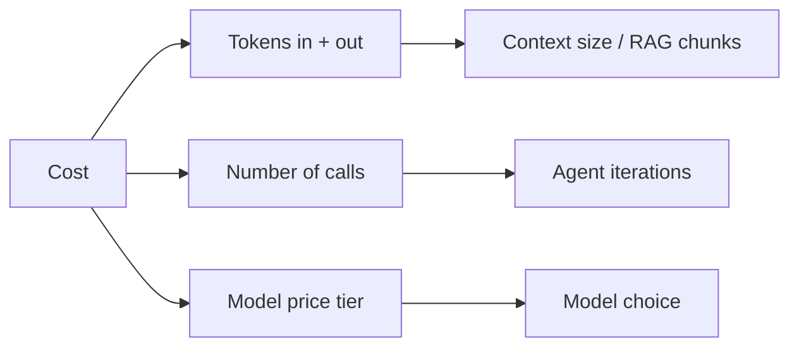
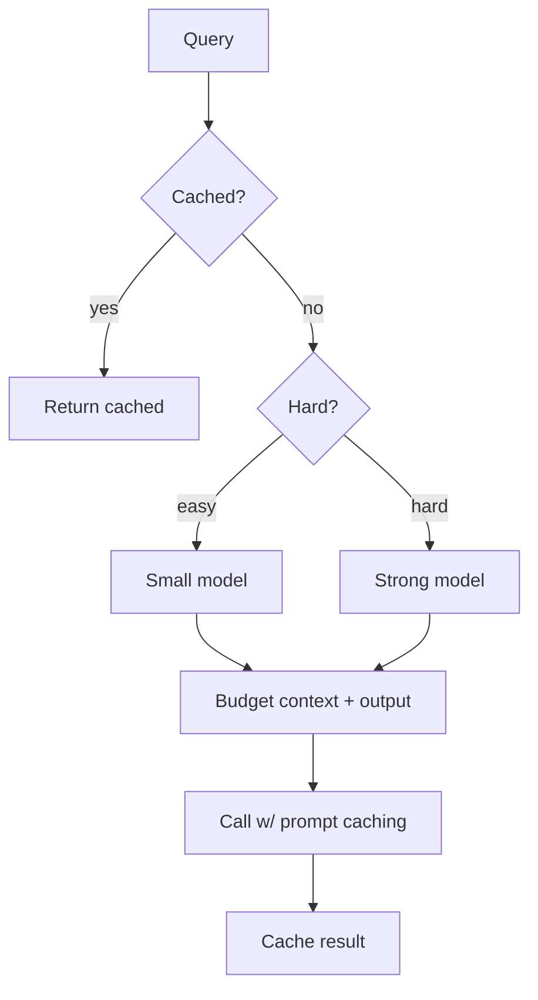

# Cost Optimization

*Last reviewed: October 2026*

!!! info "What's changed recently"
    - **More price tiers.** Most providers now offer batch APIs (often around half
      the on-demand price), discounted **cached input** tokens, and latency
      tiers. Bedrock added Priority, Standard, and Flex tiers in November 2025.
    - **Reasoning tokens are a major cost line.** Thinking or reasoning models bill
      for hidden reasoning output, so reasoning-effort or thinking-budget settings
      are now real cost controls.
    - **Agents multiply tokens.** Per-token prices for a given capability keep
      falling, but agent loops, tool schemas, and long contexts raise volume, so
      **cost per successful task** is the metric that matters.

LLM bills scale with **tokens × calls × model price**. This page is the practical
playbook for cutting cost without wrecking quality. See also
[LLMOps](../llmops/index.md).

<!-- RELATED-MODULE -->

## Where the money goes

## The levers (biggest first)

| Lever | How | Typical savings |
|-------|-----|-----------------|
| **Model routing** | Cheap model for easy queries, strong for hard | Large |
| **Prompt caching** | Reuse a fixed prefix (system + docs) across calls | Large for repeated prefixes |
| **Right-sizing** | Smallest model that passes eval | Large |
| **Token budgeting** | Cap input (trim context/RAG) and output (max_tokens) | Medium |
| **Response caching** | Cache identical/similar queries | Medium (repetitive traffic) |
| **Fewer agent steps** | Iteration caps, better tools/plans | Medium |
| **Batch / flex tiers** | Send latency-tolerant work to provider batch APIs or flex tiers | Large for offline jobs |
| **Reasoning effort** | Lower thinking budget / effort on easy tasks | Medium–large on reasoning models |
| **Batching** | Group requests (self-host) | Medium (throughput) |
| **Shorter prompts** | Trim verbose system prompts / few-shot | Small–medium |

## A cost-aware request

## Guardrails so cuts don't hurt quality

- **Measure on an eval set** — every cost change is scored for quality
  regression, not guessed.
- **Watch the metric that matters** — cost *per successful task*, not per call.
- **Monitor** cost per user/tenant/day; alert on spikes.

## Common wins

- Move classification/routing/extraction to a **small model**.
- Turn on **prompt caching** when the system prompt or retrieved docs repeat.
- **Trim RAG** — retrieve wide, rerank, keep only the top few chunks.
- **Cap agent iterations** — most runaway cost is agent loops.

## Interview deep dive

### Talking points
- **"Cost = tokens × calls × price — attack all three."**
- **"Biggest levers: routing, caching, right-sizing."**
- **"Measure cost per successful task, gated by an eval set."**

### Scenario questions

??? question "Your GenAI feature's monthly bill doubled. Walk through cutting it."
    Break down by tokens/calls/model. Route easy queries to a cheaper model; enable
    **prompt caching** for the fixed prefix; **trim context** (fewer, reranked
    chunks; max_tokens); cache repeated queries; cap agent iterations. Re-run the
    eval set so quality holds.

??? question "How do you decide if a cheaper model is 'good enough'?"
    Evaluate it on a labeled set for the actual task; if it passes the quality bar
    (faithfulness/accuracy), route eligible traffic to it and keep the strong model
    for the hard slice.

### Rapid-fire

| Q | A |
|---|---|
| Cost drivers? | Tokens (in+out), call count, model price |
| Biggest lever? | Model routing + right-sizing |
| Prompt caching? | Reuse a fixed prefix to cut cost/latency |
| Right metric? | Cost per successful task |
| Runaway agent cost fix? | Iteration + cost caps |
| Offline workload? | Batch API / flex tier (often ~50% cheaper) |

## How interviewers probe this

??? question "Finance wants a 40% cut with no quality loss. How do you plan it?"
    A strong answer starts with **attribution**: cost by feature, tenant, model,
    and token type (input, cached input, output, reasoning). Then go after the
    biggest bucket with the matching lever: routing or right-sizing, prompt
    caching for repeated prefixes, batch or flex for offline work, trimming
    context, and capping agent loops. Each change ships behind an eval gate and a
    canary, and progress is reported as cost per successful task.

??? question "How do you design a model router, and how do you know it's working?"
    Use a cheap classifier (rules, a small model, or confidence from a first pass)
    to decide the tier, escalate on low confidence or failed validation, and log
    each decision. Check it with offline evals on a labeled set, then online
    metrics: the share of traffic handled by the cheap tier, the escalation rate,
    and quality per tier. Misrouting hard queries to a weak model is the failure
    to watch.

??? question "Prompt caching is on, but the hit rate is low. Why?"
    The prefix isn't stable. Common causes: timestamps or user IDs early in the
    system prompt, tool definitions in a non-deterministic order, retrieved chunks
    placed before stable instructions, or prefixes below the provider's minimum
    cacheable length. Fix the layout so the static parts come first and
    byte-identical.

??? question "How do you stop one tenant from blowing the monthly budget?"
    Per-tenant token and cost budgets enforced at the gateway, rate limits,
    request-size caps, per-tenant cost dashboards with alerts, and graceful
    degradation (cheaper model or queued processing) instead of a hard failure
    when a soft limit is reached.
