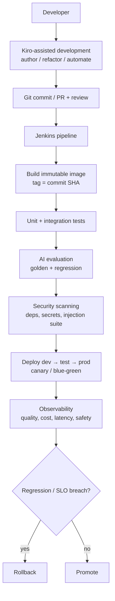

# DevOps for AI

The delivery-engineering discipline around AI systems: version control,
infrastructure as code, deployment strategies, and the pipeline that safely gets
a change from an editor to production. This page is the **delivery mechanics**;
the AI-specific eval/rollout gates live in [LLMOps](../llmops/index.md).

!!! note "Kiro and Jenkins — the roles"
    **Kiro** is used for **AI-assisted development and automation** — authoring,
    refactoring, scaffolding, docs. **Jenkins** is the **production CI/CD system**
    that builds, tests, evaluates, scans, and deploys. Kiro accelerates how code is
    written; **Jenkins is the gate to production.** Kiro does not replace Jenkins.

---

## Everything as code

The DevOps baseline: infra, pipelines, and config live in version control so
environments are **rebuildable, reviewable, and reproducible** — not hand-crafted.

- **Application + prompts + config** in Git (prompts are code, they're gated by
  eval, see LLMOps).
- **Infrastructure as Code** (Terraform/CloudFormation): plan → review the diff in
  a PR → apply; remote **state with locking**; pin provider/module versions;
  separate state per environment; gate prod `apply` behind approval.
- **Immutable artifacts**: build the container image **once**, tag by commit SHA,
  **promote the same image** dev → test → prod. Never rebuild per environment.
- **Externalized config**: environment differences (endpoints, model IDs, scopes)
  live in env vars / parameter store / secrets manager, never baked into the image.

??? question "Why promote one artifact instead of rebuilding per environment?"
    Rebuilding risks a *different* artifact reaching prod than you tested (different
    base image, dep versions, build flags). Promoting the exact tested image means
    the tested bits are the shipped bits; environment differences stay in
    externalized config.

---

## The delivery pipeline (Kiro-assisted → Jenkins → prod)

**Kiro's part** is upstream of Git: it helps you write and refactor the code and
automation faster. Once you commit, **Jenkins owns the path to prod** — build,
test, the AI eval + security gates, deploy, and rollback. The two are
complementary: faster authoring, unchanged production gating.

---

## Deployment strategies

| Strategy | How | Trade-off | AI note |
|----------|-----|-----------|---------|
| **Rolling** | Replace instances gradually | Mixed versions during rollout; slower rollback | Fine for stateless model-API pods |
| **Blue/green** | Full standby env, instant switch | Double resources briefly; instant rollback | Clean cutover for a model/prompt change |
| **Canary** | Route a small % to the new version | Safest; needs traffic routing + metrics | **Best for AI**: watch quality/cost/safety on the slice before ramping |

- **Rollback** must be one action (redeploy last-good image / flip blue-green).
  For AI, roll back the **prompt/model version** too, not just code.
- **Feature flags** decouple **deploy** from **release**: ship code dark, enable
  for a % of users, and turn a feature off instantly without a redeploy — shrinks
  blast radius and lets you test in prod safely.

??? question "Blue/green vs canary for a risky model change?"
    **Canary**: route a small traffic slice to the new prompt/model, watch quality,
    cost, latency, and safety metrics on that slice, then ramp or abort. It's the
    safest for AI because quality regressions only show under real traffic.
    Blue/green gives instant switch/rollback but exposes everyone at once on the
    flip. Pair either with feature flags + auto-rollback on regression.

---

## Infrastructure as Code, safely

??? question "How do you keep IaC safe and reviewable?"
    Plan before apply (review the diff in the PR), remote **state with locking** so
    two applies can't collide, modularize + pin versions, separate state per
    environment, gate prod `apply` behind approval, and detect **drift** on a
    schedule. Never change prod resources in the console, that drift makes the next
    apply propose destructive reconciliation.

??? question "Someone changed a resource in the console and IaC now wants to revert it. What happened?"
    **Drift**: live state diverged from code, so the next plan reconciles it (often
    destructively). Fix: import the manual change into code, or revert it in the
    console, then re-plan. Prevent by locking down console write access in prod and
    requiring all changes through IaC + PR.

---

## What's different about DevOps for AI

Classic DevOps assumes: same input + same code = same output, and "tests pass" =
safe to ship. AI breaks both.

- **Non-determinism** — the same prompt can yield different outputs; you gate on
  **eval metrics**, not exact-match tests.
- **Quality can regress with zero code change** — a prompt or model tweak shifts
  behavior; hence **golden + regression eval** in the pipeline (see LLMOps).
- **New artifacts to version + gate** — prompts, model versions, eval/datasets,
  retrieval config, not just code.
- **AI-specific security gate** — a prompt-injection/jailbreak suite + output-
  guardrail check, on top of dependency/secret scans.
- **Cost is a deploy concern** — a change can 3x spend with no traffic change;
  cost belongs in the pipeline report and post-deploy monitoring.

---

## Interview deep dive

### 60-second talking points

- **"Everything as code; promote one immutable artifact; externalize config."**
- **"Canary + feature flags + one-command rollback, and roll back the prompt/model
  too, not just code."**
- **"AI changes gate on eval + an injection suite, because 'tests pass' isn't
  'safe to ship' for a non-deterministic system."**

??? question "Walk me through your delivery pipeline for an AI service."
    Author with **Kiro-assisted development**, commit to Git with review. **Jenkins**
    then builds an immutable SHA-tagged image, runs unit/integration tests, the
    **AI eval gate** (golden + regression), and **security scanning** (deps/secrets
    + injection suite), deploys via **canary**, monitors quality/cost/latency/
    safety, and **rolls back** on regression. Kiro speeds authoring; Jenkins is the
    production gate.

??? question "Where does Kiro fit vs Jenkins?"
    Kiro is AI-assisted **development** in the editor. Jenkins is the production
    **CI/CD** that tests, evaluates, scans, and deploys. Kiro doesn't replace
    Jenkins, it accelerates the authoring that happens before the commit; Jenkins
    still decides what reaches prod.

??? question "How do you roll back an AI regression that isn't a code bug?"
    Because prompts and model versions are versioned artifacts, roll them back the
    same way as code: redeploy the last-good image **and** revert the prompt/model
    version. Canary + auto-rollback on a quality/cost/safety regression makes this
    fast; feature-flag the change so you can also disable it without a redeploy.

### Pitfalls interviewers probe

- Rebuilding artifacts per environment instead of promoting one.
- Baking secrets/config into images.
- Editing prod resources in the console (IaC drift).
- Treating "unit tests pass" as safe to ship an AI change.
- Rolling back code but not the prompt/model version.
- Implying an AI-dev assistant replaces the CI/CD system.

### Rapid-fire

| Q | A |
|---|---|
| Immutable artifact? | Build once, tag by SHA, promote the same image |
| Feature flag vs deploy? | Activation control vs shipping code |
| Canary? | Small % traffic to new version, ramp on good metrics |
| IaC drift? | Live state diverged from code |
| AI-specific gate? | Golden + regression eval + injection suite |
| Roll back AI change? | Revert code **and** prompt/model version |
| Kiro vs Jenkins? | AI-assisted dev vs production CI/CD gate (complementary) |

!!! note "Related"
    [LLMOps / Production CI-CD](../llmops/index.md) ·
    [Kubernetes & Containers](../kubernetes/index.md) ·
    [Observability & Eval](../observability/index.md) ·
    [Reliability](../reliability/index.md) ·
    Practice: [DevOps Interview Q&A](../../Personal-SourceCode/DevOps_Interview_QA.md)
