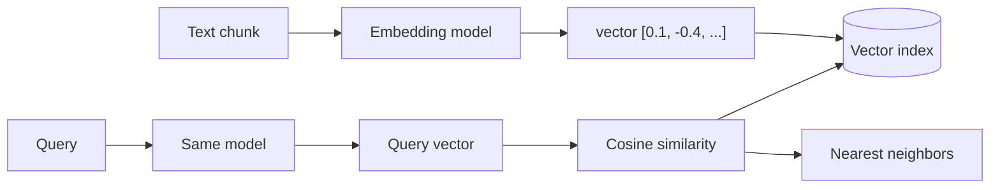

# Embedding Models

*Last reviewed: October 2026*

!!! info "What's changed recently"
    - **Truncatable (Matryoshka) embeddings are mainstream.** Several current
      models (OpenAI `text-embedding-3`, Cohere Embed v4, Voyage, Google's Gemini
      embeddings) let you shorten vectors to cut storage, with modest quality loss.
    - **Multimodal embeddings went mainstream.** Cohere Embed v4 (April 2025) and
      Amazon Nova Multimodal Embeddings (October 2025) put text, images, and other
      media in one vector space.
    - **Open-weight models are competitive at the top of MTEB** (for example the
      Qwen3-Embedding family), and the benchmark expanded into the multilingual
      MMTEB.
    - **Quantized vectors** (int8 / binary) and vector-native object storage
      (Amazon S3 Vectors) keep large corpora affordable.

Embeddings turn text into vectors that capture meaning — the foundation of
semantic search, RAG, clustering, and classification. Choosing and using the
right embedding model matters as much as the LLM.

<!-- RELATED-MODULE -->

## How embeddings power retrieval

## What to compare

| Factor | Why it matters |
|--------|----------------|
| **Dimensions** | Higher = more expressive but more storage/compute (e.g. 384 → 3072); truncatable models let you choose |
| **Max input length** | Must cover your chunk size |
| **Domain/language fit** | Match to your content (code, legal, multilingual) |
| **Quality (MTEB)** | Benchmark score for retrieval tasks |
| **Cost & hosting** | API per-token vs self-hosted open model |
| **Normalization** | Cosine assumes normalized vectors |

## Common options (by category)

| Model family | Notes |
|--------------|-------|
| **OpenAI `text-embedding-3` (small/large)** | Strong, easy API; large = 3072-dim |
| **Cohere Embed v4** | Multimodal (text + images), multilingual, long input, rerank pairing |
| **Amazon Titan Text Embeddings V2 / Nova Multimodal Embeddings** | In-AWS/Bedrock, keeps data in-boundary |
| **Google Gemini embeddings** | Strong multilingual retrieval; truncatable dimensions |
| **Voyage AI** | High MTEB, domain variants (code, finance, law) |
| **Open: Qwen3-Embedding, `bge`, `e5`, `gte`, `nomic`** | Self-host, no per-call cost, strong quality |
| **Sentence-Transformers (MiniLM etc.)** | Lightweight, local, fast |

## Rules that trip people up

- **Same model for index and query** — vectors from different models aren't
  comparable. Changing models means **re-embedding the whole corpus**.
- **Match the metric** — cosine for normalized text embeddings (most common).
- **Dimensions ≠ always better** — bigger costs more storage/latency; measure.
  With a truncatable (Matryoshka) model, test a shorter dimension before paying
  for the full one.
- **Embedding model ≠ the LLM** — it's a separate (often smaller) model.
- **Chunk quality drives it** — the vector represents a chunk; keep chunks
  self-contained.

## Interview deep dive

### Talking points
- **"Embeddings map meaning to vectors; similar meaning → nearby vectors."**
- **"Use the same model to index and query, or the vectors don't compare."**
- **"Pick by domain fit + MTEB + cost, not just dimensions."**

### Scenario questions

??? question "You upgraded the embedding model and search got worse. Why?"
    Old and new vectors are incompatible. You must **re-embed the entire corpus**
    with the new model and query with the same one; mixing them yields meaningless
    neighbors.

??? question "How do you pick an embedding model for a legal-document RAG?"
    Favor domain/length fit (long legal passages → larger max input), strong MTEB
    retrieval score, and governance (in-boundary like Titan if data-sensitive).
    Validate on your own labeled retrieval set, not just the benchmark.

### Rapid-fire

| Q | A |
|---|---|
| What's an embedding? | A vector capturing text meaning |
| Index vs query model? | Must be the **same** model |
| Change model → | Re-embed everything |
| Metric for text? | Cosine (normalized) |
| Benchmark? | MTEB |

## How interviewers probe this

??? question "You need to migrate 200M vectors to a new embedding model. Plan it."
    A strong answer covers: dual-write new documents with both models, backfill
    the corpus in batches (cost and throughput estimate), build the new index
    side by side, run offline retrieval evals (recall@k, nDCG) on a labeled set,
    shadow or A/B the new index, cut over by alias, and keep the old index for
    rollback. It also says the two vector spaces can never be mixed in one query.

??? question "How do you choose dimensions and precision for a large corpus?"
    Estimate storage and memory (vectors × dimensions × bytes) and latency
    targets. Then measure recall at candidate settings: full-precision vs int8 or
    binary, and full vs truncated dimensions. Often a quantized first pass plus
    rescoring or reranking keeps quality while cutting memory sharply.

??? question "MTEB says model A is best, but it underperforms on your data. Why?"
    Benchmarks average many tasks and domains. Your queries, vocabulary,
    languages, and chunk lengths differ, and leaderboard scores can be inflated by
    training on benchmark-like data. Build a domain eval set from real queries and
    pick the model on that, plus cost, latency, and data-residency constraints.

??? question "When would you fine-tune an embedding model?"
    When domain vocabulary (internal product names, codes, legal phrasing) keeps
    retrieval poor even after hybrid search and reranking, and you have, or can
    mine, query and relevant-passage pairs. Check the gain against a held-out set,
    and plan for re-embedding the corpus every time the model changes.
