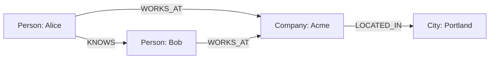

# Graph DB & GraphRAG

*Last reviewed: October 2026*

!!! info "What's changed recently"
    - **GQL is an ISO standard** (ISO/IEC 39075, 2024), the first new ISO database
      query language since SQL. It is heavily influenced by Cypher, and vendors are
      converging on it.
    - **GraphRAG matured into variants.** Microsoft's GraphRAG (entity graph +
      community summaries, with *local* and *global* search) was followed by
      cheaper approaches such as LazyGraphRAG that defer LLM summarization to
      query time.
    - **Managed GraphRAG arrived in cloud platforms.** For example, Amazon Bedrock
      Knowledge Bases can build and query a graph in Neptune Analytics.

Graph databases store data as **nodes** and **relationships**, making connected
queries (paths, neighbors, patterns) natural and fast. In GenAI they power
**knowledge graphs** and **GraphRAG** — retrieval that follows relationships, not
just vector similarity.

<!-- RELATED-MODULE -->

## Nodes and relationships



Everything is a node (with labels/properties) or a relationship (typed,
directional, with properties). Traversing relationships is a first-class
operation. In native graph stores like Neo4j it follows stored pointers
("index-free adjacency") instead of joining tables.

## Query languages

=== "Cypher (Neo4j)"

    ```cypher
    MATCH (a:Person)-[:KNOWS]->(b:Person)-[:WORKS_AT]->(c:Company)
    WHERE a.name = 'Alice'
    RETURN b.name, c.name
    ```

=== "GQL (ISO standard)"

    ```sql
    MATCH (a:Person WHERE a.name = 'Alice')-[:KNOWS]->(b:Person)-[:WORKS_AT]->(c:Company)
    RETURN b.name, c.name
    ```

=== "Gremlin"

    ```groovy
    g.V().has('Person','name','Alice')
     .out('KNOWS').out('WORKS_AT').values('name')
    ```

## GraphRAG

Instead of only fetching similar text chunks, GraphRAG retrieves an entity's
**connected context** by walking the knowledge graph — great for multi-hop
questions ("which suppliers are affected if factory X goes down?") where the
answer depends on relationships, not just semantic similarity.

Two common flavors:

| Flavor | How it works | Good for |
|--------|--------------|----------|
| **Local / entity-centric** | Vector search finds entry entities, then the graph is expanded N hops for context | "What is connected to X?" multi-hop questions |
| **Global / community summaries** (Microsoft GraphRAG) | Cluster the graph into communities, pre-summarize each with an LLM, answer from the summaries | "What are the main themes across the corpus?" |

The cost is in **building** the graph: LLM entity and relationship extraction
over the whole corpus, plus entity resolution (deduplicating "IBM" and
"International Business Machines"). Budget for it and evaluate extraction quality.

## When to use a graph DB

- Highly connected data (social, org charts, supply chains, fraud rings).
- Multi-hop / path queries that are painful as SQL joins.
- Knowledge graphs backing GenAI retrieval.

## Interview questions

??? question "Graph DB vs relational for connected data?"
    Graphs treat relationships as first-class, so each hop costs roughly the
    neighbors you touch rather than a join over whole tables. That makes deep,
    variable-length traversals far cheaper than multi-join SQL. Relational is
    better for tabular, set-based analytics.

??? question "What is GraphRAG and when does it beat vector RAG?"
    Retrieval that walks a knowledge graph for connected context. It wins on
    multi-hop, relationship-dependent questions where pure vector similarity misses
    the chain of facts.

??? question "Cypher vs Gremlin?"
    Cypher (Neo4j) is a declarative, pattern-matching language; Gremlin is an
    imperative graph-traversal language. Both express node/relationship queries.

---

## Interview deep dive

### 60-second talking points

- **"Relationships are first-class."** Traversing a connection costs about the
  neighbors touched, not a table-wide join — ideal for connected data.
- **"GraphRAG follows the graph, not just similarity."** Great for multi-hop,
  relationship-dependent questions.

### Scenario & system-design questions

??? question "When would you pick a graph DB over relational for a feature?"
    Highly connected data with **multi-hop** queries — fraud rings, supply chains,
    org/social networks, recommendations. If most queries are "who/what is
    connected to X within N hops," a graph avoids painful recursive joins.

??? question "How does GraphRAG beat vector RAG on some questions?"
    For questions whose answer depends on a **chain of relationships** ("which
    customers are affected if supplier X fails?"), walking a knowledge graph
    retrieves connected context that pure vector similarity would miss. Often
    combined: vectors to find entry nodes, graph to expand context.

??? question "How do you build a knowledge graph for GenAI?"
    Extract **entities + relationships** from documents (LLM or NLP), load as
    nodes/edges with properties, then query with Cypher/Gremlin — or feed the
    subgraph as grounded context to the LLM (GraphRAG).

### Pitfalls interviewers probe

- Using a graph DB for tabular/aggregate analytics (relational/warehouse wins).
- Modeling mistakes: storing everything as properties instead of relationships.
- Assuming GraphRAG replaces vector RAG (often complementary).

### Rapid-fire

| Q | A |
|---|---|
| Graph vs relational? | First-class relationships, cheap multi-hop traversal |
| Query languages? | Cypher (Neo4j, declarative), GQL (ISO standard), Gremlin (traversal) |
| GraphRAG? | Retrieve connected context by walking a knowledge graph |
| Best fit data? | Connected: fraud, supply chain, social, recommendations |

## How interviewers probe this

??? question "Build a GraphRAG system over 50k contracts. What's the pipeline and what does it cost?"
    A strong answer covers: chunking, LLM-based entity and relationship
    extraction with a defined schema (parties, obligations, dates, clauses),
    entity resolution, loading into the graph with provenance back to source
    chunks, a hybrid retrieval path (vectors to find entry nodes, graph to
    expand), and an eval set of multi-hop questions. It estimates extraction
    tokens up front and plans incremental updates, not full rebuilds.

??? question "How do you know GraphRAG is worth it over hybrid vector search plus reranking?"
    Run both on the same eval set and split results by question type. GraphRAG
    usually wins on multi-hop and corpus-wide "themes" questions and loses or ties
    on single-fact lookups, while costing more to build and maintain. Recommend it
    only for the question types where the measured gain justifies that cost.

??? question "Your graph has duplicate entities and answers are fragmented. Fix it."
    This is an entity-resolution problem: normalize names, use identifiers where
    they exist, merge with embedding similarity plus rules, keep alias edges, and
    re-run resolution as new data lands. Track a duplicate rate as a data-quality
    metric.

??? question "How do you model time and change in a knowledge graph?"
    Use relationship properties (`valid_from` / `valid_to`), versioned nodes, or
    event nodes, depending on query needs, so you can answer "as of" questions
    without overwriting history.
