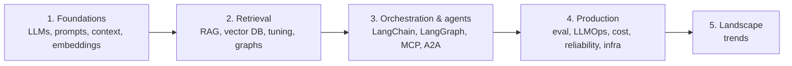

# GenAI Topics

*Last reviewed: October 2026*

The building blocks of generative and agentic AI, from how models work through
to running them reliably in production. Each topic page has diagrams, the
trade-offs that matter, and an interview deep dive.

**Who it's for:** engineers preparing for senior, staff or principal AI, ML
platform or forward-deployed roles who need to explain *why* a design works, not
just which library to import. If you'd rather build something first, start with
the [Setup Guides](../Setup-Guides/index.md) and come back here for the theory.

## Suggested learning path

1. **Foundations** give you the vocabulary every other page uses.
2. **Retrieval** is the most common system-design prompt.
3. **Orchestration and agents** is where staff-level questions about control,
   safety and tool design come in.
4. **Production** is what separates senior answers from demos: evaluation, cost,
   failure handling and deployment.
5. **Trends** keeps your answers current. Read it last and re-read it before
   interviews.

## 1. Foundations

-   :material-school: __LLM Fundamentals__

    ---

    Tokens, attention, sampling, context windows, and when to use fine-tuning
    versus RAG.

    [:octicons-arrow-right-24: Open](llm-fundamentals/index.md)

-   :material-text-box-edit: __Prompt Engineering__

    ---

    Instructions, few-shot examples, reasoning strategies and structured output.

    [:octicons-arrow-right-24: Open](prompt-engineering/index.md)

-   :material-window-restore: __Context Engineering__

    ---

    Deciding what goes into the context window: assembly, memory, compaction and
    token budgets.

    [:octicons-arrow-right-24: Open](context-engineering/index.md)

-   :material-dots-hexagon: __Embedding Models__

    ---

    How text becomes vectors, and how to choose and use embedding models for
    search and RAG.

    [:octicons-arrow-right-24: Open](embeddings/index.md)

## 2. Retrieval and knowledge

-   :material-database-search: __RAG__

    ---

    Retrieval-augmented generation end to end: indexing, retrieval, grounding
    and citations.

    [:octicons-arrow-right-24: Open](rag/index.md)

-   :material-vector-triangle: __Vector Databases__

    ---

    How similarity search works, ANN indexes, distance metrics and choosing a
    store.

    [:octicons-arrow-right-24: Open](vector-db/index.md)

-   :material-tune: __Retrieval Tuning__

    ---

    Top-K, metadata filtering and reranking: the levers with the biggest effect
    on RAG quality.

    [:octicons-arrow-right-24: Open](retrieval-tuning/index.md)

-   :material-graph-outline: __Graph DB & GraphRAG__

    ---

    Nodes, relationships, knowledge graphs, and retrieval that follows
    connections.

    [:octicons-arrow-right-24: Open](graph-db/index.md)

## 3. Orchestration and agents

-   :material-link-variant: __LangChain__

    ---

    Composing prompts, models, retrievers and tools into LLM applications.

    [:octicons-arrow-right-24: Open](langchain/index.md)

-   :material-graph: __LangGraph__

    ---

    Agent workflows as stateful graphs, with cycles, branching and
    human-in-the-loop.

    [:octicons-arrow-right-24: Open](langgraph/index.md)

-   :material-connection: __MCP__

    ---

    Model Context Protocol, the open standard that connects LLM hosts to tools
    and data servers.

    [:octicons-arrow-right-24: Open](mcp/index.md)

-   :material-account-switch: __A2A__

    ---

    Agent-to-agent communication for delegating and coordinating across teams
    of agents.

    [:octicons-arrow-right-24: Open](a2a/index.md)

-   :material-robot-industrial: __Agent Engineering__

    ---

    A survey of building agents that reason, use tools and act reliably.

    [:octicons-arrow-right-24: Open](agent-engineering/index.md)

-   :material-head-cog: __Agent Principles & Patterns__

    ---

    A code-level deep dive into agent principles, control-flow patterns and the
    anti-patterns to avoid.

    [:octicons-arrow-right-24: Open](agent-principles/index.md)

-   :material-account-cog: __AgentCore__

    ---

    Amazon Bedrock AgentCore: runtime, memory, gateway, identity and
    observability for production agents.

    [:octicons-arrow-right-24: Open](agentcore/index.md)

-   :material-aws: __Amazon Bedrock__

    ---

    AWS's managed multi-provider model API, with knowledge bases, agents and
    guardrails.

    [:octicons-arrow-right-24: Open](bedrock/index.md)

## 4. Production

-   :material-chart-line: __Observability & Evaluation__

    ---

    Tracing, evaluation sets, LLM-as-judge and production monitoring.

    [:octicons-arrow-right-24: Open](observability/index.md)

-   :material-cog-sync: __LLMOps / Deployment__

    ---

    Serving, scaling, caching, versioning and the lifecycle of models and
    prompts.

    [:octicons-arrow-right-24: Open](llmops/index.md)

-   :material-cash-multiple: __Cost Optimization__

    ---

    A practical playbook for cutting token and call costs without losing
    quality.

    [:octicons-arrow-right-24: Open](cost-optimization/index.md)

-   :material-shield-refresh: __Reliability & Distributed Systems__

    ---

    Timeouts, retries, circuit breakers and the failure modes specific to AI
    systems.

    [:octicons-arrow-right-24: Open](reliability/index.md)

-   :material-infinity: __DevOps for AI__

    ---

    Version control, infrastructure as code, CI/CD pipelines and deployment
    strategies for AI systems.

    [:octicons-arrow-right-24: Open](devops-ai/index.md)

-   :material-kubernetes: __Kubernetes & Containers__

    ---

    Running model serving and GPU workloads: images, cold starts, autoscaling.

    [:octicons-arrow-right-24: Open](kubernetes/index.md)

## 5. Landscape

-   :material-trending-up: __GenAI Trends & Market__

    ---

    A dated snapshot of where the field is, so your answers reflect today rather
    than 2023.

    [:octicons-arrow-right-24: Open](trends/index.md)

## Practise what you read

- Interview Q&A: [GenAI](../Personal-SourceCode/GenAI_Interview_QA.md) ·
  [Agents](../Personal-SourceCode/Agents_Interview_QA.md) ·
  [LangChain & LangGraph](../Personal-SourceCode/LangChain_LangGraph_Interview_QA.md) ·
  [MCP](../Personal-SourceCode/MCP_Interview_QA.md) ·
  [AI Engineer](../Personal-SourceCode/AI_Engineer_Interview_QA.md)
- Role path: [AI Engineer](../Personal-SourceCode/Path_AI_Engineer.md).
