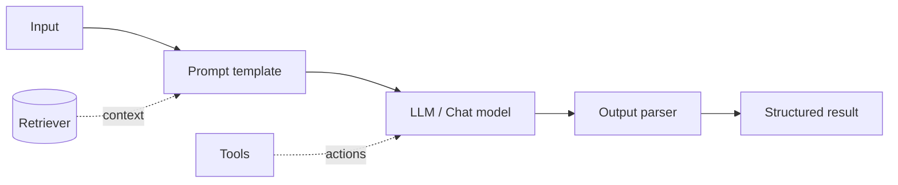

# LangChain

*Last reviewed: October 2026*

!!! info "What's changed recently"
    - **LangChain 1.0 (October 2025)** slimmed the package around one agent
      abstraction: `create_agent`, which runs on the LangGraph runtime. The
      maintainers committed to no breaking changes until 2.0.
    - **Middleware** hooks into the agent loop. Built-ins cover human-in-the-loop
      approval, summarization near context limits, and PII redaction, and you can
      write your own.
    - **Standard content blocks** (`message.content_blocks`) give one
      provider-neutral view of text, reasoning traces, citations, and server-side
      tool calls. Structured output now runs inside the main agent loop.
    - **Legacy chains, memory classes, and retriever helpers moved to
      `langchain-classic`.** Conversation state now lives in LangGraph persistence
      (checkpointers keyed by thread). 1.0 requires Python 3.10+.

LangChain is a framework for composing LLM applications from reusable pieces:
prompts, models, retrievers, tools, and memory — wired together with **LCEL**
(LangChain Expression Language).

<!-- RELATED-MODULE -->

## Building blocks



- **Prompt templates** — parameterized prompts.
- **Models** — chat/LLM wrappers with a common interface.
- **Output parsers** — coerce text into structured data (JSON, Pydantic).
- **Retrievers** — pluggable RAG sources.
- **Tools & agents** — let the model take actions (`create_agent` in 1.x).
- **Middleware** — hooks around model and tool calls (approval, summarization,
  PII redaction, retries).
- **Memory** — carry conversation state (in 1.x, via LangGraph checkpointers;
  the old `*Memory` classes live in `langchain-classic`).

## LCEL — composition with pipes

```python
from langchain_core.prompts import ChatPromptTemplate
from langchain_core.output_parsers import StrOutputParser

prompt = ChatPromptTemplate.from_template("Explain {topic} in one sentence.")
chain = prompt | model | StrOutputParser()
chain.invoke({"topic": "vector databases"})
```

The `|` operator composes runnables into a pipeline that supports streaming,
batching, and async out of the box. LCEL is still the way to build fixed chains
in 1.x.

## Agents in LangChain 1.x

```python
from langchain.agents import create_agent
from langchain.agents.middleware import HumanInTheLoopMiddleware

agent = create_agent(
    model="anthropic:claude-sonnet-4-5",          # provider:model string or a chat model
    tools=[get_order, issue_refund],
    system_prompt="You are a support agent. Use tools for every fact.",
    middleware=[HumanInTheLoopMiddleware(interrupt_on={"issue_refund": True})],
)
agent.invoke({"messages": [{"role": "user", "content": "Refund order 123"}]})
```

`create_agent` replaces the older `AgentExecutor` and LangGraph's prebuilt
`create_react_agent`. Because it runs on LangGraph, you get persistence,
streaming, and interrupts without dropping down a level. Confirm exact
middleware names and arguments against the current docs.

## Chains vs agents

- **Chain** — a fixed sequence you define (predictable, cheaper).
- **Agent** — the LLM decides which tools to call and in what order (flexible,
  more tokens, needs guardrails). Use a chain when the steps are known.

## Interview questions

??? question "Chain vs agent — when to use which?"
    Use a chain when the workflow is known and deterministic. Use an agent when the
    path depends on intermediate results and the model must choose tools — at the
    cost of latency, tokens, and reliability.

??? question "What is LCEL and why does it help?"
    A declarative way to compose runnables with `|`. You get streaming, batching,
    async, and retries uniformly, and components swap cleanly.

??? question "How does LangChain support RAG?"
    Retrievers plug into chains to fetch context, which is formatted into the
    prompt before the model call — with vector stores, re-rankers, and parsers as
    swappable parts.

---

## Interview deep dive

### 60-second talking points

- **"LangChain composes LLM apps from swappable parts."** Prompts, models,
  retrievers, tools, memory — wired with LCEL pipes.
- **"Chain when the path is known; agent when the model must decide."**
- **"LCEL gives streaming/batch/async for free."**

### Scenario & system-design questions

??? question "Build a RAG chatbot with conversation memory in LangChain."
    Retriever (vector store) → format context into a prompt template → chat model
    → output parser, composed via LCEL. Carry history with a LangGraph
    checkpointer (thread ID per conversation) and add a **query-rewriting step**
    that turns follow-ups ("what about it?") into standalone queries before
    retrieving. (The classic `create_history_aware_retriever` helper now lives in
    `langchain-classic`.) Alternatively, give a `create_agent` agent a retriever
    tool and let it decide when to search.

??? question "Your agent loops and burns tokens. How do you make it production-safe?"
    Cap **max iterations**; give a tight, well-described tool set; add timeouts and
    cost budgets; prefer a **chain** if the flow is actually deterministic; log
    every step for observability; and validate tool inputs/outputs.

??? question "Why might you NOT use LangChain?"
    For simple single-call apps the abstraction adds overhead/indirection; some
    teams prefer thin direct SDK calls or lighter frameworks. Use it when you
    genuinely benefit from swappable components, agents, and RAG plumbing.

### Pitfalls interviewers probe

- Using an agent where a chain suffices (latency, cost, flakiness).
- No max-iteration/tool guardrails.
- Describing pre-1.0 APIs (`AgentExecutor`, `ConversationBufferMemory`) as
  current.
- Over-abstracting simple flows.
- Ignoring history rewriting in multi-turn RAG.

### Rapid-fire

| Q | A |
|---|---|
| LCEL? | Declarative composition with `|`; streaming/batch/async built in |
| Chain vs agent? | Fixed sequence vs model chooses tools/steps |
| Memory? | Carries conversation state across turns |
| History-aware retriever? | Rewrites follow-ups into standalone queries |
| Agent API in 1.x? | `create_agent` (on the LangGraph runtime) + middleware |
| Where did legacy chains go? | `langchain-classic` |
