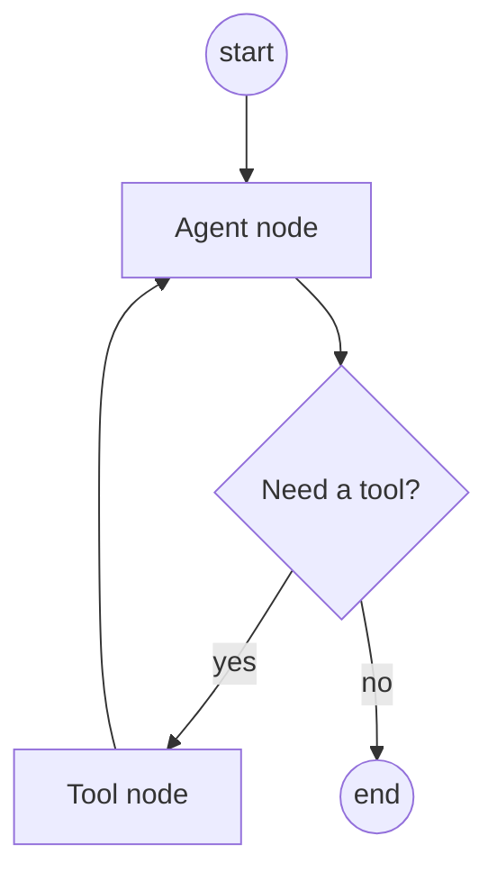

# LangGraph

*Last reviewed: October 2026*

!!! info "What's changed recently"
    - **LangGraph 1.0 (October 2025)** is the stable runtime for durable,
      stateful agents, with built-in persistence and human-in-the-loop. It stayed
      backward compatible apart from deprecations.
    - **`langgraph.prebuilt` is deprecated.** `create_react_agent` gives way to
      LangChain's `create_agent`, which itself runs on LangGraph. Use raw
      `StateGraph` when you need custom control flow.
    - **Human-in-the-loop uses `interrupt()` and `Command(resume=...)`** on a
      checkpointed thread, replacing static breakpoints as the main pattern.

LangGraph models agent workflows as a **graph** of nodes (steps) and edges
(transitions) with shared **state** — giving you cycles, branching, and
human-in-the-loop that plain linear chains can't express.

<!-- RELATED-MODULE -->

## Graph model



- **Nodes** — functions/LLM calls that read and update state.
- **Edges** — control flow; **conditional edges** branch on state.
- **State** — a typed object passed through the graph (e.g. messages, scratchpad).
- **Cycles** — nodes can loop back (agent ↔ tools) — the key difference from a
  chain.

```python
from typing import Annotated, TypedDict
from langgraph.graph import StateGraph, START, END
from langgraph.graph.message import add_messages
from langgraph.checkpoint.memory import InMemorySaver
from langgraph.types import interrupt, Command

class State(TypedDict):
    messages: Annotated[list, add_messages]     # reducer appends, not overwrites

def approve(state: State):
    decision = interrupt({"question": "Approve this refund?"})  # pauses the run
    return {"messages": [("system", f"approval={decision}")]}

g = StateGraph(State)
g.add_node("approve", approve)
g.add_edge(START, "approve")
g.add_edge("approve", END)
app = g.compile(checkpointer=InMemorySaver())   # use a durable saver in prod

cfg = {"configurable": {"thread_id": "t-1"}}
app.invoke({"messages": [("user", "refund #123")]}, cfg)   # stops at interrupt
app.invoke(Command(resume="yes"), cfg)                      # resumes same thread
```

## Why a graph over a chain

- **Loops**: agent calls a tool, sees the result, decides again.
- **Branching**: route based on classification or validation.
- **Human-in-the-loop**: pause for approval, then resume.
- **Persistence**: checkpoint state to resume long-running or interrupted runs.

## Interview questions

??? question "LangGraph vs a LangChain chain?"
    A chain is a linear/DAG pipeline; LangGraph adds explicit state plus cycles and
    conditional edges, so you can model iterative agents and branching workflows.

??? question "Why is shared state important?"
    Nodes communicate through a typed state object, enabling loops, checkpointing/
    resume, and human-in-the-loop without threading data manually between steps.

??? question "Give a use case that needs LangGraph, not a chain."
    An agent that repeatedly calls tools until a condition is met, or a workflow
    that pauses for human approval then continues — both require cycles/branching.

---

## Interview deep dive

### 60-second talking points

- **"Graph, not pipeline."** Nodes + edges + shared state let you express
  **loops**, **branching**, and **human-in-the-loop** — things a linear chain
  can't.
- **"State is the contract."** A typed state object flows through nodes, enabling
  checkpointing and resume.

### Scenario & system-design questions

??? question "Design an agent that researches, then writes, then self-reviews before answering."
    Nodes: `plan → retrieve → draft → critique → (loop back to draft if critique
    fails) → finalize`. Conditional edge on the critique result creates the
    **revision loop**; shared state holds the draft + feedback; checkpoint so a
    long run can resume.

??? question "You need a human to approve an action before the agent proceeds. How?"
    Use **human-in-the-loop**: the approval node calls `interrupt()`, the
    checkpointer persists state under a `thread_id`, and the app **resumes** with
    `Command(resume=decision)` after the human answers. That's impossible to do
    cleanly in a stateless chain. Use a durable checkpointer (Postgres, etc.) in
    production so the pause survives restarts.

??? question "When is LangGraph overkill?"
    For a straight prompt→retrieve→answer flow with no loops/branches, a plain
    LCEL chain is simpler. Reach for LangGraph when you need cycles, conditional
    routing, persistence, or multi-agent coordination.

### Pitfalls interviewers probe

- No termination condition on a cyclic graph → infinite loop.
- Bloated state object (pass only what nodes need).
- Using it for flows that don't need cycles/branching.
- Using `InMemorySaver` in production (state is lost on restart).
- Non-idempotent side effects in a node that can re-run on resume or retry.

### Rapid-fire

| Q | A |
|---|---|
| Core primitives? | Nodes, edges, shared state |
| vs a chain? | Adds cycles, conditional edges, persistence |
| Human-in-the-loop? | `interrupt()` → checkpoint → `Command(resume=...)` |
| Prebuilt ReAct agent in 1.x? | `create_react_agent` deprecated → LangChain `create_agent` |
| Why shared state? | Enables loops, checkpointing, resume |

## How interviewers probe this

??? question "Design a long-running research agent that survives crashes and pauses for approval."
    A strong answer covers: typed state with reducers, a durable checkpointer
    (Postgres or similar) keyed by `thread_id`, `interrupt()` at the approval
    node with `Command(resume=...)`, idempotent side effects (a node may re-run
    on resume), step and cost limits in state, and streaming of intermediate
    events to the UI. It also covers how to replay or time-travel from a
    checkpoint to debug a bad run.

??? question "How do you structure a multi-agent system in LangGraph?"
    Use a supervisor graph whose nodes are subgraphs or agents, hand-offs via
    `Command(goto=..., update=...)`, shared state kept minimal with private state
    per subgraph, a bounded delegation depth, and tracing across subgraphs. Then
    justify why it isn't a single agent with more tools.

??? question "Your graph's state grows until runs slow down and cost spikes. What do you change?"
    Keep large payloads (documents, tool output) outside state and reference
    them by ID, summarize or trim `messages` with a reducer or summarization
    middleware, and split per-node scratch state from shared state. Check
    checkpoint size, because each step persists it.

??? question "When would you pick raw StateGraph over create_agent?"
    `create_agent` covers the standard model-and-tools loop with middleware.
    Drop to `StateGraph` for custom topologies: parallel branches with joins,
    deterministic workflow steps mixed with LLM steps, multiple specialized loops,
    or bespoke routing that middleware can't express.
