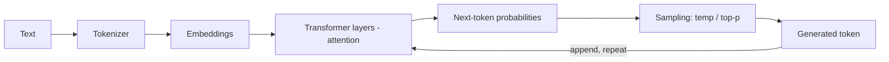
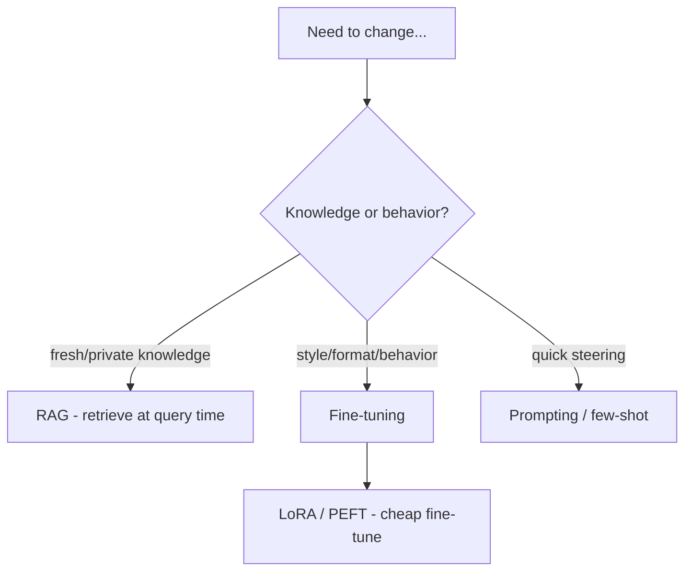

# LLM Fundamentals

*Last reviewed: October 2026*

!!! info "What's changed recently"
    - **Reasoning models are standard.** Frontier models spend extra "thinking"
      tokens before answering (test-time compute), usually with an effort or
      budget setting. More thinking buys accuracy on hard tasks at the cost of
      latency and money.
    - **Sampling knobs don't always apply.** Some reasoning models fix or ignore
      temperature and top-p, so reliability comes from structured outputs,
      validation, and evals rather than temperature alone.
    - **Mixture-of-Experts (MoE) is the common frontier architecture**, including
      most large open-weight models: many parameters in total, only a fraction
      active per token.
    - **Post-training goes beyond SFT and RLHF.** Preference optimization (DPO
      and variants) and reinforcement fine-tuning with verifiable rewards are now
      common adaptation tools, alongside LoRA.

The concepts every GenAI engineer should be fluent in: how models represent
text, generate it, and how you adapt them. This underpins every other topic.

<!-- RELATED-MODULE -->

## From text to tokens to output

- **Tokens** — models read/write **tokens** (~¾ of a word each), not characters.
  Cost and context limits are measured in tokens.
- **Embeddings** — tokens/text map to vectors capturing meaning (basis of RAG &
  vector search).
- **Transformer + attention** — each token attends to others; **self-attention**
  is the core mechanism.
- **Autoregressive generation** — the model predicts the next token, appends it,
  and repeats.

## Sampling controls

| Parameter | Effect |
|-----------|--------|
| **Temperature** | Higher = more random/creative; lower = more deterministic (some reasoning models ignore it) |
| **Top-p (nucleus)** | Sample from the smallest set of tokens summing to p |
| **Top-k** | Sample from the k most likely tokens |
| **Max tokens** | Caps output length |
| **Stop sequences** | End generation at a marker |

For factual/structured tasks → low temperature. For brainstorming → higher.

## Context window

The max tokens (input + output) a model can consider at once. Larger windows fit
more context but cost more and can dilute attention ("lost in the middle") — see
[Context Engineering](../context-engineering/index.md).

## Ways to adapt a model

| Approach | Changes | Cost | Use when |
|----------|---------|------|----------|
| **Prompting / few-shot** | Behavior at call time | Cheapest | Quick steering, format |
| **RAG** | Adds knowledge | Low | Fresh/private/changing facts + citations |
| **Fine-tuning** | Bakes in behavior/style | High | Consistent style/format, narrow domain |
| **LoRA / PEFT** | Efficient fine-tune | Medium | Fine-tune without full retrain |
| **Preference / RL fine-tuning** | Aligns outputs to preferences or graded rewards | High | Tasks with clear graders (DPO, reinforcement fine-tuning) |

**Rule of thumb:** need *knowledge* → RAG; need *behavior/style* → fine-tune;
need *quick change* → prompt. Most enterprise apps start with RAG.

## Other essentials

- **Hallucination** — plausible but wrong output; mitigate with grounding
  (RAG), "say you don't know," low temp, and verification.
- **Context vs parametric knowledge** — what's in the prompt vs what's baked in
  the weights (and possibly stale).
- **Embeddings ≠ the LLM** — a separate (often smaller) model produces vectors
  for retrieval.
- **Cost/latency** scale with tokens (input + output, including hidden
  reasoning tokens) and model size.
- **Reasoning vs non-reasoning models** — reasoning models trade latency and
  cost for accuracy on multi-step problems; use them where the task needs it,
  not by default.
- **MoE** — only some "expert" sub-networks run per token, so a model's total
  parameter count overstates its per-token compute.

## Interview deep dive

### 60-second talking points

- **"Models work in tokens; cost, context, and limits are all token-based."**
- **"Temperature/top-p trade determinism for creativity."**
- **"Knowledge → RAG; behavior → fine-tune; quick change → prompt."**

### Scenario & system-design questions

??? question "A stakeholder asks: should we fine-tune or use RAG?"
    Ask what needs to change. **Fresh/private/changing knowledge** or a need for
    citations → **RAG** (cheaper, current, no retraining). Consistent **style,
    format, or domain behavior** → **fine-tuning** (or LoRA). Often RAG first;
    fine-tune only if behavior still isn't right.

??? question "Outputs are too random / too repetitive. What do you tune?"
    Lower **temperature** (and/or top-p) for more deterministic, factual output;
    raise it for creativity. Add stop sequences and max-tokens for control. For
    structure, use structured output rather than just temperature.

??? question "Why do larger context windows not always help?"
    More tokens cost more and add latency, and models attend less to the middle of
    long contexts ("lost in the middle") — so relevance and ordering matter more
    than raw size.

### Pitfalls interviewers probe

- Confusing tokens with words/characters.
- Fine-tuning to add knowledge (that's RAG's job).
- High temperature for factual tasks.
- Assuming bigger context = better answers.
- Thinking the embedding model is the same as the chat LLM.

### Rapid-fire

| Q | A |
|---|---|
| What's a token? | ~¾ word unit models read/write; basis of cost/limits |
| Temperature? | Randomness of sampling (low=deterministic) |
| Context window? | Max tokens (in+out) considered at once |
| RAG vs fine-tune? | Knowledge vs behavior/style |
| LoRA/PEFT? | Efficient fine-tuning without full retrain |
| Hallucination fix? | Ground (RAG), "say you don't know", low temp, verify |

## How interviewers probe this

??? question "When would you pick a reasoning model over a fast non-reasoning model?"
    A strong answer ties it to the task: multi-step math, code, planning, or
    ambiguous analysis benefits from reasoning; extraction, classification, and
    short chat usually don't. Measure accuracy, latency, and cost on your eval set,
    tune effort or thinking budget, and route only the hard slice to the
    expensive mode.

??? question "Explain why the same prompt gives different answers, and how you make outputs dependable."
    Sampling randomness, nondeterminism from batching and floating-point math on
    the serving side, and silent model updates if versions aren't pinned. Make it
    dependable with pinned versions, structured outputs and schema validation,
    low temperature where supported, retries with repair, and evals that measure
    the distribution of answers, not a single run.

??? question "Fine-tune, RAG, or a bigger model? Walk through the decision."
    Diagnose the gap first. Missing or changing knowledge points to RAG. A format
    or behavior gap points to prompting, then fine-tuning. A reasoning-capability
    gap points to a stronger or reasoning model. Factor in data availability,
    maintenance cost (re-tuning on every base-model upgrade), and latency.

??? question "What actually limits context length in practice?"
    Attention cost and KV-cache memory grow with sequence length, so long
    contexts cost more and slow down. Quality also degrades with long inputs well
    before the advertised limit. Budget and order context deliberately instead of
    filling the window.
