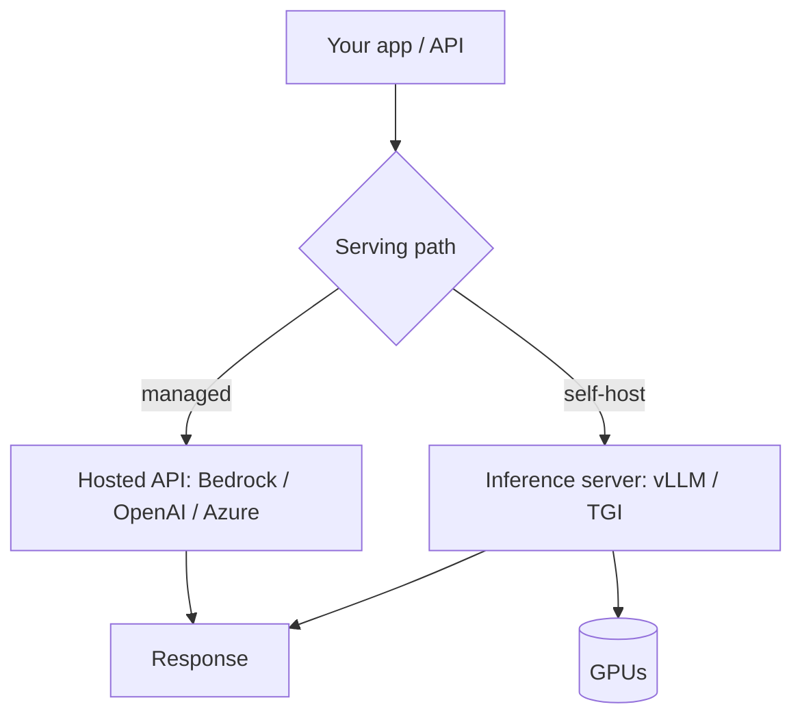
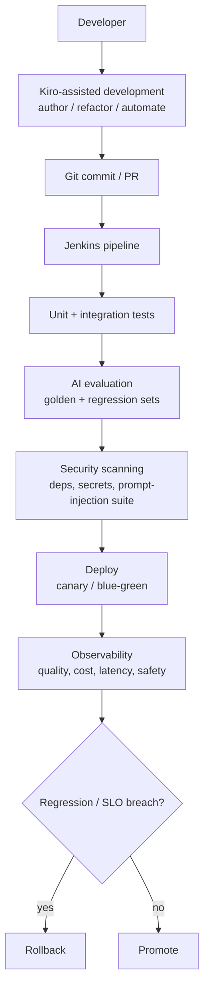

# LLMOps / Deployment

LLMOps is MLOps for LLM apps: **serving, scaling, cost control, caching,
versioning, and lifecycle** of models and prompts in production. It's what turns
a working prototype into a reliable, affordable service.

<!-- RELATED-MODULE -->

## Serving options

| Path | Pros | Cons |
|------|------|------|
| **Managed API** (Bedrock, OpenAI, Azure) | No infra, fast to ship, scales | Per-token cost, less control, data-egress concerns |
| **Self-hosted** (vLLM, TGI, Ollama) | Control, data stays in, fixed cost | You manage GPUs, scaling, ops |

## Performance & cost levers

- **Caching** — cache identical prompts/responses; **prompt caching** reuses a
  fixed prefix (system prompt, docs) across calls to cut cost/latency.
- **KV cache** — self-hosted servers reuse attention state across tokens
  (vLLM's paged KV cache boosts throughput).
- **Batching** — group concurrent requests for GPU efficiency.
- **Quantization** — 8-bit/4-bit weights shrink memory and speed inference with
  small quality loss.
- **Model right-sizing** — use the smallest model that passes eval; route easy
  queries to cheap models, hard ones to strong models (**model routing**).
- **Streaming** — stream tokens for perceived latency.
- **Token budgets** — cap input/output; trim context (see Context Engineering).

## Lifecycle & governance

- **Prompt versioning** — treat prompts as code: version, review, test, roll back.
- **Model versioning** — pin model versions; test before upgrading (models drift).
- **CI/CD with evals** — run the eval suite on every prompt/model change (see
  Observability).
- **Canary / A-B rollout** — ship changes to a slice first.
- **Guardrails + monitoring** — in the request path and on metrics (cost,
  latency, error rate, quality).
- **Secrets & data** — keys in a secrets manager; know where data flows
  (governance, PII, region).

## Reliability patterns

- **Timeouts + retries** on model calls; **fallback** to a smaller model or cached
  answer on failure.
- **Rate limiting** per user/tenant.
- **Graceful degradation** — return a useful partial/extractive answer if the LLM
  is down (like this site's own agent).

## Interview deep dive

### 60-second talking points

- **"Managed API to ship fast; self-host (vLLM/TGI) for control and fixed cost."**
- **"Biggest cost levers: caching, right-sizing/routing, and token budgets."**
- **"Treat prompts and model versions as code, gated by an eval suite."**

### Scenario & system-design questions

??? question "Your LLM feature's bill is too high. How do you cut cost without wrecking quality?"
    Route easy queries to a **cheaper model**, reserve the strong model for hard
    ones (**model routing**); enable **prompt caching** for the fixed prefix;
    trim context with budgets; cache repeated queries; and cap max tokens.
    Measure quality on the eval set so cuts don't regress accuracy.

??? question "Design deployment for a customer-facing RAG chatbot."
    App/API (FastAPI) → retrieval → **managed model (Bedrock)** or self-hosted
    vLLM → guardrails → streaming response. Add caching, timeouts+retries with a
    fallback model, rate limiting, tracing/monitoring, prompt/model versioning,
    and CI evals. Canary new versions.

??? question "When would you self-host a model instead of using a managed API?"
    Data must stay in-house (compliance), you need a custom/fine-tuned model, want
    fixed cost at high steady volume, or need latency/control a hosted API can't
    give. Trade-off: you own GPU ops and scaling.

??? question "How do you safely upgrade the underlying model version?"
    Pin versions; run the **eval suite** on the new version; **canary** to a slice
    of traffic; monitor quality/cost/latency; roll back if metrics regress. Models
    drift, so never auto-upgrade blindly.

### Pitfalls interviewers probe

- No caching / no token budgets (runaway cost).
- One giant model for every query (no routing).
- Prompts/models unversioned and untested.
- Auto-upgrading model versions without eval.
- No fallback when the model API fails.

### Rapid-fire

| Q | A |
|---|---|
| Managed vs self-host? | Speed/no-ops vs control/fixed-cost/data-in |
| Self-host servers? | vLLM, TGI, Ollama |
| Prompt caching? | Reuse a fixed prefix across calls to cut cost/latency |
| Model routing? | Cheap model for easy queries, strong for hard |
| Safe model upgrade? | Pin, eval, canary, monitor, roll back |
| Quantization? | Lower-bit weights → less memory, faster, small quality loss |

---

## Production AI CI/CD pipeline

Shipping AI safely means the pipeline gates on **quality and safety**, not just
"the code compiles." A functional test suite passing is *not* enough for an AI
system, an unchanged codebase can still regress because a prompt or model changed.

!!! note "Kiro and Jenkins — how they fit together"
    In this workflow, **Kiro is used for AI-assisted development and automation**
    (writing code, scaffolding, refactors, docs). **Jenkins remains the production
    CI/CD system** that builds, tests, evaluates, scans, and deploys. Kiro speeds
    up authoring; **Jenkins is still the gate to production**. Kiro does not
    replace Jenkins.

**What each AI-specific gate does:**

- **Golden-dataset evaluation** — a curated set of representative inputs with
  known-good outputs/rubrics. The change must meet a quality bar (correctness,
  faithfulness, format validity) before it proceeds.
- **Regression evaluation** — compares the new prompt/model against the current
  production version on the same set; blocks a *drop* even if absolute scores look
  fine.
- **Security scanning** — dependency/secret scans **plus an AI layer**: run a
  prompt-injection / jailbreak test suite and check output guardrails still hold.
- **Canary + rollback** — ship to a traffic slice, watch quality/cost/latency/
  safety, auto-roll-back on regression. Deploy is decoupled from release via flags.

**What's versioned and gated (treat all as code):**

| Artifact | Versioned | Gated by |
|----------|-----------|----------|
| Application code | Git | Unit/integration tests |
| **Prompts** | Prompt registry / Git | Golden + regression eval |
| **Model version** | Pinned config | Eval before upgrade (models drift) |
| **Datasets / eval sets** | Dataset versioning | Reviewed; drives the gates |
| Retrieval index config | Config as code | Retrieval eval (recall@k) |

---

## AgentOps — operating agents in production

Agents add operational surface beyond a single model call: multi-step loops,
tools, memory, and non-determinism. AgentOps extends LLMOps with agent-specific
lifecycle and telemetry.

**Beyond LLMOps, you also manage:**

- **Tool registry + versioning** — tools (and MCP servers) are dependencies; pin,
  review on change, and eval routing accuracy after changes.
- **Trajectory evaluation** — score not just the final answer but the *path*
  (were the steps/tool calls sensible and efficient?). See
  [Observability & Eval](../observability/index.md).
- **Loop / cost guards as first-class ops** — step caps, token/cost budgets, and
  repeated-action detection are runtime controls you monitor and alert on.
- **Human-in-the-loop queues** — approvals for gated actions become an operational
  workflow (latency, backlog, audit).
- **Replay + tracing** — durable, checkpointed state lets you replay a bad run to
  find which step failed (see [Agent Principles](../agent-principles/index.md)).

**Agent-specific signals to monitor:** steps-per-task, tool-failure rate, retry
count, loop-detection hits, cost-per-task, approval latency, and task-success
rate over time (drift).

??? question "How is deploying an agent different from deploying a single-call LLM feature?"
    An agent has a **loop, tools, and memory**, so more can go wrong and it's
    non-deterministic. You add: tool/MCP versioning + review, **trajectory** eval
    (not just final-answer), runtime **loop/cost guards** you monitor, HITL
    approval queues, and step-level tracing for replay. CI must eval the whole
    trajectory and the routing, not just one prompt.

??? question "A prompt change passes all unit tests but the AI answers got worse. How does CI catch this?"
    Unit tests can't see quality regressions. The pipeline needs a **golden-dataset
    eval** (meet a quality bar) plus a **regression eval** (compare against the
    current prod version and block a drop). That's the AI-specific gate between
    "tests pass" and "deploy."

??? question "Where does Kiro fit vs Jenkins in your delivery pipeline?"
    Kiro is for **AI-assisted development** — authoring, refactoring, automating
    work in the editor. **Jenkins is the production CI/CD** that runs tests, AI
    evaluation, security scanning, and controls the deploy. Kiro accelerates how
    code gets written; Jenkins is still the gate that decides what reaches prod.

!!! note "Related"
    [Observability & Eval](../observability/index.md) ·
    [Cost Optimization](../cost-optimization/index.md) ·
    [Agent Principles](../agent-principles/index.md) ·
    [AI Security](../../AI-Security/index.md) ·
    Practice: [DevOps Interview Q&A](../../Personal-SourceCode/DevOps_Interview_QA.md) ·
    [AI Engineer Interview Q&A](../../Personal-SourceCode/AI_Engineer_Interview_QA.md)
