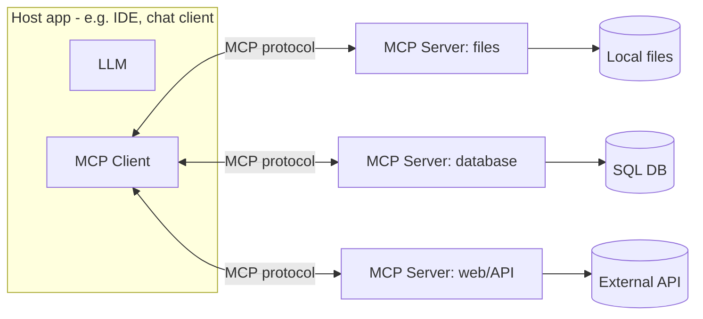

# MCP (Model Context Protocol)

*Last reviewed: October 2026*

!!! info "What's changed recently"
    - **Remote servers are now normal.** Spec `2025-03-26` added the
      **Streamable HTTP** transport, replacing the older HTTP+SSE transport. stdio
      is still used for local servers.
    - **Authorization uses OAuth.** An HTTP MCP server acts as an OAuth resource
      server: it publishes protected-resource metadata (RFC 9728) and accepts only
      tokens issued for it. `2025-06-18` added structured tool output, elicitation,
      and resource links. `2025-11-25` added Client ID Metadata Documents,
      incremental scope consent, URL-mode elicitation, and experimental **tasks**.
    - **`2026-07-28` makes the protocol stateless.** There is no `initialize`
      handshake and no `Mcp-Session-Id`. Each request carries its protocol version
      and capabilities in `_meta`, and a new `server/discover` call advertises what
      a server supports. Multi Round-Trip Requests (`input_required` results)
      replace server-to-client requests, and tasks move to an official extension.
    - **Deprecations in `2026-07-28`:** Roots, Sampling, and Logging; the
      HTTP+SSE transport; and Dynamic Client Registration, in favor of Client ID
      Metadata Documents.
    - **Neutral governance.** In December 2025 Anthropic donated MCP to the Linux
      Foundation's **Agentic AI Foundation**, alongside goose and AGENTS.md.

MCP is an open standard that lets LLM applications connect to tools, data, and
context through a uniform interface — think "USB-C for AI." Instead of custom
glue per integration, a **host** talks to any **MCP server** the same way.

<!-- RELATED-MODULE -->

## How MCP fits together

- **Host** — the app the user interacts with (contains the LLM).
- **Client** — connector inside the host, one per server.
- **Server** — exposes capabilities over MCP; you can write your own.

## What a server exposes

| Primitive | Meaning | Example |
|-----------|---------|---------|
| **Tools** | Actions the model can call | `run_sql`, `send_email`, `search` |
| **Resources** | Readable data/context | files, rows, docs |
| **Prompts** | Reusable prompt templates | "summarize ticket" |

Clients can also offer features back to servers. **Elicitation** lets a server
ask the user for input mid-call. **Sampling** (a server asking the host's model
for a completion) and **Roots** (sharing workspace paths) still exist, but
`2026-07-28` deprecates them.

## Transports

| Transport | Where | Notes |
|-----------|-------|-------|
| **stdio** | Local server launched by the host | Simple; inherits local trust. Log to stderr. |
| **Streamable HTTP** | Remote / shared servers | One HTTP endpoint with optional streamed responses; OAuth-protected. As of `2026-07-28` it is stateless, so it scales behind an ordinary load balancer. |
| ~~HTTP+SSE~~ | Legacy | Deprecated since `2025-03-26`; migrate to Streamable HTTP. |

## Why it matters

- **Interoperability** — write a server once, use it from any MCP-compatible host.
- **Separation of concerns** — capabilities live in servers, not baked into each app.
- **Governance** — a controlled boundary for what the model can access/do.

## Interview questions

??? question "What problem does MCP solve?"
    The M×N integration problem: instead of custom code for every app-to-tool
    pairing, MCP gives one standard protocol so any host can use any server.

??? question "Tools vs resources vs prompts?"
    Tools are callable actions (side effects/queries), resources are readable
    context the model can pull in, and prompts are reusable templated instructions.

??? question "How is MCP different from plain function calling?"
    Function calling is model-native and app-specific; MCP standardizes the
    transport and discovery so tools are reusable across hosts and decoupled from
    any one model or app.

---

## Interview deep dive

### 60-second talking points

- **"MCP is USB-C for AI tools."** One standard protocol so any host can use any
  server — solves the M×N integration explosion.
- **"Capabilities live in servers, not baked into apps."** Write a server once,
  reuse everywhere; a clean governance boundary.

### Scenario & system-design questions

??? question "Your team has 5 AI apps each needing the same 6 internal tools. Why MCP?"
    Without MCP that's up to 5×6 bespoke integrations. With MCP you build **6 MCP
    servers once**; every app (host) connects via the same protocol. New apps get
    all tools for free; tool changes happen in one place.

??? question "How is MCP different from native function calling?"
    Function calling is model-/app-specific glue. MCP **standardizes transport and
    discovery**, so tools are decoupled from any one model or app and reusable
    across hosts. Function calling can be the mechanism a host uses *underneath*.

??? question "What are the security considerations when exposing tools via MCP?"
    Treat the server as a privilege boundary: **least-privilege** tool scopes,
    OAuth on remote servers (validate that each token was issued for *this*
    server), validate inputs, and don't blindly trust model requests, because an
    agent could be prompt-injected into calling a tool maliciously. Never forward
    the client's token to downstream APIs ("token passthrough"); the server gets
    its own credentials. Pin and review third-party servers to guard against tool
    poisoning and rug pulls. See [AI Security](../../AI-Security/index.md).

### Pitfalls interviewers probe

- Confusing tools (actions) vs resources (readable context) vs prompts (templates).
- Thinking MCP is a model feature (it's a protocol between host and servers).
- Over-privileged tools with no auth.
- Describing MCP as it was in early 2025 (local stdio only, no auth, stateful
  sessions) instead of the current remote, OAuth-protected, stateless shape.

### Rapid-fire

| Q | A |
|---|---|
| Problem it solves? | M×N app-to-tool integration |
| Host / client / server? | App(+LLM) / connector / capability provider |
| Server exposes? | Tools, resources, prompts |
| vs function calling? | Standard protocol + discovery, model/app-agnostic |
| Remote transport? | Streamable HTTP (HTTP+SSE is deprecated) |
| Remote auth? | OAuth: server is a resource server; tokens must be issued for it |
| Latest spec shape? | `2026-07-28`: stateless, no `initialize`, `server/discover`, MRTR |
| Governance? | Linux Foundation's Agentic AI Foundation (since Dec 2025) |

## How interviewers probe this

??? question "Design authorization for a remote MCP server that many hosts will use."
    A strong answer covers: the server as an **OAuth resource server** that
    publishes protected-resource metadata; the client discovering the
    authorization server, registering (Client ID Metadata Documents preferred;
    Dynamic Client Registration is deprecated in `2026-07-28`), and running
    authorization code + **PKCE**; tokens bound to this server (audience checked
    on every call); scopes mapped to tools, with incremental consent for sensitive
    ones; and **no token passthrough**. The server uses its own vaulted
    credentials for downstream APIs.

??? question "What does the stateless 2026-07-28 revision change for how you run servers?"
    No sessions means no sticky routing: any replica can serve any request, so
    horizontal scaling and serverless hosting get simpler. State that must persist
    across calls becomes an explicit handle passed as a tool argument. Server-to-
    client questions become Multi Round-Trip Requests, where the client retries
    with `inputResponses`. Broken streams are no longer resumable, so tools need
    to be idempotent. `server/discover` lets clients probe versions for backward
    compatibility.

??? question "A third-party server's tool description changed and your agent started leaking data. Explain and prevent."
    This is **tool poisoning / rug pull**: tool descriptions enter the model's
    context, so changing them can steer the agent. Prevent it with an allowlist of
    servers, pinned versions, hashed tool definitions diffed on every
    `list_changed`, re-review on change, egress allowlists, approval gates on
    sensitive tools, and keeping untrusted servers away from agents that hold
    sensitive data.

??? question "Your agent is connected to 40 MCP servers and tool-selection quality dropped. Why, and what do you do?"
    Too many tool schemas crowd the context, cost tokens, and confuse selection.
    Route or filter tools per task, consolidate overlapping tools, put a gateway
    in front to aggregate, and load tool definitions progressively. Keep tool
    lists in a stable order so prompt caches still hit (`2026-07-28` asks servers
    to return tools deterministically for this reason). Measure tool-selection
    accuracy with evals.

??? question "When would you not build an MCP server?"
    When one app and one model use an internal function, native function calling
    is simpler. On a latency-critical path, the extra process or network hop may
    not be worth it. MCP pays off when several hosts or agents reuse the same
    capability, or when you need a governed boundary around it.
