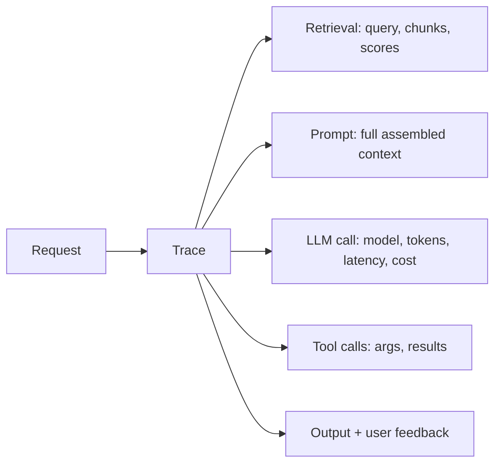

# Observability & Evaluation

*Last reviewed: October 2026*

!!! info "What's changed recently"
    - **OpenTelemetry is the common wire format.** The OTel GenAI semantic
      conventions define standard span attributes for model calls, tokens, and
      tools. MCP's `2026-07-28` spec documents trace-context propagation through
      `_meta`, so traces can follow a request across MCP servers.
    - **Agent evaluation is trajectory-based.** Tools now score tool selection,
      tool arguments, and goal success, not just the final text.
    - **Online evaluation is built into platforms.** For example, AgentCore
      Evaluations and Snowflake Cortex Agent evaluations (both GA in March 2026)
      score live traffic and alert on quality drops.

You can't improve what you can't see. Observability = **tracing and monitoring**
what your LLM app does in production; evaluation = **measuring quality**
systematically. Together they turn "it feels better" into evidence.

<!-- RELATED-MODULE -->

## What to trace

A trace links every step of one request. Capture: inputs/outputs at each step,
retrieved chunks + scores, the exact prompt, model + tokens + latency + cost,
tool calls, and any errors. Tools: **LangSmith, Langfuse, Arize/Phoenix,
OpenTelemetry** (many emit or ingest OTel using the GenAI semantic conventions).
For agents spanning services, propagate trace context (`traceparent`) through
tool and MCP calls so one trace covers the whole run.

## Evaluation methods

| Method | What | Use for |
|--------|------|---------|
| **Reference-based** | Compare to a gold answer (exact/semantic) | Tasks with known answers |
| **LLM-as-judge** | An LLM scores outputs on a rubric | Open-ended quality at scale |
| **Human eval** | People rate/label | Gold standard, expensive |
| **Heuristics** | Regex/format/validity checks | Structure, safety, guardrails |
| **A/B / online** | Compare variants on live traffic | Real-world impact |

### RAG-specific metrics

- **Retrieval:** context precision / recall.
- **Generation:** **faithfulness** (grounded in context?), **answer relevance**,
  **context relevance**. Frameworks like RAGAS operationalize these.

### Agent-specific metrics

- **Task success rate** (did it accomplish the goal?), steps/iterations, tool-call
  accuracy, cost per task.
- **Trajectory quality** — right tools, right arguments, no wasted or unsafe
  steps. Score it against reference trajectories or with an LLM judge.

## LLM-as-judge (done right)

Powerful but biased if naive:

- Give the judge a **clear rubric** and examples.
- Prefer **pairwise** comparison (A vs B) over absolute scores — more reliable.
- Watch for **position bias** (randomize order) and **self-preference** (a model
  favoring its own style).
- **Calibrate** against human labels on a sample.

## Guardrails & monitoring

- **Input/output guardrails** — block PII leakage, injection, toxic content,
  off-topic. (Bedrock Guardrails, NeMo Guardrails, custom checks.)
- **Monitor** cost/latency/error-rate, hallucination flags, and drift over time.
- **Feedback loop** — capture thumbs up/down and route bad cases into the eval set.

## Interview deep dive

### 60-second talking points

- **"Trace every step so you can debug the pipeline, not just the model."**
- **"Separate retrieval metrics from generation metrics."**
- **"LLM-as-judge scales eval, but use pairwise + calibrate to humans."**

### Scenario & system-design questions

??? question "How do you set up evaluation for a RAG app before and after changes?"
    Build a labeled eval set of representative questions. Measure retrieval
    (context precision/recall) and generation (faithfulness, answer relevance),
    via RAGAS-style metrics + LLM-as-judge, calibrated on a human-labeled sample.
    Run it in CI so every change is scored, not vibes.

??? question "Users report occasional wrong answers in production. How do you find and fix them?"
    Use **traces** to inspect failing requests end-to-end: was the right context
    retrieved? was the prompt correct? Add the failures to the eval set, fix the
    root cause (retrieval vs prompt vs model), and monitor the metric going
    forward. Capture user feedback to surface these.

??? question "What are the biases in LLM-as-judge and how do you mitigate them?"
    Position bias (order matters → randomize), verbosity bias (prefers longer),
    self-preference (favors own style). Use pairwise comparisons, clear rubrics,
    and calibrate against human labels.

### Pitfalls interviewers probe

- No tracing → can't tell if it's a retrieval, prompt, or model problem.
- One blended "quality" score instead of retrieval vs generation.
- Trusting LLM-as-judge without calibration.
- No production monitoring (cost/latency/drift).
- No feedback loop from real failures into evals.

### Rapid-fire

| Q | A |
|---|---|
| What to trace? | Retrieval, prompt, model call (tokens/cost/latency), tools, output |
| RAG gen metrics? | Faithfulness, answer relevance, context relevance |
| Agent metric? | Task success rate |
| LLM-as-judge best practice? | Pairwise + rubric + calibrate to humans |
| Guardrails cover? | PII, injection, toxicity, off-topic, format |

## How interviewers probe this

??? question "Design the observability stack for an agent platform used by ten teams."
    A strong answer covers: OpenTelemetry instrumentation with GenAI conventions
    and trace propagation across tools and MCP servers; one backend for traces,
    metrics, and logs; per-team and per-tenant cost and latency dashboards;
    redaction of PII in captured prompts; sampling and retention policies; and
    online evaluators with alerts that feed failing traces into eval datasets.

??? question "How do you trust an LLM-as-judge enough to gate releases on it?"
    Calibrate it against a human-labeled sample and report agreement. Use
    pairwise comparisons and specific rubrics, randomize order, use a different
    model family from the system under test where possible, and track judge
    drift when the judge model changes. Keep a small human-reviewed slice in
    every release.

??? question "Quality dropped 5% this week with no deploy. How do you find out why?"
    Segment the metric by input type, tenant, and tool path; check for upstream
    changes (provider model update, data or index freshness, a changed MCP
    server, new traffic mix); diff traces of failing cases against last week; and
    confirm the eval itself didn't change. Then add the new failure pattern to
    the regression set.

??? question "What do you log, and what do you deliberately not log?"
    Log inputs, outputs, retrieved document IDs, tool arguments and results,
    tokens, cost, and latency. Mask or hash PII and secrets, keep raw prompts
    under restricted access and short retention, and never log credentials that
    tools receive.
