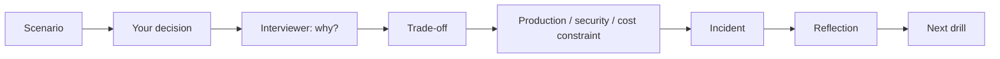

# Practice: Defend Your Decisions

This is the core OfferReady experience — across roles. Pick a scenario for your
target role (**AI/GenAI Engineer, AI Architect, Data Architect, AI Security,
Cloud/Platform, or Forward Deployed**), make a decision, and defend it as the
interviewer keeps
pushing — **why?**, then the trade-off, then a production constraint, then an
incident. It's the part of the interview that actually decides the offer.

!!! info "Free preview · Pro unlocks the full tree"
    Everyone can preview each scenario (the setup + a sample decision). Running
    the **complete** branch-by-branch defense — with progress tracking — is part
    of **OfferReady Pro**. See [Free vs Pro](../assets/pricing.html).

  
<em>Loading scenarios…</em>

---

## How a scenario runs

Each step reveals a **strong answer** and what a good answer *shows*, then you
self-rate how well you defended it. Your ratings drive your weak-area drills.

Prefer plain question drills first? The [Practice mode](../Personal-SourceCode/Interview_Practice.md)
(flashcards, timed exam, 225 questions) is free and a good warm-up.
