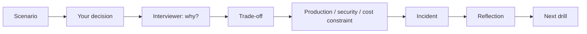

# Practice: Defend Your Decisions

Practice explaining why you chose an approach, what alternatives you considered,
and how the decision changes under cost, scale, reliability, and failure
constraints. Pick a scenario for your target role (**AI/GenAI Engineer, AI
Architect, Data Architect, AI Security, Cloud/Platform, or Forward Deployed**),
make a decision, and defend it as the interviewer keeps pushing — **why?**, then
the trade-off, then a production constraint, then an incident.

!!! note "Why this matters"
    Technical interviews often evaluate how you reason through tradeoffs, not
    only whether you know the terminology. Completing a scenario here updates
    your Interview Readiness.

!!! info "Free scenarios run here · Pro adds the full library"
    A set of complete defend-your-decision scenarios runs **free, right here** —
    make the call, then hold your reasoning through the why → trade-off →
    constraint → incident follow-ups, and self-rate. **OfferReady Pro** adds the
    full multi-role library with progress saved across devices. See
    [Free vs Pro](../assets/pricing.html).

  
<em>Loading scenarios…</em>

---

## How a scenario runs

Each step reveals a **strong answer** and what a good answer *shows*, then you
self-rate how well you defended it. Your ratings drive your weak-area drills.

Prefer plain question drills first? The [Practice mode](../Personal-SourceCode/Interview_Practice.md)
(flashcards, timed exam, 225 questions) is free and a good warm-up.
