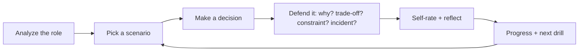

# Practice

Practice is the core of OfferReady. Everything else — the topic pages, the
question banks, the reference architectures — is there to get you ready for
**this**: making an engineering decision and **defending it** while an
interviewer keeps pushing. That is what actually decides a senior offer, and
it's the one thing you can't get from reading.

!!! tip "New here? Start with two steps"
    1. **[Analyze My Job](../Analyze/index.md)** — paste a job description and get a focused prep plan.
    2. **[Defend Your Decisions](../Practice-Scenarios/index.md)** — run a decision-defense scenario for your target role (contributes to Interview Readiness).

## The practice loop

The loop is the product: analyze what a role needs, practice defending the
decisions that role expects, track where you're weak, and get pointed at the
next drill.

## What's in here

-   :material-sword-cross:{ .lg .middle } __Defend Your Decisions__

    ---

    **Decision-defense scenarios.** Across roles — AI/GenAI Engineer, AI
    Architect, Data Architect, AI Security, Cloud/Platform, Forward Deployed.
    Decide, then defend it branch by branch against a saved job.

    *Contributes to Interview Readiness.*

    [:octicons-arrow-right-24: Open scenarios](../Practice-Scenarios/index.md)

-   :material-cards-outline:{ .lg .middle } __Practice Mode__

    ---

    **Focused drills.** Flashcards and timed exams over the question library — a
    fast warm-up before you defend a full scenario.

    *Local Practice, does not currently update Interview Readiness.*

    [:octicons-arrow-right-24: Start drilling](../Personal-SourceCode/Interview_Practice.md)

-   :material-comment-question-outline:{ .lg .middle } __Keep Asking Why__

    ---

    **Follow-up challenge drill.** Give an answer and the interviewer keeps
    asking *why* — the chain that separates a memorized answer from a real one.

    *Related to Defend Your Decisions. Local Practice, does not currently update Interview Readiness.*

    [:octicons-arrow-right-24: Practice the why-chain](../Personal-SourceCode/Interview_Why_Interactive.md)

-   :material-account-voice:{ .lg .middle } __Mock Interview__

    ---

    **Full interview simulation** — mixed questions, follow-ups, and pressure in
    one sitting.

    *Preview. Local Practice, does not currently update Interview Readiness.*

    [:octicons-arrow-right-24: Run a simulation](../Personal-SourceCode/Interview_Master_Simulator.md)

-   :material-chart-line:{ .lg .middle } __Practice History__

    ---

    **Completed activity.** Your recent practice sessions and per-topic strength
    on this device. For your overall readiness and next step, see the Dashboard.

    [:octicons-arrow-right-24: See your history](../Personal-SourceCode/Interview_Progress.md)

---

## Free vs Pro

The reason to go Pro isn't *more to read* — it's **practice defending the
decisions senior engineers make under pressure**. Analyze, one scenario per
role (preview), Practice mode, Keep Asking Why, and basic progress are **free**.
Pro unlocks the **complete** scenario trees, the full simulator, and deeper
progress analytics. See [Free vs Pro](../assets/pricing.html).

Prefer to watch it work first? Walk through the
[Sample Readiness Walkthrough](../Sample-Walkthrough/index.md) — a fully worked
example, no sign-in.
