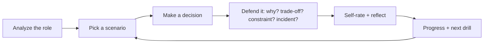

# Prepare for This Interview

Choose the type of preparation that matches what you need to improve. The core
of OfferReady is making an engineering decision and **defending it** while an
interviewer keeps pushing — that's what actually decides a senior offer, and
it's the one thing you can't get from reading.

!!! tip "New here? This is the full journey"
    1. **[Understand the role](../Analyze/index.md)** — paste a job description to see what it expects.
    2. **[Check your fit](../Gap-Analysis/index.md)** — compare your resume to find your gaps.
    3. **[Defend your decisions](../Practice-Scenarios/index.md)** — practice defending your reasoning (updates Interview Readiness).
    4. **[Measure readiness](../Dashboard/index.md)** — see your blended Interview Readiness and what to do next.

## The practice loop

The loop is the product: analyze what a role needs, practice defending the
decisions that role expects, track where you're weak, and get pointed at the
next drill.

## What's in here

-   :material-sword-cross:{ .lg .middle } __Defend Your Decisions__

    ---

    Practice explaining technical choices, tradeoffs, alternatives, cost,
    scale, and failure modes — branch by branch against a saved job.

    *Updates Interview Readiness.*

    [:octicons-arrow-right-24: Practice Decision Defense](../Practice-Scenarios/index.md)

-   :material-cards-outline:{ .lg .middle } __Practice Mode__

    ---

    Complete focused warm-up drills for individual questions and topics.

    *Local Practice Only — saved on this device and does not currently update Interview Readiness.*

    [:octicons-arrow-right-24: Start drills](../Personal-SourceCode/Interview_Practice.md)

-   :material-comment-question-outline:{ .lg .middle } __Keep Asking Why__

    ---

    **Follow-up defense drill.** Practice responding when an interviewer
    repeatedly challenges your reasoning.

    *Local Practice Only — saved on this device and does not currently update Interview Readiness.*

    [:octicons-arrow-right-24: Practice the follow-up chain](../Personal-SourceCode/Interview_Why_Interactive.md)

-   :material-account-voice:{ .lg .middle } __Mock Interview__

    ---

    Rehearse a complete interview flow from opening question to follow-up.

    *Preview · Local Practice Only — saved on this device and does not currently update Interview Readiness.*

    [:octicons-arrow-right-24: Start Mock Interview](../Personal-SourceCode/Interview_Master_Simulator.md)

-   :material-chart-line:{ .lg .middle } __Review Practice Activity__

    ---

    See completed readiness activity and local practice. For your overall
    readiness and next step, see the Dashboard.

    [:octicons-arrow-right-24: Review Practice Activity](../Personal-SourceCode/Interview_Progress.md)

---

## Free vs Pro

The reason to go Pro isn't *more to read* — it's **practice defending the
decisions senior engineers make under pressure**. Analyze, one scenario per
role (preview), Practice mode, Keep Asking Why, and basic progress are **free**.
Pro unlocks the **complete** scenario trees, the full simulator, and deeper
progress analytics. See [Free vs Pro](../assets/pricing.html).

Prefer to watch it work first? Walk through the
[Sample Readiness Walkthrough](../Sample-Walkthrough/index.md) — a fully worked
example, no sign-in.
