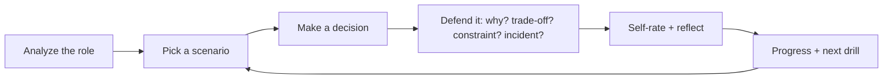

# Prepare for This Interview

Choose the type of preparation that matches what you need to improve. Technical
interviews often evaluate more than knowledge — they test how you reason through
tradeoffs, explain decisions, and respond to follow-up questions.

!!! tip "New here? Follow the full journey"
    1. **[Understand the role](../Analyze/index.md)** — paste a job description to see what the role expects.
    2. **[Check your fit](../Gap-Analysis/index.md)** — compare your resume evidence with the role requirements.
    3. **[Defend your decisions](../Practice-Scenarios/index.md)** — practice explaining your reasoning, alternatives, and tradeoffs.
    4. **[Measure readiness](../Dashboard/index.md)** — review readiness inputs and identify the next area to improve.

## The practice loop

The loop is the product: analyze what a role needs, practice defending the
decisions that role expects, track where you're weak, and get pointed at the
next drill.

## What's in here

-   :material-sword-cross:{ .lg .middle } __Defend Your Decisions__ · **Recommended**

    ---

    Practice explaining technical choices, alternatives, tradeoffs, cost,
    scale, reliability, and failure modes — branch by branch against a saved job.

    *Updates Interview Readiness.*

    [:octicons-arrow-right-24: Practice Decision Defense](../Practice-Scenarios/index.md)

-   :material-cards-outline:{ .lg .middle } __Practice Mode__

    ---

    Complete focused warm-up drills for individual questions and topics.

    *Local Practice Only — saved on this device and does not currently update Interview Readiness.*

    [:octicons-arrow-right-24: Start Drills](../Personal-SourceCode/Interview_Practice.md)

-   :material-comment-question-outline:{ .lg .middle } __Keep Asking Why__

    ---

    **Follow-up defense drill.** Practice responding when an interviewer
    repeatedly challenges your reasoning. *Related to Defend Your Decisions.*

    *Local Practice Only — saved on this device and does not currently update Interview Readiness.*

    [:octicons-arrow-right-24: Practice the Follow-up Chain](../Personal-SourceCode/Interview_Why_Interactive.md)

-   :material-account-voice:{ .lg .middle } __Mock Interview__

    ---

    Rehearse a complete interview flow from the opening question through
    follow-up questions.

    *Preview · Local Practice Only — saved on this device and does not currently update Interview Readiness.*

    [:octicons-arrow-right-24: Start Mock Interview](../Personal-SourceCode/Interview_Master_Simulator.md)

-   :material-chart-line:{ .lg .middle } __View My Progress__

    ---

    Review completed readiness activity and local practice, then see the
    Dashboard for overall readiness and the next recommended action.

    [:octicons-arrow-right-24: View My Progress](../Personal-SourceCode/Interview_Progress.md)

---

## Free vs Pro

Free includes role analysis and local practice — understand the role, check your
fit, and warm up with local drills. **Pro** unlocks the complete supported
readiness practice: the full defend-your-decision scenario library and deeper
progress. Only verified, job-scoped activities (like Defend Your Decisions)
update your Interview Readiness; local practice stays on this device. See
[Free vs Pro](../assets/pricing.html).

Prefer to watch it work first? Walk through the
[Sample Readiness Walkthrough](../Sample-Walkthrough/index.md) — a fully worked
example, no sign-in.
