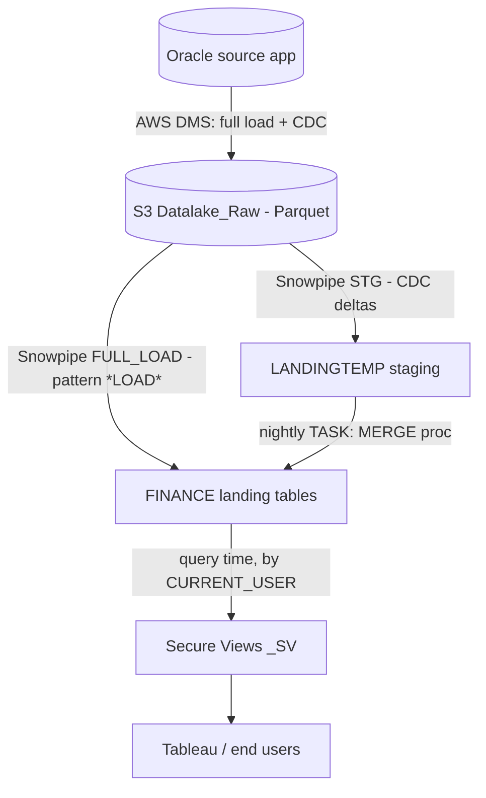
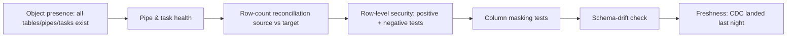

# Data Migration — Oracle → Snowflake (Case Study)

A real migration pattern: replicating a large financial application (PowerPlant,
on Oracle) into Snowflake via **AWS DMS → S3 → Snowpipe → CDC merge**, with
row/column-level **secure views** and **SOX-grade validation**.

!!! note "Generalized"
    This page describes the *architecture and approach* as a reusable study
    reference. Production specifics (bucket names, exact table lists, DBA
    processes) live in the source runbook, not here.

## End-to-end architecture



Two ingestion paths per table:

- **Full load** — initial/refresh Parquet files matched by a `*LOAD*` pattern go
  straight into the landing table via a dedicated Snowpipe.
- **CDC** — ongoing change deltas land in a staging table via a second pipe, then
  a scheduled **Task** runs a **MERGE** stored procedure into the landing table.

## The repeating per-table object set

Every source table gets the *same* set of Snowflake objects — the key to
scaling a 70+ table migration without bespoke code:

| Object | Pattern | Role |
|--------|---------|------|
| Full-load pipe | `PIPE_<TABLE>_FULL_LOAD` | Initial load → landing table |
| CDC pipe | `PIPE_<TABLE>_STG` | Change deltas → staging |
| Staging table | `<TABLE>_STG` | Holds CDC rows |
| Delete table | `DEL_<TABLE>_STG` | Tracks deletes |
| External table | `EXT_<TABLE>` | View over S3 (source of truth for inventory) |
| Landing table | `<TABLE>` | Final merged table |
| Merge task | `TASK_<TABLE>` | Nightly MERGE via stored proc |

```sql
-- The nightly CDC merge each task runs (generalized)
CALL STAGING.PROC_MERGE_CDC_STREAM_SEQ(
  'FINANCE',            -- source schema
  '<TABLE>',            -- table
  'LANDINGTEMP',        -- staging schema
  '<TABLE>_STG',        -- staging table
  '<PRIMARY_KEY_COLS>', -- merge keys = source PK
  'Y',                  -- handle deletes
  CURRENT_DATABASE(),
  'DEL_<TABLE>_STG',    -- delete table
  'TRANSACT_ID'         -- sequence column for ordering
);
```

## Security model

- **Row-level security** via secure views (`_SV`) that filter on `CURRENT_USER`
  against mirrored security tables (company, department).
- **Column-level security / masking** for sensitive fields (e.g. employee IDs on
  payroll/labor views).
- Security tables are the **highest-priority** for testing — a structural change
  there forces secure-view rework and SOX review.

## Validation strategy (what makes it trustworthy)



- **Reconciliation** — compare source vs target row counts per table.
- **Positive/negative security tests** — a user sees exactly their authorized
  companies/departments and *nothing* they aren't granted.
- **Schema-drift check** — compare column lists across environments to catch
  upgrade-induced changes.
- **Freshness** — confirm CDC landed within the last 24h.

## Migration talking points (interview-ready)

- **"Full load + CDC via DMS, merged with a templated Snowflake task."** One
  object pattern repeated per table = maintainable at scale.
- **"Security is enforced at query time in secure views, not in the pipeline."**
  Data-only security changes flow through overnight with no Snowflake change;
  only *structural* changes need rework + SOX review.
- **"Validation is layered"** — existence → health → reconciliation → security →
  drift → freshness.

## Interview deep dive

??? question "Why full-load and CDC as separate pipes/patterns?"
    They have different file patterns and targets: full-load Parquet goes directly
    into the landing table (bulk), while CDC deltas go to staging and are merged
    incrementally. Separating them lets you re-run a clean full load (pause CDC,
    truncate, reload, resume) without mixing bulk and delta data.

??? question "How do you migrate 70+ tables without writing 70 bespoke pipelines?"
    Standardize one **object template** per table (pipe + staging + external +
    landing + merge task) and a **single parameterized merge proc**. Merge keys =
    each table's primary key. Generate/validate the object list from metadata
    (`SHOW PIPES/TASKS`, `INFORMATION_SCHEMA`).

??? question "A source upgrade renamed a column. What breaks and what do you do?"
    Structural drift breaks the external/landing table mapping and any secure view
    referencing that column. Detect via a **schema-drift check** across
    environments, rework the affected secure views, and trigger **SOX review**
    since security-relevant structures changed.

??? question "How do you prove row-level security is correct after migration?"
    Positive test (user sees exactly their granted companies/departments),
    **negative test** (query an unauthorized company → 0 rows), and masking test
    (non-privileged user sees masked employee IDs). Run per test user with known
    access in each environment.

??? question "How do you cut over safely to a new source server?"
    Pause CDC merge tasks → run a fresh full load → validate object presence +
    row-count reconciliation → run security tests → refresh downstream marts →
    resume CDC. Expect a reporting-downtime window during the reload.

## Related material

- **[Snowflake](../../Technologies/snowflake/index.md)** — Streams & Tasks,
  Snapshot/CDC, secure views, tagging.
- **[AWS (Interview Q&A)](../../Personal-SourceCode/AWS_Interview_QA.md)** — S3, DMS-adjacent patterns.
- **[dbt](../../Technologies/dbt/index.md)** — the transformation layer for marts.
