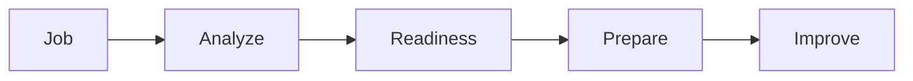

# Sample Readiness Walkthrough

!!! warning "Sample walkthrough — demonstration only"
    This is a **worked example** showing how OfferReady maps a real job to a
    focused preparation plan. The job description, profile, and readiness below
    are **illustrative sample data** — nothing here analyzes *your* resume.
    Live job-and-resume analysis is on the roadmap. Every **"next step"** links
    to real study material already in this site.

**The idea:** most prep starts with content ("study everything"). OfferReady
starts with **the job** — understand what *this* role requires, see where the
gaps are, and prepare specifically for them. Here's that flow, end to end, for
one fictional role.

---

## 1. The job

!!! quote "Sample job description — AI Solutions Architect"
    *We're hiring an **AI Solutions Architect** to design and ship production
    GenAI systems for enterprise customers. You'll architect RAG and agent
    applications on **AWS (Bedrock)**, own reliability and cost at scale, work
    directly with customers to turn ambiguous needs into shipped solutions, and
    set the standard for how teams build GenAI. Requires strong **Python**,
    **AWS**, **RAG/agents**, **system design**, and production/operational
    experience. Snowflake and Kubernetes a plus.*

**Target role:** AI Solutions Architect · **Seniority:** Staff / Principal · with
**Forward-Deployed** (customer-facing) expectations.

---

## 2. Job analysis

What the description actually signals, extracted into categories.

=== "Core skills"

    - Python (production-grade)
    - AWS (esp. **Bedrock**)
    - RAG (retrieval design + tuning)
    - Agents (tool use, orchestration)
    - System design (GenAI at scale)

=== "Technology signals"

    - **AWS Bedrock** — managed models, knowledge bases, guardrails
    - **Kubernetes** — serving / scaling
    - **Snowflake** — governed enterprise data (a plus)
    - Observability / LLMOps tooling

=== "Experience signals"

    - Production AI applications (not just prototypes)
    - Reliability + cost ownership at scale
    - Customer-facing delivery (FDE-style)
    - Setting patterns for other teams (Staff/Principal)

=== "Interview signals"

    - System-design rounds (design a production RAG/agent platform)
    - "Defend your decisions" follow-ups (why this model / retrieval / tool)
    - Production-incident troubleshooting
    - Behavioral: customer ambiguity, cross-team influence

---

## 3. My Readiness

A **transparent** readiness view across six dimensions — not a mystery score.
Each shows *what the role requires*, *what this sample profile has*, *the likely
gap*, and *the next step* (linking real content). Sample profile: strong Python
+ AWS + RAG; lighter on Bedrock-specific production, K8s serving, and Staff-level
system design.

| Dimension | Status | Role requires | Sample profile has | Likely gap | Next step |
|-----------|:------:|---------------|--------------------|-----------|-----------|
| **Resume alignment** | 🟡 Partial | GenAI architect keywords, production outcomes | RAG + AWS projects | Bedrock/agent production wording, scale metrics | Reframe projects around outcomes + scale |
| **Technical skills** | 🟡 Partial | Python, AWS **Bedrock**, RAG, agents | Python, AWS, RAG | **Bedrock** + agent production depth | [Bedrock](../GenAI-Topics/bedrock/index.md) · [Agent deep-dive](../GenAI-Topics/agent-principles/index.md) |
| **Relevant experience** | 🟢 Strong | Production AI apps | RAG apps shipped | Frame at architect scope | [Data Migration case study](../Projects/data-migration/index.md) |
| **System design** | 🔴 Gap | Design GenAI platforms at scale | Component-level design | End-to-end + trade-offs at Staff level | [Requirements → Production](../Personal-SourceCode/Interview_Requirements_to_Production.md) |
| **Interview preparation** | 🟡 Partial | GenAI + AI-engineer rounds | General prep | Role-specific banks | [GenAI Q&A](../Personal-SourceCode/GenAI_Interview_QA.md) · [AI Engineer Q&A](../Personal-SourceCode/AI_Engineer_Interview_QA.md) |
| **Behavioral / FDE** | 🟡 Partial | Customer ambiguity, influence | Some STAR stories | FDE customer framing | [Behavioral / STAR](../Personal-SourceCode/Behavioral_STAR_Interview_QA.md) · [FDE path](../Personal-SourceCode/Path_FDE.md) |

**Readiness dimensions are descriptive, not predictive** — they show what a
strong candidate for *this* role demonstrates, so you know where to focus. They
do **not** predict whether you'll get an offer.

---

## 4. Your preparation plan

The gaps above, turned into an ordered plan. Each priority says **why it
matters** (tied to the JD), **what to study**, **what to build**, and **how to
show it in the interview** — all pointing at existing content.

### Priority 1 — AWS Bedrock + production agents
- **Why:** the role explicitly requires production GenAI on Bedrock and agent experience — this is the biggest gap.
- **Study:** [Bedrock](../GenAI-Topics/bedrock/index.md) · [Building Agents — Deep Dive](../GenAI-Topics/agent-principles/index.md) · [Agent Engineering](../GenAI-Topics/agent-engineering/index.md)
- **Build:** an agent with tool calling, guardrails, and a bounded loop (see the GenAI POC project under **Build**).
- **Interview:** [Agentic AI / Agents Q&A](../Personal-SourceCode/Agents_Interview_QA.md), then defend it in [Keep Asking Why](../Personal-SourceCode/Interview_Why_Interactive.md).

### Priority 2 — System design at Staff level
- **Why:** architect roles are graded on end-to-end design and named trade-offs, not components.
- **Study:** [RAG](../GenAI-Topics/rag/index.md) → [Retrieval Tuning](../GenAI-Topics/retrieval-tuning/index.md) · [Reliability](../GenAI-Topics/reliability/index.md)
- **Practice:** drive [Requirements → Production](../Personal-SourceCode/Interview_Requirements_to_Production.md) — design a production RAG/agent platform end to end.
- **Interview:** [Staff / Principal path](../Personal-SourceCode/Path_Staff_Principal_Architect.md).

### Priority 3 — Reliability, cost & operations
- **Why:** "own reliability and cost at scale" is in the JD.
- **Study:** [Observability & Eval](../GenAI-Topics/observability/index.md) · [LLMOps](../GenAI-Topics/llmops/index.md) · [Cost Optimization](../GenAI-Topics/cost-optimization/index.md) · [Kubernetes](../GenAI-Topics/kubernetes/index.md)
- **Practice:** the [Production Incident Interviews](../Personal-SourceCode/Interview_Production_Incidents.md).

### Priority 4 — Customer-facing (FDE) + behavioral
- **Why:** "work directly with customers to turn ambiguous needs into shipped solutions."
- **Study/Practice:** [Forward Deployed Engineer path](../Personal-SourceCode/Path_FDE.md) · [Behavioral / STAR](../Personal-SourceCode/Behavioral_STAR_Interview_QA.md).

---

## 5. Track your progress

In this sample, readiness moves from mostly 🟡/🔴 to 🟢 as you work the plan:

- [x] Job analyzed
- [x] Readiness reviewed
- [ ] Bedrock + agents prepared *(Priority 1)*
- [ ] System design practiced *(Priority 2)*
- [ ] Reliability & cost covered *(Priority 3)*
- [ ] Behavioral / FDE ready *(Priority 4)*
- [ ] Mock interview passed — [Master Simulator](../Personal-SourceCode/Interview_Master_Simulator.md)

**Next action:** start Priority 1 — [Bedrock](../GenAI-Topics/bedrock/index.md).

---

!!! note "How this becomes a live product"
    Today this walkthrough uses fixed sample data. A future **Pro** version would
    take *your* pasted job description and resume, run the same analysis
    automatically, and generate *your* readiness and plan — which requires a
    hosted analysis service and accounts (not yet built). Until then, use this as
    a model for how to prep against a real posting: extract the signals, score
    yourself honestly on each dimension, and follow the linked material for your
    gaps. See [Pricing](../Personal-SourceCode/Pricing.md) for the planned Free/Pro split.
