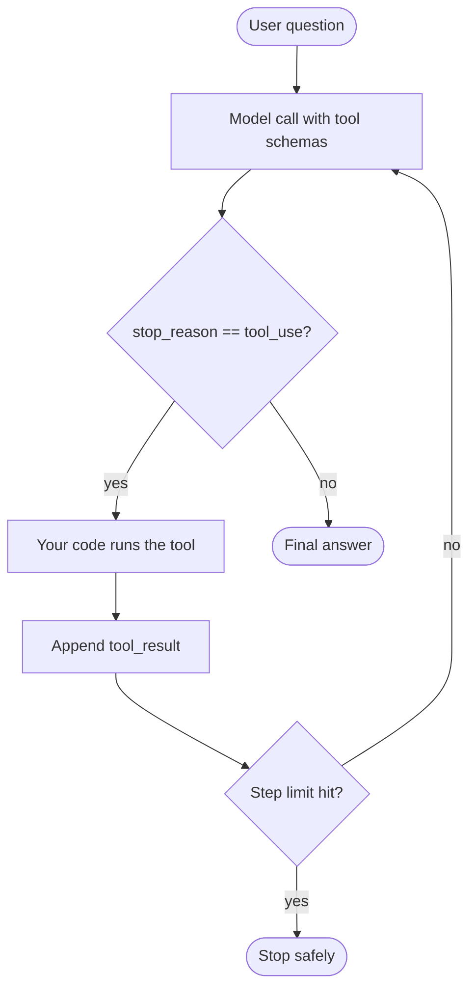

# Build Your First Agent

*Last reviewed: October 2026*

An agent is a **control loop**. The model chooses a tool, your code runs it, the
result goes back to the model, and this repeats until the model can answer. You
will build that loop by hand first, so you can see every moving part, and then
the same agent with LangChain's `create_agent`, which runs on LangGraph. The
concepts are covered in [Agent Engineering](../../GenAI-Topics/agent-engineering/index.md)
and [Principles & Patterns](../../GenAI-Topics/agent-principles/index.md).



## Prerequisites

- [Local Environment](../local-environment/index.md) set up.
- **Option A:** an `ANTHROPIC_API_KEY` in `.env` and a current model ID from the
  [Anthropic models page](https://platform.claude.com/docs/en/models/overview),
  for example `claude-sonnet-5-5` or `claude-haiku-5-5` as of October 2026.
- **Option B:** `uv add langchain langchain-anthropic` (or `langchain-openai` or
  `langchain-ollama` for other providers).

## Option A: A plain tool-use loop

```python title="agent.py"
import json

import anthropic
from dotenv import load_dotenv

load_dotenv()
client = anthropic.Anthropic()
MODEL = "<your-model>"     # e.g. claude-haiku-5-5
MAX_STEPS = 6              # hard stop so the agent can't loop forever


# 1. Tools are plain Python functions...
def get_order_status(order_id: str) -> dict:
    orders = {"A100": "shipped", "A101": "processing"}   # stub: call your real API
    if order_id not in orders:
        return {"error": f"order {order_id} not found"}
    return {"order_id": order_id, "status": orders[order_id]}


def add(a: float, b: float) -> float:
    return a + b


TOOLS_IMPL = {"get_order_status": get_order_status, "add": add}

# 2. ...described to the model with a name, a description and a JSON Schema.
TOOLS = [
    {"name": "get_order_status",
     "description": "Look up the shipping status of one order by its ID, e.g. 'A100'.",
     "input_schema": {"type": "object",
                      "properties": {"order_id": {"type": "string"}},
                      "required": ["order_id"]}},
    {"name": "add",
     "description": "Add two numbers and return the sum.",
     "input_schema": {"type": "object",
                      "properties": {"a": {"type": "number"}, "b": {"type": "number"}},
                      "required": ["a", "b"]}},
]


def run_agent(question: str) -> str:
    messages = [{"role": "user", "content": question}]
    for step in range(MAX_STEPS):
        resp = client.messages.create(model=MODEL, max_tokens=1024,
                                      tools=TOOLS, messages=messages)
        messages.append({"role": "assistant", "content": resp.content})

        if resp.stop_reason != "tool_use":
            return "".join(b.text for b in resp.content if b.type == "text")

        results = []
        for block in resp.content:
            if block.type == "tool_use":
                print(f"  step {step}: {block.name}({block.input})")
                try:
                    output = TOOLS_IMPL[block.name](**block.input)
                    results.append({"type": "tool_result", "tool_use_id": block.id,
                                    "content": json.dumps(output)})
                except Exception as exc:           # report errors to the model
                    results.append({"type": "tool_result", "tool_use_id": block.id,
                                    "content": str(exc), "is_error": True})
        messages.append({"role": "user", "content": results})
    return "Stopped: step limit reached without a final answer."


if __name__ == "__main__":
    print(run_agent("What's the status of order A100, and what is 21.5 + 20.5?"))
```

```bash
uv run agent.py
```

!!! success "Expected output"
    One or more trace lines such as `step 0: get_order_status({'order_id': 'A100'})`
    and `step 0: add({'a': 21.5, 'b': 20.5})`. The model may ask for both tools in
    one turn or across two turns. Then comes a final answer saying order A100 has
    shipped and the sum is 42. Try `order Z999` to see the model deal with a tool
    error.

Points to notice:

- The **assistant message containing the `tool_use` blocks** must go back into
  `messages` before the `tool_result` blocks. Every `tool_result` needs the
  matching `tool_use_id`.
- `MAX_STEPS` is your runaway guard. Production agents also cap tokens, cost and
  wall-clock time.
- OpenAI's Responses API follows the same pattern, using `function_call` output
  items and `function_call_output` inputs. Ollama returns `message.tool_calls`
  for models that support tools.

## Option B: The same agent with `create_agent`

From LangChain 1.0, `langchain.agents.create_agent` replaces
`langgraph.prebuilt.create_react_agent`. It builds the loop above as a LangGraph
graph and adds middleware, streaming and checkpointing.

```python title="agent_lc.py"
from dotenv import load_dotenv
from langchain.agents import create_agent
from langchain.tools import tool

load_dotenv()


@tool
def get_order_status(order_id: str) -> str:
    """Look up the shipping status of one order by its ID, e.g. 'A100'."""
    return {"A100": "shipped", "A101": "processing"}.get(order_id, "not found")


@tool
def add(a: float, b: float) -> float:
    """Add two numbers and return the sum."""
    return a + b


agent = create_agent(
    model="anthropic:<your-model>",   # or "openai:<model>", "ollama:<model>"
    tools=[get_order_status, add],
    system_prompt="You are a concise support assistant. Use tools; never guess.",
)

result = agent.invoke(
    {"messages": [{"role": "user",
                   "content": "Status of order A100, and 21.5 + 20.5?"}]},
    config={"recursion_limit": 10},          # step guard
)
print(result["messages"][-1].content)
```

Here the docstring and type hints **are** the tool schema, so write them for the
model to read.

## Tool design (the part that matters)

- **Clear names and descriptions.** The model picks tools based on them.
- **Narrow, single-purpose tools.** `get_order_status(order_id)` is better than
  `query_database(sql)`.
- **Typed arguments, structured returns and helpful errors** that the model can
  act on.
- **Separate reading from writing.** Gate anything that changes state (refunds,
  emails, deletes) behind a human approval step.

## Troubleshooting

| Error | Fix |
|---|---|
| `tool_use ids were found without tool_result blocks` | The assistant turn was appended but not every `tool_use` got a matching `tool_result`. Answer all of them in one user message. |
| `messages: roles must alternate` | Put all `tool_result` blocks for a turn into **one** user message. |
| The model never calls a tool | Make the description more specific, check that `input_schema` is valid JSON Schema, and confirm the model supports tool use. |
| LangGraph `GraphRecursionError` | The agent hit `recursion_limit`. Usually the tools return unhelpful results or the prompt is ambiguous. Don't just raise the limit. |
| `ImportError: create_agent` | Upgrade with `uv add "langchain>=1.0"`. |

## Cost and safety notes

- Each loop iteration is a full model call that re-sends the whole conversation,
  so the cost grows with every step. Cap the steps and log tokens on each call.
- Treat tool output and user input as **untrusted**. A web page or document can
  contain injected instructions. Give tools least-privilege credentials that are
  scoped to each user.
- Keep the API key in `.env` or a secrets manager, never in the tool code.

## What to build next

- Add `ask()` from [First RAG](../first-rag/index.md) as a `search_docs` tool to
  get agentic RAG.
- Expose your tools through [MCP](../../GenAI-Topics/mcp/index.md) so any MCP host
  can use them.
- Add human-in-the-loop approval and persistence with
  [LangGraph](../../GenAI-Topics/langgraph/index.md), then multi-agent hand-offs
  with [A2A](../../GenAI-Topics/a2a/index.md).
- Deploy it behind [FastAPI](../../Technologies/fastapi/index.md) with tracing from
  [Observability & Eval](../../GenAI-Topics/observability/index.md).

## How this shows up in interviews

- *"Chain or agent?"* Use a chain or workflow when the steps are known. Use an
  agent only when the model must decide the path, and say what that costs in
  latency, money and predictability.
- *"How do you stop an agent going rogue?"* Step, token and cost caps, scoped
  tools, approval for writes, output validation, a deterministic fallback, and
  full traces.
- *"How do you evaluate an agent?"* Check task success, whether it picked the
  right tools, step count and cost on a fixed scenario set, and replay traces
  after every change.
- Practise in [Agents Q&A](../../Personal-SourceCode/Agents_Interview_QA.md) and
  [LangChain & LangGraph Q&A](../../Personal-SourceCode/LangChain_LangGraph_Interview_QA.md).
