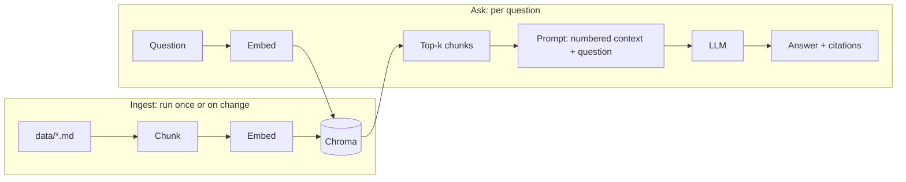

# Build Your First RAG App

*Last reviewed: October 2026*

Put the pieces together: ingest documents, retrieve the relevant chunks and have
an LLM answer **only from them, with citations**. This version uses plain Python
with no framework, so every step is visible. The architecture is covered on
[RAG](../../GenAI-Topics/rag/index.md) and [RAG Flow](../../Documentation/rag-flow/index.md).



## Prerequisites

- [Local Environment](../local-environment/index.md) done, with `chromadb`
  installed.
- `llm.py` from [LLM Access](../llm-access/index.md) (it provides `complete()`)
  and `embed.py` from [Vector DB Setup](../vector-db-setup/index.md) (it
  provides `embed()`). Both must be in the project root.
- One working provider. Fully local works: `ollama pull nomic-embed-text` plus
  a chat model, with `LLM_PROVIDER=ollama` and `LLM_MODEL=<your-model>` in `.env`.

## Step 1: Add some documents

```bash
mkdir -p data
cat > data/handbook.md <<'EOF'
# Refund policy
Customers can request a full refund within 30 days of purchase. After 30 days,
refunds are issued as store credit only.

# Support hours
Support is available Monday to Friday, 9am to 6pm Eastern. Weekend requests are
answered the next business day.
EOF
```

On Windows PowerShell, create `data/handbook.md` in your editor and paste in the
same text. Any `.md` or `.txt` files in `data/` will be indexed.

## Step 2: The complete app

```python title="rag.py"
import sys
from pathlib import Path

import chromadb

from embed import embed
from llm import complete

CHUNK_SIZE, OVERLAP, TOP_K = 800, 120, 4
db = chromadb.PersistentClient(path="./rag_index")
col = db.get_or_create_collection("handbook")


def chunk(text: str) -> list[str]:
    """Split on paragraphs, then pack paragraphs into ~CHUNK_SIZE char chunks."""
    chunks, current = [], ""
    for para in [p.strip() for p in text.split("\n\n") if p.strip()]:
        if current and len(current) + len(para) > CHUNK_SIZE:
            chunks.append(current)
            current = current[-OVERLAP:]          # carry a little context forward
        current = f"{current}\n\n{para}".strip()
    if current:
        chunks.append(current)
    return chunks


def ingest(folder: str = "data") -> None:
    for path in Path(folder).glob("*.[mt][dx]*"):    # .md and .txt
        pieces = chunk(path.read_text(encoding="utf-8"))
        col.upsert(
            ids=[f"{path.name}#{i}" for i in range(len(pieces))],
            documents=pieces,
            metadatas=[{"source": path.name, "chunk": i} for i in range(len(pieces))],
            embeddings=embed(pieces),
        )
        print(f"indexed {path.name}: {len(pieces)} chunks")


PROMPT = """Answer the question using ONLY the numbered context below.
Cite sources inline like [1]. If the answer is not in the context, reply
exactly: "I don't know based on the provided documents."

Context:
{context}

Question: {question}"""


def ask(question: str) -> str:
    res = col.query(query_embeddings=embed([question]), n_results=TOP_K)
    docs, metas = res["documents"][0], res["metadatas"][0]
    context = "\n\n".join(f"[{i + 1}] ({m['source']}) {d}"
                          for i, (d, m) in enumerate(zip(docs, metas)))
    answer = complete(PROMPT.format(context=context, question=question),
                      system="You are a careful assistant that never guesses.")
    sources = sorted({f"{m['source']}#{m['chunk']}" for m in metas})
    return f"{answer}\n\nRetrieved: {', '.join(sources)}"


if __name__ == "__main__":
    if sys.argv[1:] == ["ingest"]:
        ingest()
    else:
        print(ask(" ".join(sys.argv[1:]) or "What is the refund policy?"))
```

## Step 3: Run it

```bash
uv run rag.py ingest
uv run rag.py "Can I get a refund after six weeks?"
uv run rag.py "What is the CEO's name?"
```

!!! success "Expected output"
    `indexed handbook.md: 1 chunks`. Then an answer saying that refunds after 30
    days are store credit only, with a citation such as `[1]` and a
    `Retrieved: handbook.md#0` line. The CEO question should get the
    "I don't know" reply. That refusal is the most important behaviour to check:
    it shows the model sticks to the context. Wording varies by model.

## Make it better (in order of impact)

1. **Build an eval set first.** Write 20 to 50 real questions with expected
   answers and sources. Measure whether retrieval found the right chunk and
   whether the answer stays faithful to the context. See
   [Observability & Eval](../../GenAI-Topics/observability/index.md).
2. **Hybrid search.** Add keyword (BM25) matching alongside vectors to catch
   names, IDs and codes.
3. **Rerank.** Retrieve wide (k = 20 to 50), then rerank down to 4. See
   [Retrieval Tuning](../../GenAI-Topics/retrieval-tuning/index.md).
4. **Metadata filters** by tenant, date or document type.
5. **Smarter chunking** that follows headings, plus contextual headers on each
   chunk.

## Troubleshooting

| Symptom | Cause and fix |
|---|---|
| `ModuleNotFoundError: embed` or `llm` | Copy `embed.py` and `llm.py` from the earlier guides into the same folder. |
| `Number of requested results 4 is greater than number of elements` | Only a warning on a tiny corpus. Add more documents or lower `TOP_K`. |
| `dimension mismatch` | You changed `EMBED_PROVIDER`. Delete `./rag_index` and ingest again. |
| The answer ignores the context or makes things up | Check the retrieved chunks first. Most RAG failures are retrieval failures. Then use a stronger model or a lower temperature. |
| Duplicate chunks after re-ingest | IDs must be stable (`file#index`). If you delete a file, delete its IDs too. |

## Cost and safety notes

- Each question costs one embedding call plus one LLM call, and the prompt grows
  with `TOP_K × CHUNK_SIZE`. Print token usage and keep the context tight.
- **Prompt injection:** retrieved text is untrusted input. A document that says
  "ignore previous instructions" will be read by the model. Keep the context
  clearly delimited and never give a RAG pipeline write access to tools without
  guardrails. See [AI Security](../../AI-Security/index.md).
- **Access control:** filter by the user's permissions *at retrieval time*. Never
  rely on the prompt to hide data the user shouldn't see.
- Keep `./rag_index` and `data/` out of git if they hold private documents.

## What to build next

- Wrap `ask()` in an HTTP endpoint with streaming: see
  [FastAPI](../../Technologies/fastapi/index.md).
- Turn retrieval into a **tool** an agent can choose to call:
  [First Agent](../first-agent/index.md).
- Swap in pgvector or Qdrant from [Vector DB Setup](../vector-db-setup/index.md)
  without changing `ask()`.

## How this shows up in interviews

RAG is the most common GenAI system-design prompt at senior level and above:

- *"Design a RAG system for 10 million internal documents."* Cover ingestion
  (incremental, idempotent), chunking, hybrid retrieval and reranking,
  permission-aware filtering, caching, evals and cost per query.
- *"Users say answers are wrong. How do you debug it?"* Trace the request, check
  retrieval recall before the prompt, then faithfulness, then the data source.
- *"RAG or fine-tuning?"* RAG for fresh or private facts and citations.
  Fine-tuning for format, style and narrow behaviour.
- Practise in [GenAI Q&A](../../Personal-SourceCode/GenAI_Interview_QA.md) and
  [Production Incidents](../../Personal-SourceCode/Interview_Production_Incidents.md).
