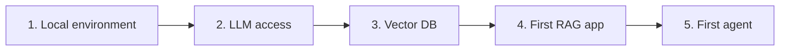

# Setup Guides

Hands-on, copy-paste guides to stand up the pieces of a GenAI stack — from a
local dev environment to your first RAG app and agent. Each guide is
platform-aware (Bedrock / OpenAI / local) so you can follow whichever you have.

-   :material-laptop: __Local Environment__

    Python, venv, keys, project layout.

    [Open](local-environment/index.md)

-   :material-brain: __LLM Access__

    Bedrock, OpenAI, or local Ollama — first call.

    [Open](llm-access/index.md)

-   :material-vector-triangle: __Vector DB Setup__

    Stand up pgvector / Chroma / FAISS and load embeddings.

    [Open](vector-db-setup/index.md)

-   :material-database-search: __First RAG App__

    Ingest docs, retrieve, answer with citations.

    [Open](first-rag/index.md)

-   :material-robot: __First Agent__

    A tool-using agent loop, step by step.

    [Open](first-agent/index.md)

!!! tip "Prerequisites"
    Python 3.10+, a terminal, and one of: AWS account with Bedrock access,
    an OpenAI API key, or **Ollama** installed locally.
