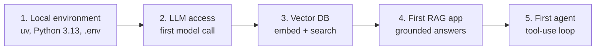

# Setup Guides

*Last reviewed: October 2026*

Five hands-on guides take you from an empty folder to a working RAG app and a
tool-using agent. They are written for engineers preparing for senior, staff
and principal AI and platform interviews who want to **have built the thing**,
not just read about it. Each guide has runnable code, the expected output,
troubleshooting for common errors, cost and safety notes, and a section on how
the topic comes up in interviews.

!!! tip "No API key? You can still do every guide"
    Each guide offers a local path with [Ollama](https://ollama.com), so it is
    free and your data stays on your machine. Hosted options (OpenAI, Anthropic,
    Amazon Bedrock) are shown side by side when you want them.

## Suggested path

Work through them in order. Each guide builds on files from the one before.

```mermaid
flowchart LR
    ENV[1. Local environment<br/>uv, Python 3.13, .env] --> LLM[2. LLM access<br/>first model call]
    LLM --> VDB[3. Vector DB<br/>embed + search]
    VDB --> RAG[4. First RAG app<br/>grounded answers]
    RAG --> AGENT[5. First agent<br/>tool-use loop]
```

Budget about half a day for the whole path. The first two guides take minutes.

-   :material-laptop: __1. Local Environment__

    ---

    Install uv, pin Python 3.13, add dependencies and keep API keys out of git.

    [:octicons-arrow-right-24: Open guide](local-environment/index.md)

-   :material-brain: __2. LLM Access__

    ---

    A first call with OpenAI, Anthropic, Bedrock or local Ollama, plus a
    provider-neutral `complete()` helper.

    [:octicons-arrow-right-24: Open guide](llm-access/index.md)

-   :material-vector-triangle: __3. Vector DB Setup__

    ---

    Embed text and run a similarity search in Chroma, Qdrant, LanceDB or pgvector.

    [:octicons-arrow-right-24: Open guide](vector-db-setup/index.md)

-   :material-database-search: __4. First RAG App__

    ---

    Chunk, index and retrieve your documents, then answer with citations and a
    safe "I don't know" when the answer isn't there.

    [:octicons-arrow-right-24: Open guide](first-rag/index.md)

-   :material-robot: __5. First Agent__

    ---

    A hand-written tool-use loop with step limits, then the same agent with
    LangChain `create_agent`.

    [:octicons-arrow-right-24: Open guide](first-agent/index.md)

## Before you start

- A terminal and git.
- Either an API key from OpenAI or Anthropic, AWS access to Bedrock, or a
  machine that can run a small local model (about 8 GB RAM).
- You don't need to install Python yourself. Guide 1 installs it with uv.

!!! warning "Keep keys safe"
    Every guide reads keys from environment variables in a git-ignored `.env`
    file. Never commit a key. If one leaks, revoke it straight away.

## After the guides

- Learn the theory behind each step in [GenAI Topics](../GenAI-Topics/index.md).
- Practise building under time pressure in [Labs](../Labs/index.md).
- Turn what you built into interview answers with
  [GenAI Q&A](../Personal-SourceCode/GenAI_Interview_QA.md) and
  [Agents Q&A](../Personal-SourceCode/Agents_Interview_QA.md).
