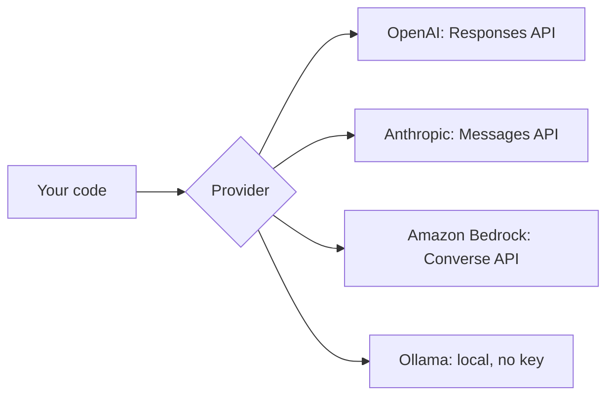

# LLM Access Setup

*Last reviewed: October 2026*

Make your first model call through a hosted API (OpenAI, Anthropic or Amazon
Bedrock) or a local model with Ollama. Pick whichever you have access to. The
later guides work with any of them, and Ollama is free if you have no API key.



## Prerequisites

- The `genai-lab` project from [Local Environment](../local-environment/index.md),
  with `openai`, `anthropic` and `ollama` installed.
- One of these: an OpenAI API key, an Anthropic API key, an AWS account with
  Bedrock model access, or a machine with about 8 GB RAM for a small local model.

!!! note "Model names change often"
    The examples use `<your-model>`. Copy a current model ID from the provider's
    list: [OpenAI models](https://platform.openai.com/docs/models),
    [Anthropic models](https://platform.claude.com/docs/en/models/overview),
    [Bedrock model IDs](https://docs.aws.amazon.com/bedrock/latest/userguide/models-supported.html),
    and the [Ollama library](https://ollama.com/library). As of October 2026,
    Anthropic lists IDs such as `claude-sonnet-5-5` and `claude-haiku-5-5`. For
    learning, pick a small, cheap model.

## Step 1: Make a first call

=== "OpenAI"

    Add `OPENAI_API_KEY` to `.env`. The **Responses API** is OpenAI's current
    primary interface. Chat Completions still works too.

    ```python title="hello_openai.py"
    from dotenv import load_dotenv
    from openai import OpenAI

    load_dotenv()
    client = OpenAI()  # reads OPENAI_API_KEY

    response = client.responses.create(
        model="<your-model>",
        instructions="You are a concise assistant.",
        input="Explain retrieval-augmented generation in one sentence.",
    )
    print(response.output_text)
    ```

=== "Anthropic"

    Add `ANTHROPIC_API_KEY` to `.env`. `max_tokens` is required.

    ```python title="hello_anthropic.py"
    import anthropic
    from dotenv import load_dotenv

    load_dotenv()
    client = anthropic.Anthropic()  # reads ANTHROPIC_API_KEY

    message = client.messages.create(
        model="<your-model>",          # e.g. claude-haiku-5-5
        max_tokens=300,
        system="You are a concise assistant.",
        messages=[{"role": "user",
                   "content": "Explain retrieval-augmented generation in one sentence."}],
    )
    print(message.content[0].text)
    print(message.usage)               # input/output token counts
    ```

=== "Amazon Bedrock"

    Authenticate with the AWS CLI (`aws sso login --profile <profile>` or your
    usual method). Then turn on access to the model in the Bedrock console for
    your region. Run `uv add boto3` first.

    ```python title="hello_bedrock.py"
    import boto3

    rt = boto3.client("bedrock-runtime", region_name="us-west-2")
    resp = rt.converse(
        modelId="<your-bedrock-model-id-or-inference-profile>",
        messages=[{"role": "user",
                   "content": [{"text": "Explain RAG in one sentence."}]}],
        inferenceConfig={"maxTokens": 300, "temperature": 0},
    )
    print(resp["output"]["message"]["content"][0]["text"])
    ```

    The Converse API gives every Bedrock model the same request shape, so you
    can switch models without rewriting code.

=== "Ollama (local)"

    Install Ollama from [ollama.com/download](https://ollama.com/download), using
    the app on macOS and Windows or the install script on Linux. Then pull a
    small model:

    ```bash
    ollama pull <your-model>       # pick a small model from ollama.com/library
    ollama list                    # confirm it downloaded
    ```

    ```python title="hello_ollama.py"
    from ollama import chat

    response = chat(
        model="<your-model>",
        messages=[{"role": "user",
                   "content": "Explain retrieval-augmented generation in one sentence."}],
    )
    print(response.message.content)
    ```

    The Ollama server listens on `http://localhost:11434`. It also has an
    OpenAI-compatible endpoint at `/v1`, so the OpenAI SDK can talk to it with
    `OpenAI(base_url="http://localhost:11434/v1", api_key="ollama")`.

Run it:

```bash
uv run hello_openai.py   # or hello_anthropic.py / hello_bedrock.py / hello_ollama.py
```

!!! success "Expected output"
    One or two sentences describing RAG. The Anthropic version also prints a
    `Usage(...)` line with input and output token counts. A local model's first
    call can take several seconds while the model loads into memory. Later calls
    are faster.

## Step 2: Hide the provider behind one function

Your application code should not care which vendor answers. A tiny wrapper is
enough, and you don't need a framework:

```python title="llm.py"
import os

from dotenv import load_dotenv

load_dotenv()
PROVIDER = os.getenv("LLM_PROVIDER", "ollama")
MODEL = os.getenv("LLM_MODEL", "<your-model>")


def complete(prompt: str, system: str = "You are a concise assistant.") -> str:
    if PROVIDER == "openai":
        from openai import OpenAI
        r = OpenAI().responses.create(model=MODEL, instructions=system, input=prompt)
        return r.output_text
    if PROVIDER == "anthropic":
        import anthropic
        r = anthropic.Anthropic().messages.create(
            model=MODEL, max_tokens=1024, system=system,
            messages=[{"role": "user", "content": prompt}])
        return r.content[0].text
    from ollama import chat
    r = chat(model=MODEL, messages=[{"role": "system", "content": system},
                                    {"role": "user", "content": prompt}])
    return r.message.content


if __name__ == "__main__":
    print(complete("Say hello in five words."))
```

Set `LLM_PROVIDER` and `LLM_MODEL` in `.env`. The [First RAG App](../first-rag/index.md)
guide imports `complete()` from this file.

## Troubleshooting

| Error | Likely cause and fix |
|---|---|
| `AuthenticationError` / 401 | The key is missing or wrong. Check that `.env` loaded (`load_dotenv()` runs before the client is created) and that there are no quotes or spaces around the value. |
| `NotFoundError` / model not found | The model ID has a typo, has been retired, or your account cannot use it. Copy it from the provider's model list. |
| `RateLimitError` / 429 | Too many requests or no credit left. Add a billing method or credit, slow down, and retry with exponential backoff. |
| Bedrock `AccessDeniedException` | Model access isn't turned on in that region, or your IAM role lacks `bedrock:InvokeModel`. |
| Bedrock `ValidationException` on the model ID | Some models must be called through an **inference profile** ID rather than the base model ID. |
| Ollama `ConnectionError` | The server isn't running. Start the app or run `ollama serve`. |
| Ollama `model not found` | Run `ollama pull <name>` and make sure the tag matches `ollama list`. |

## Cost and safety notes

- Hosted APIs bill **per token**, input and output separately. Print the token
  usage while learning and set a monthly budget cap in each console.
- Keys belong in environment variables or a secrets manager. Never put them in
  source code, notebooks or front-end code, and never commit them.
- Don't send confidential or personal data to a provider until you have checked
  its data-retention terms. Ollama keeps everything on your machine.
- Set `temperature` low (or 0) for factual and extraction tasks so results are
  easier to reproduce. Some reasoning models ignore or reject temperature, so
  check the model's docs.

## What to build next

- Ask for **structured output** (JSON that matches a schema) and validate it with
  Pydantic. See [Prompt Engineering](../../GenAI-Topics/prompt-engineering/index.md).
- Add **streaming** so tokens show up as they are generated.
- Continue to [Vector DB Setup](../vector-db-setup/index.md) to store embeddings
  for retrieval.

## How this shows up in interviews

- *"How would you avoid lock-in to one model vendor?"* Use a thin provider
  interface like `complete()`, store prompts and model IDs in config, and run an
  eval set before switching models.
- *"Hosted API, Bedrock or self-hosted?"* Weigh data residency, latency, cost at
  your volume, operational burden and model quality. See
  [Model Selection](../../Documentation/model-selection/index.md) and
  [Bedrock](../../GenAI-Topics/bedrock/index.md).
- *"How do you handle rate limits and outages?"* Retries with backoff and jitter,
  timeouts, a fallback model and circuit breakers. See
  [Reliability](../../GenAI-Topics/reliability/index.md).
- Drill these in [GenAI Q&A](../../Personal-SourceCode/GenAI_Interview_QA.md)
  and [AI Engineer Q&A](../../Personal-SourceCode/AI_Engineer_Interview_QA.md).
