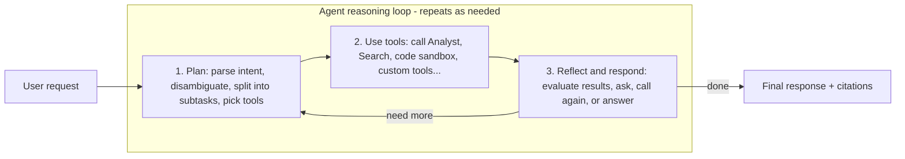
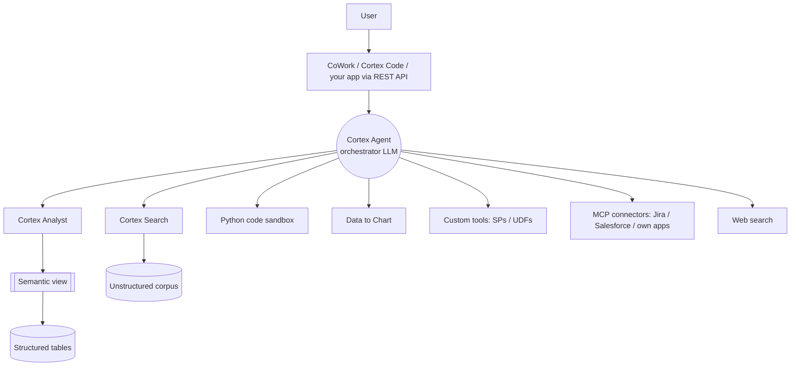

# Cortex Agents — deep dive

**Cortex Agents** is Snowflake's fully managed agentic platform: you define an
agent as a reusable object (a model + tools + orchestration instructions), and
Snowflake runs the reasoning loop, tool calls, and code sandbox for you — no
custom orchestration runtime to build or operate. Data access stays governed by
Snowflake privileges and each tool's execution context.

!!! quote "How Snowflake frames it"
    An agent reasons over a request, plans the work, calls tools, executes code,
    and generates a response — without you building or running your own
    orchestration loop or sandbox. *(Paraphrased from Snowflake's Cortex Agents
    documentation; content rephrased for compliance with licensing
    restrictions.)*

---

## The reasoning loop (know this cold)

An agent answers a request with a three-step loop, repeated as many times as the
request needs:



1. **Plan** — parse the request, disambiguate a vague question (e.g. "tell me
   about Acme" could mean products, location, or sales), split a complex request
   into subtasks, and choose a tool for each part.
2. **Use tools** — call the selected tools: Cortex Analyst for structured data,
   Cortex Search for unstructured, the code sandbox to process results, etc.
3. **Reflect and respond** — evaluate each tool's output and decide the next
   move: ask a clarifying question, call another tool, or produce the final
   answer.

!!! tip "Interview soundbite"
    *"An agent is Plan → Use tools → Reflect, looped. Cortex gives you that loop
    as a managed service, so I design the tools, semantic model, and
    instructions — not the control flow."*

---

## The tools an agent can use

The tools are what give an agent access to your data and the outside world. An
agent with **no tools** can still converse, but only from the model's general
knowledge — it can't query anything in your account.

| Tool | Purpose |
|------|---------|
| **Cortex Analyst** | Generate governed SQL over structured data via a semantic view |
| **Cortex Search** | Retrieve from unstructured sources (docs, policies, transcripts, contracts) |
| **Code execution (Python sandbox)** | Run Python in a secure isolated sandbox to process data / do calculations |
| **Data to Chart** | Generate visualizations from result data |
| **Custom tools** | Stored procedures / UDFs that call backend systems or your own business logic |
| **Packaged agent skills** | Modular bundles of instructions + scripts for repeatable, task-specific behavior |
| **MCP connectors** | Reach remote MCP servers (e.g. Jira, Salesforce, your own apps) to discover and invoke their tools |
| **Web search** | Pull real-time information from the public internet |



!!! note "Inaccessible tool handling"
    If the caller's role can't use *every* configured tool, the run can still
    continue with the tools that role *can* access. This is why **least-privilege
    role design directly shapes what an agent can actually do per user** — a
    great governance talking point.

---

## Threads: server-side conversation state

**Threads** keep conversation context across turns, so your client app doesn't
have to manage state itself. This matters in interviews because it changes the
architecture: you're not stuffing full history into every prompt from your app —
Snowflake maintains the thread.

- Multi-turn follow-ups ("and for last quarter?") work without you re-sending
  context.
- Your app stays thin; state lives with the managed service.
- Contrast with a hand-rolled LangChain app where **you** own memory/compaction.

---

## Defining and calling an agent

An agent is a **reusable object** bundling its model, tools, and orchestration
instructions. You can create one:

- in **Snowsight** (UI),
- with **Cortex Agents SQL commands**,
- or via the **REST API**.

You steer behavior with **natural-language orchestration instructions** and
either pick the model or let Snowflake auto-select. Users interact via
**Snowflake CoWork** and **Cortex Code**, or you integrate the agent into your
own application through the **REST API**.

```sql
-- Illustrative shape of the building blocks an agent wires together.
-- (Exact DDL/params evolve — confirm against current Snowflake docs.)

-- 1) A semantic view powers Cortex Analyst (structured tool).
--    Defines logical tables, metrics, relationships, synonyms.
CREATE OR REPLACE SEMANTIC VIEW sales_sv
  /* tables, dimensions, metrics, relationships, verified queries ... */;

-- 2) A Cortex Search service powers retrieval (unstructured tool).
CREATE OR REPLACE CORTEX SEARCH SERVICE support_docs_svc
  ON content
  ATTRIBUTES product, region
  WAREHOUSE = search_wh
  TARGET_LAG = '1 hour'
  AS SELECT content, product, region FROM knowledge_base;

-- 3) The agent bundles model + tools + instructions, then your app
--    calls it (REST API) or users chat with it in CoWork.
```

!!! warning "Don't over-claim exact syntax"
    In an interview, describe the **objects and how they connect** (semantic
    view → Analyst tool; search service → Search tool; both → agent). Flag that
    exact DDL and REST payloads change; you'd confirm against the docs. That
    reads as senior, not vague.

---

## Governance & safety in the agent path

Everything the agent does inherits Snowflake's controls:

- **Privilege-scoped tools** — data access follows the caller's role and each
  tool's execution context. Masking policies and row-access policies still apply
  to what Analyst can query and what Search can return.
- **Audit trail** — agent actions and tool calls are subject to the same access
  controls and logging as the rest of your data.
- **Human-in-the-loop for writes** — treat custom tools that mutate systems as
  privileged; gate them, don't let the model call them unilaterally.
- **Review before serving** — Snowflake explicitly notes LLM responses and
  citations aren't guaranteed accurate; validate agent output before showing it
  to end users. This is the *insecure output handling* control from
  [AI Security](../AI-Security/index.md).

!!! danger "The AI-security link"
    An agent that reads unstructured docs (via Search) is exposed to **indirect
    prompt injection** — malicious instructions hidden in a retrieved document.
    Contain it the same way as any RAG system: treat retrieved content as
    **data, not instructions**, keep write-capable tools least-privileged and
    gated, and validate outputs. See [AI Security](../AI-Security/index.md).

---

## Interview questions

??? question "Walk me through what happens when a user asks a Cortex Agent a multi-part question."
    The orchestrator LLM runs a loop. **Plan:** it parses intent, disambiguates,
    and splits the question into subtasks (say, one structured metric + one
    document lookup), choosing a tool per subtask. **Use tools:** it calls Cortex
    Analyst (which generates SQL over the semantic view) for the metric and
    Cortex Search for the document part, maybe the code sandbox to combine them.
    **Reflect and respond:** it evaluates the results, decides whether it needs
    another tool call or a clarifying question, and only then composes the final
    answer with citations. The loop repeats until it can answer or gives up.

??? question "Cortex Agent vs. building your own agent with LangGraph on top of Snowflake — when each?"
    Use **Cortex Agents** when the data lives in Snowflake and governance matters:
    you inherit RBAC/masking/audit, avoid egress, and don't operate an
    orchestration runtime or sandbox. Reach for a **custom framework** when you
    need orchestration logic Cortex doesn't express, heavy non-SQL glue, or a
    multi-cloud/multi-source topology where Snowflake is just one participant —
    and even then you can expose Cortex Analyst/Search as tools (including over
    MCP) rather than reimplementing them.

??? question "How does an agent combine structured and unstructured data in one answer?"
    Through two tools: **Cortex Analyst** turns natural language into governed
    SQL over a **semantic view** (structured), and **Cortex Search** does hybrid
    retrieval over a text corpus (unstructured). The orchestrator calls both,
    then reflects over the combined results — e.g. "revenue for accounts whose
    contracts mention an early-termination clause" needs Search to find the
    clause and Analyst to sum the revenue.

??? question "A user says the agent 'can't see' data a colleague can. Why?"
    Almost certainly **role-based access**: tools run under the caller's
    privileges and each tool's execution context, and Snowflake supports
    continuing a run with only the tools a role can access
    (inaccessible-tool handling). The colleague's role can use a tool or see rows
    (via row-access/masking policies) that this user's role cannot. Diagnose by
    comparing granted roles and policies, not by "fixing the agent."

??? question "How do you stop an agent from taking a destructive action?"
    Don't give it unilateral write power. Keep mutating **custom tools**
    least-privileged, require human approval (human-in-the-loop) for
    irreversible actions, and separate read tools from write tools. Combine with
    audit logging so every tool call is traceable. This is *excessive agency*
    containment from the AI-security threat model.

??? question "Where does prompt injection enter a Cortex Agent, and how do you contain it?"
    Through any tool that returns attacker-influenceable text — **Cortex Search**
    over documents, **web search**, or **MCP** tool responses. Contain it by
    treating all retrieved content as untrusted **data** (never instructions),
    gating write-capable tools, validating outputs before serving, and reviewing
    tool/skill definitions (tool poisoning) before enabling them.

---

## Rapid-fire

| Q | A |
|---|---|
| The agent loop? | Plan → Use tools → Reflect and respond, repeated |
| Two core data tools? | Cortex Analyst (structured, SQL) + Cortex Search (unstructured, retrieval) |
| What powers Analyst? | A **semantic view/model** |
| Who holds conversation state? | **Threads** (server-side, managed) |
| Ways to create an agent? | Snowsight, Cortex Agents SQL, REST API |
| Where users chat? | Snowflake CoWork, Cortex Code, or your app via REST API |
| Agent with no tools? | Converses from general model knowledge only — can't query your account |
| Role can't use a tool? | Run can continue with the accessible tools (inaccessible-tool handling) |

---

**Next:** [Analyst, Semantic Models & Search (native RAG)](analyst-search-rag.md)
