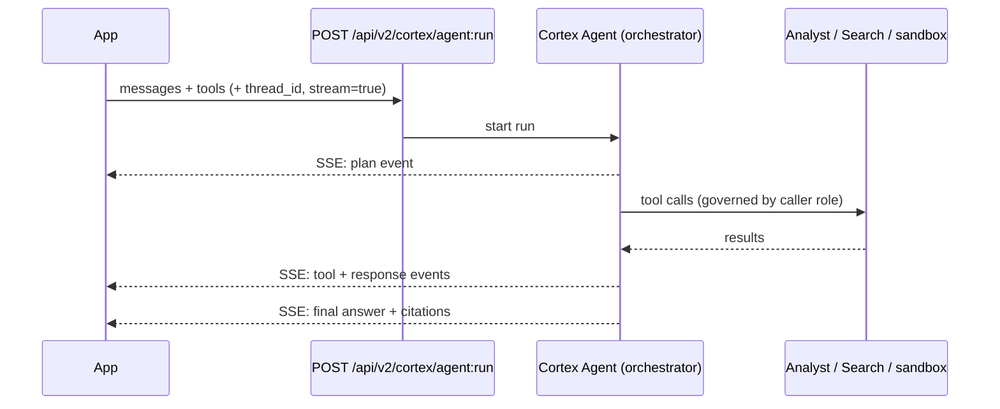

# AISQL Functions & the Agents API (technical reference)

The other pages in this section build the mental models. This page is the
**concrete technical layer** an interviewer drills into once they believe you
understand the concepts: the actual function surface, the options that control
`AI_COMPLETE`, embeddings and chunking, and the **Cortex Agents REST API** you
call from an application.

!!! info "Currency + naming note"
    Cortex ships fast and **function names are migrating**. The newer, preferred
    surface is the **`AI_*`** family (`AI_COMPLETE`, `AI_CLASSIFY`, `AI_FILTER`,
    `AI_AGG`, `AI_EMBED`, `AI_SIMILARITY`, …); the older **`SNOWFLAKE.CORTEX.*`**
    functions (`COMPLETE`, `SENTIMENT`, `SUMMARIZE`, `EXTRACT_ANSWER`,
    `EMBED_TEXT_*`) still work. Availability and exact signatures vary by region
    and account — always confirm against Snowflake's official docs
    (docs.snowflake.com) before relying on a specific parameter in an interview.
    *Content was rephrased for compliance with licensing restrictions.*

---

## The AISQL function surface

Cortex exposes LLM/ML capability as **SQL functions** (also callable from
Python via Snowpark / Snowflake ML). Group them by job:

| Job | Newer `AI_*` | Legacy `SNOWFLAKE.CORTEX.*` | Notes |
|-----|-------------|-----------------------------|-------|
| Generate text / reason | `AI_COMPLETE` | `COMPLETE`, `TRY_COMPLETE` | The workhorse. Multimodal (text + image). `TRY_COMPLETE` returns `NULL` instead of erroring. |
| Classify into categories | `AI_CLASSIFY` | `CLASSIFY_TEXT` | Single- or multi-label; plain-language category definitions. Works on text or images. |
| Boolean filter / join predicate | `AI_FILTER` | — | Returns a boolean; use it in `WHERE` / `JOIN` to filter rows by a natural-language condition. |
| Aggregate/reduce a column | `AI_AGG`, `AI_SUMMARIZE_AGG` | `SUMMARIZE` | Reduce many rows of text under one instruction (e.g. "summarize all complaints"). |
| Embeddings (vectors) | `AI_EMBED` | `EMBED_TEXT_768`, `EMBED_TEXT_1024` | Produce a `VECTOR` for similarity search / clustering. |
| Similarity between inputs | `AI_SIMILARITY` | — | Convenience similarity score between two inputs. |
| Extract an answer from text | — | `EXTRACT_ANSWER` | Pull a specific answer span from a passage. |
| Sentiment | — | `SENTIMENT`, `ENTITY_SENTIMENT` | Score sentiment (overall or per entity). |
| Transcribe audio | `AI_TRANSCRIBE` | — | Speech → text (multimodal). |
| Translate | — | `TRANSLATE` | Language translation. |
| Run an agent from SQL | `AGENT_RUN`, `DATA_AGENT_RUN` | — | Non-streaming JSON; wrappers over the Agents REST API (see below). |

!!! tip "Interview framing for the two families"
    *"The `AI_*` functions are the current, consolidated surface — same governed,
    in-perimeter execution as the older `SNOWFLAKE.CORTEX.*` ones, but with a
    cleaner signature, multimodal support, and structured outputs. I'd write new
    pipelines against `AI_COMPLETE`/`AI_CLASSIFY`/`AI_FILTER` and treat the legacy
    names as still-supported aliases."*

Models available through these functions come from multiple providers (OpenAI,
Anthropic, Meta/Llama, Mistral, DeepSeek and others) — **curated by Snowflake**,
not "any model on the internet." You pass the model name as a string, or let
Snowflake auto-select for some functions.

---

## `AI_COMPLETE` in depth — the options that matter

Simplest form is a model + a prompt string:

```sql
SELECT AI_COMPLETE('claude-3-5-sonnet', 'Explain RAG in two sentences.');
```

The power is in the **options object** (third argument), which controls
generation and shapes the output. The interview-relevant knobs:

| Option | What it does |
|--------|--------------|
| `temperature` | 0–1 randomness. Low (0.2) = deterministic/focused; high (0.7) = diverse. Use **low** for extraction/classification. |
| `max_tokens` | Caps output length (Snowpark default 4096, max 8192 for `complete`). Too small ⇒ **truncated** JSON — a classic bug. |
| `top_p` | Nucleus sampling alternative to temperature. |
| `response_format` / type literal | **Structured output** — force the response to match a JSON schema or SQL `TYPE` literal (below). |
| `guardrails` | Enable Cortex Guard to filter unsafe content on eligible models. |
| message history | Pass an array of `{role, content}` objects for chat-style multi-turn; one `system` prompt allowed, first in the array. |
| streaming | In Python, a streaming generator yields text incrementally (experimental flag for REST-based streaming). |

### Structured outputs (say this — it's the "senior" detail)

`AI_COMPLETE` can take a **JSON schema** (or a SQL `TYPE` literal starting with
the `TYPE` keyword and an `OBJECT` at the top level) that the completion **must**
conform to. This is the Cortex equivalent of OpenAI's `response_format:
json_object` — it removes brittle prompt-and-pray JSON parsing.

```sql
-- Force a typed object back, not free-form prose.
SELECT AI_COMPLETE(
  model  => 'claude-3-5-sonnet',
  prompt => 'Extract the ticket fields: ' || body,
  model_parameters => {'temperature': 0, 'max_tokens': 400},
  response_format => {
    'type': 'json',
    'schema': {
      'type': 'object',
      'properties': {
        'category': {'type': 'string'},
        'severity': {'type': 'string'},
        'summary':  {'type': 'string'}
      },
      'required': ['category','severity']
    }
  }
) AS ticket_json
FROM support_tickets;
```

!!! warning "Confirm the exact option keys"
    The concept (schema-constrained output) is stable and worth stating; the
    **exact argument names/shape** (`response_format` vs a type literal, key
    casing) differ across the `COMPLETE` vs `AI_COMPLETE` variants and evolve.
    In an interview: *"I'd pass a JSON schema so the model returns typed output
    and I skip post-processing — confirming the current parameter name in the
    docs."* That reads as senior, not vague.

### Multimodal

`AI_COMPLETE` (and `AI_CLASSIFY`, `AI_EMBED`, `AI_SIMILARITY`, `AI_TRANSCRIBE`)
accept **files** — images, documents, audio — via `FILE` objects on a stage.
So "analyze this scanned invoice" or "classify this product photo" is the same
governed SQL surface, no separate vision pipeline.

---

## Embeddings, vectors & chunking

When you *don't* use managed Cortex Search and want to build retrieval yourself
inside Snowflake, the primitives are the embedding functions plus the native
`VECTOR` type and vector distance functions.

```sql
-- 1) Chunk long documents first (retrieval quality depends on chunk size).
--    SPLIT_TEXT_RECURSIVE_CHARACTER (Cortex) or your own UDF produces chunks.
CREATE OR REPLACE TABLE doc_chunks AS
SELECT d.doc_id,
       c.value::string AS chunk
FROM   documents d,
       LATERAL FLATTEN(input => SNOWFLAKE.CORTEX.SPLIT_TEXT_RECURSIVE_CHARACTER(
              d.content, 'markdown', 1200, 200)) c;   -- ~1200 chars, 200 overlap

-- 2) Embed each chunk into a VECTOR column.
ALTER TABLE doc_chunks ADD COLUMN embedding VECTOR(FLOAT, 768);
UPDATE doc_chunks
SET embedding = AI_EMBED('snowflake-arctic-embed-m', chunk);  -- model + text

-- 3) Retrieve by cosine similarity to a query embedding.
WITH q AS (SELECT AI_EMBED('snowflake-arctic-embed-m', 'how do refunds work?') AS qv)
SELECT chunk,
       VECTOR_COSINE_SIMILARITY(embedding, q.qv) AS score
FROM   doc_chunks, q
ORDER BY score DESC
LIMIT 5;
```

Key facts to have ready:

- **`VECTOR(FLOAT, n)`** is a native column type; distance functions are
  `VECTOR_COSINE_SIMILARITY`, `VECTOR_L2_DISTANCE`, `VECTOR_INNER_PRODUCT`.
- **Chunk size + overlap is a real tuning knob** — too big dilutes relevance, too
  small loses context. Overlap preserves meaning across boundaries.
- **Match embedding dimensions** to the model (e.g. 768 vs 1024); a mismatch is a
  common error.
- **When to DIY vs Cortex Search:** hand-rolled vectors give you full control of
  the index and scoring; **Cortex Search** gives you managed hybrid retrieval +
  freshness with none of the plumbing. Interviewers like hearing you pick the
  managed service unless you have a concrete reason not to.

---

## The Cortex Agents REST API (how apps actually call an agent)

The other pages describe the agent *loop*; this is the **integration contract**.
An external application (not just Snowsight/CoWork) drives a Cortex Agent through
a REST endpoint.

```text
POST  /api/v2/cortex/agent:run
Auth: Snowflake token (key-pair JWT / OAuth)
Body: { model, tools, tool resources, messages, ... }
```

What to know:

- **Streaming by default.** `agent:run` streams **server-sent events (SSE)** —
  you consume `plan`, tool-call, and response events as they happen. Set
  `stream: false` to get a **single JSON** response instead.
- **Long / background runs.** Requests time out after ~15 minutes by default; set
  `background: true` for long jobs (which can run up to ~6 hours) and reconnect
  via the **Stream Agent Run** endpoint.
- **Threads = server-side state.** Use the Threads API so multi-turn context
  ("and for last quarter?") is maintained by Snowflake — the API streams
  metadata events for each user/assistant message; listen for both.
- **SQL shortcuts.** `AGENT_RUN` / `DATA_AGENT_RUN` are utility wrappers that run
  an agent from SQL and return **non-streaming JSON** — handy for scripts, but
  they **reject `stream: true`**. Snowflake recommends the **streaming REST API**
  for real application integrations.



!!! tip "Interview soundbite"
    *"From an app I call `POST /api/v2/cortex/agent:run`, consume the SSE stream
    for plan/tool/response events, and pass a thread id so Snowflake holds
    conversation state. For a quick SQL-only path I'd use `AGENT_RUN`, knowing it
    returns a single JSON blob and can't stream. Long jobs go `background: true`
    and I reconnect to the run."*

---

## Choosing the right call (decision table)

| Situation | Use |
|-----------|-----|
| Enrich/classify many rows on a schedule | `AI_COMPLETE`/`AI_CLASSIFY`/`AI_FILTER` in SQL + Streams/Tasks |
| Need typed JSON back, no post-parsing | `AI_COMPLETE` with a **response schema** (structured output) |
| Boolean condition inside a query/join | `AI_FILTER` |
| Reduce a whole column to one summary | `AI_AGG` / `AI_SUMMARIZE_AGG` |
| Build your own retrieval, full index control | `AI_EMBED` + `VECTOR` + `VECTOR_COSINE_SIMILARITY` |
| Managed retrieval, no index plumbing | **Cortex Search** service (see [native RAG page](analyst-search-rag.md)) |
| Text-to-SQL over governed tables | **Cortex Analyst** over a semantic view |
| Multi-step, cross-domain, interactive, from an app | **Agents REST API** (`agent:run`, streaming) |
| Multi-step agent, quick SQL/script | `AGENT_RUN` / `DATA_AGENT_RUN` (non-streaming JSON) |

---

## Interview questions

??? question "What's the difference between `COMPLETE` and `AI_COMPLETE`?"
    Same governed, in-perimeter LLM execution; `AI_COMPLETE` is the newer,
    consolidated `AI_*` surface with a cleaner signature, multimodal input
    (images/docs/audio via FILE objects), and structured outputs. The legacy
    `SNOWFLAKE.CORTEX.COMPLETE` still works. I'd write new code against
    `AI_COMPLETE` and treat the old name as a supported alias — confirming
    current availability per region.

??? question "How do you get reliable JSON out of a Cortex completion instead of parsing prose?"
    Use **structured outputs**: pass a JSON schema (or a SQL `TYPE` literal) so
    the model must conform, and set `temperature` to 0 and a sufficient
    `max_tokens` so it isn't truncated. That removes brittle regex parsing and
    integrates with systems needing deterministic shapes — the Cortex equivalent
    of a `response_format: json` contract.

??? question "You need retrieval but don't want Cortex Search — how, in Snowflake?"
    Chunk the text (e.g. `SPLIT_TEXT_RECURSIVE_CHARACTER` with overlap), embed
    each chunk with `AI_EMBED` into a `VECTOR(FLOAT, n)` column matching the
    model's dimensions, and query with `VECTOR_COSINE_SIMILARITY` ordered
    descending. I'd only DIY this when I need control over the index/scoring;
    otherwise Cortex Search gives managed hybrid retrieval and freshness for
    free.

??? question "An app team wants to embed a Cortex Agent in their product. What's the integration?"
    `POST /api/v2/cortex/agent:run` with auth (key-pair JWT / OAuth), a body of
    messages + tools, consuming the **SSE stream** of plan/tool/response events.
    Pass a **thread id** so Snowflake maintains conversation state. For long jobs
    set `background: true` and reconnect via the stream endpoint. For a SQL-only
    path there's `AGENT_RUN`, but it returns a single JSON value and can't
    stream, so it's for scripts, not interactive apps.

??? question "A batch `AI_COMPLETE` job is returning cut-off JSON. Why, and fix?"
    `max_tokens` is too low, so the output is **truncated** mid-JSON and won't
    parse. Raise `max_tokens`, tighten the prompt/schema so the response is
    smaller, and use structured outputs so the shape is bounded. Also wrap in
    `TRY_COMPLETE` so a single bad row returns `NULL` instead of failing the whole
    statement.

---

## Rapid-fire

| Q | A |
|---|---|
| Preferred function family? | `AI_*` (`AI_COMPLETE`, `AI_CLASSIFY`, `AI_FILTER`, `AI_AGG`, `AI_EMBED`, `AI_SIMILARITY`) |
| Legacy family (still works)? | `SNOWFLAKE.CORTEX.*` (`COMPLETE`, `SENTIMENT`, `SUMMARIZE`, `EMBED_TEXT_*`) |
| Error-safe completion? | `TRY_COMPLETE` (returns `NULL` instead of raising) |
| Force typed JSON output? | Structured outputs — JSON schema / SQL `TYPE` literal |
| Truncated JSON cause? | `max_tokens` too low |
| Native vector type + distance? | `VECTOR(FLOAT, n)` + `VECTOR_COSINE_SIMILARITY` |
| Chunking helper? | `SPLIT_TEXT_RECURSIVE_CHARACTER` (size + overlap) |
| Agent from an app? | `POST /api/v2/cortex/agent:run`, SSE streaming, thread id for state |
| Agent from SQL? | `AGENT_RUN` / `DATA_AGENT_RUN` — non-streaming JSON, no `stream:true` |
| Long agent run? | `background: true`, reconnect via Stream Agent Run |

---

**Sources (verify current):** Snowflake official docs — Cortex AISQL / LLM
functions, `AI_COMPLETE` (single string, structured outputs, prompt object),
`AGENT_RUN` / `DATA_AGENT_RUN`, and Cortex Agents Run REST API
(docs.snowflake.com). *Content was rephrased for compliance with licensing
restrictions.*

**Next:** [Cortex Agents — deep dive](agents.md) · [Analyst, Semantic Models & Search](analyst-search-rag.md)
