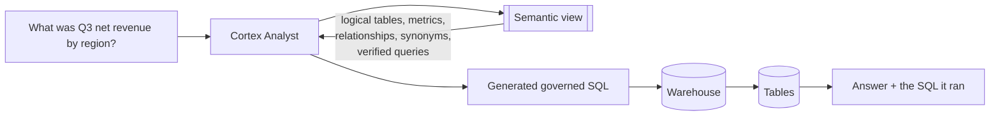
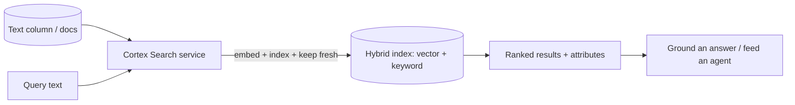
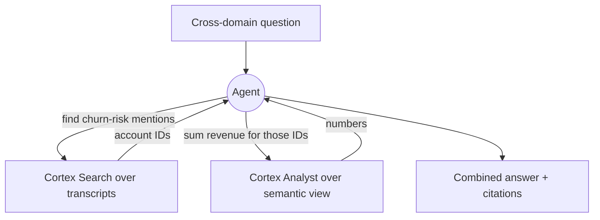

# Cortex Analyst, Semantic Models & Search (native RAG)

The two data tools underneath every Cortex Agent, worth understanding in their
own right. **Cortex Analyst** answers questions over *structured* data by
generating governed SQL against a **semantic view**. **Cortex Search** answers
questions over *unstructured* text with managed hybrid retrieval — Snowflake's
native RAG engine. Together they let one system reason over tables **and**
documents.

---

## Cortex Analyst: text-to-SQL you can trust

Naive text-to-SQL fails in production because the model has to guess table
names, join keys, business definitions ("what counts as active revenue?"), and
synonyms. Analyst fixes this with a **semantic view/model** — a governed
contract between business language and your schema.



### What lives in a semantic model

| Element | Why it matters |
|---------|----------------|
| **Logical tables / views** | The entities the business talks about |
| **Dimensions & measures/metrics** | Encodes *definitions* (net revenue = gross − returns) so the model doesn't invent them |
| **Relationships / join keys** | Removes join ambiguity — the #1 cause of wrong SQL |
| **Synonyms** | Maps business words ("clients" → `customers`) to schema |
| **Verified queries** | Curated NL→SQL examples that anchor the model on hard/common questions |

!!! tip "The semantic model is the product"
    In an interview, stress that **quality of Analyst answers = quality of the
    semantic model**, not the LLM. You improve accuracy by curating metrics,
    relationships, synonyms, and verified queries — the same way a good BI
    semantic layer does. This is the work; the LLM is the easy part.

### Analyst design principles

- **Start narrow.** A small, correct semantic model over a few key tables beats a
  sprawling one that's wrong on edge cases.
- **Encode definitions once.** Put business logic (active customer, fiscal
  quarter) in the model so every question inherits it.
- **Return the SQL.** Analyst surfaces the SQL it generated — expose it so users
  (and you) can verify and trust the answer.
- **Iterate from real questions.** Mine the questions users actually ask, add
  verified queries for the ones it gets wrong.

---

## Cortex Search: native, governed RAG

Cortex Search is a **managed retrieval service** over your text data. It handles
embedding, indexing, and **hybrid** (semantic vector + keyword) retrieval, and
keeps the index fresh as the source changes — so you don't stand up and secure a
separate vector database.



### Why hybrid and managed matter

- **Hybrid retrieval** — vector similarity catches meaning ("cancel my plan" ≈
  "terminate subscription"); keyword catches exact terms (error codes, IDs, SKUs)
  that pure vector search misses. You get both.
- **Managed freshness** — the service refreshes as underlying data changes (you
  set a target lag), so retrieval doesn't go stale — no manual re-embedding job.
- **Governed** — results respect the same access controls as the source data;
  you can filter on attributes (product, region, tenant) for row-scoped
  retrieval.
- **No separate vector store** — one less system to secure, sync, and pay for.
  This is the native-RAG win versus exporting embeddings to an external DB.

### Search ↔ Analyst integration (the detail that impresses)

Cortex Search also **improves Cortex Analyst**: it can do fuzzy/literal search
over a column to find the exact literal value Analyst needs in its SQL. Example:
a user asks about "Acme" but the table stores "Acme Supplies Inc." — Search
resolves the literal so Analyst's `WHERE` clause matches. Mentioning this shows
you understand the stack, not just the parts.

---

## Structured + unstructured together

The pattern interviewers love, because real questions cross the boundary:

> "Show total revenue for accounts whose latest support transcript mentions
> churn risk."



- **Search** isolates the relevant unstructured records (which accounts).
- **Analyst** computes the governed metric (their revenue).
- The **agent** stitches them and cites both.

This is also a clean **AISQL** batch pattern without an agent: use LLM functions
(`AI_FILTER`, `EXTRACT_ANSWER`, `SENTIMENT`) to enrich unstructured columns into
structured signals, then query them with plain SQL.

```sql
-- Turn unstructured transcripts into structured churn signal, then aggregate.
CREATE OR REPLACE TABLE account_signals AS
SELECT
    account_id,
    AI_FILTER(prompt => 'Does this transcript indicate churn risk? ' || transcript)  AS churn_flag,
    SNOWFLAKE.CORTEX.SENTIMENT(transcript)                                            AS sentiment
FROM support_transcripts;

-- Now it's just SQL — join to revenue, aggregate, govern with existing policies.
SELECT r.region, SUM(r.revenue) AS at_risk_revenue
FROM account_signals s
JOIN revenue r USING (account_id)
WHERE s.churn_flag
GROUP BY r.region;
```

!!! note "Agent vs. AISQL — pick deliberately"
    **AISQL batch** (above) is best for set-based enrichment over many rows,
    scheduled with Streams/Tasks. A **Cortex Agent** is best for interactive,
    multi-step, ad-hoc questions where you don't know the query shape in advance.
    Saying *when not to use an agent* signals maturity.

---

## Interview questions

??? question "Why not just do naive text-to-SQL against the raw schema?"
    Because the model has to guess table names, joins, and business definitions,
    so it's confidently wrong on anything nontrivial. A **semantic view** encodes
    metrics, relationships, synonyms, and verified queries, so Analyst generates
    correct, governed SQL. The semantic model is where you invest; it's the
    difference between a demo and production.

??? question "How is Cortex Search different from rolling your own RAG with a vector DB?"
    It's a **managed, governed, hybrid** retrieval service: Snowflake handles
    embedding, indexing, freshness (target lag), and combines vector + keyword
    retrieval — inside the perimeter, respecting access controls, with attribute
    filtering. You skip standing up, securing, and syncing a separate vector
    store. Trade-off: less control over the index internals than a DIY stack.

??? question "When would you choose AISQL batch enrichment over a Cortex Agent?"
    When the work is **set-based and predictable** — enrich or classify many rows
    on a schedule (Streams + Tasks), then query with plain SQL. Agents are for
    **interactive, multi-step, unpredictable** questions. Batch is cheaper and
    more testable when you know the query shape; agents shine when you don't.

??? question "How do you improve a Cortex Analyst that keeps getting one metric wrong?"
    Fix the **semantic model**, not the prompt: define the metric explicitly
    (formula, filters), add the correct **relationships/join keys**, add
    **synonyms** for how users phrase it, and add a **verified query** for the
    exact question. Then confirm by inspecting the SQL Analyst returns.

??? question "A query fails because a user typed 'Acme' but the data says 'Acme Supplies Inc.' — fix?"
    Use the **Search↔Analyst literal-search integration**: a Cortex Search
    service over that column resolves the fuzzy user term to the exact stored
    literal, which Analyst then uses in its `WHERE` clause. It turns brittle
    exact-match filters into robust ones.

---

## Rapid-fire

| Q | A |
|---|---|
| Analyst runs over what? | A **semantic view/model** (metrics, relationships, synonyms, verified queries) |
| Biggest cause of wrong text-to-SQL? | Ambiguous joins / undefined business metrics — fixed in the semantic model |
| Cortex Search retrieval type? | **Hybrid** — vector + keyword |
| Who manages embedding/indexing/freshness? | Cortex Search (set a target lag) |
| Native-RAG win? | No separate vector store to secure, sync, and pay for |
| Cross-domain answer? | Search finds records + Analyst computes metric, agent stitches |
| Batch enrichment tool? | AISQL / LLM functions (`AI_FILTER`, `EXTRACT_ANSWER`, `SENTIMENT`) + Streams/Tasks |

---

**Next:** [Security, Governance, Cost & Observability](governance-cost-observability.md)
