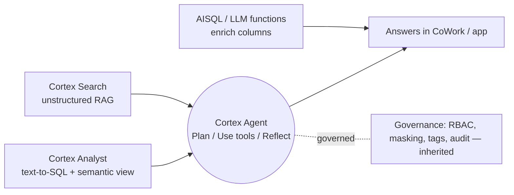

# Cheat Sheet + 30-Day Cortex Ramp

Last-mile revision: the facts, the snippets, and a focused plan. Pairs with the
site-wide [Master Cheat Sheets](../Personal-SourceCode/Interview_Cheat_Sheets.md)
and [30-Day Prep Plan](../Personal-SourceCode/Interview_30_Day_Plan.md).

---

## One-page mental model



- **Structured?** Analyst (needs a semantic view).
- **Unstructured?** Search (hybrid, managed RAG).
- **Both + reasoning/actions?** Agent (Analyst + Search as tools).
- **Many rows, set-based?** AISQL batch, not an agent.

---

## Rapid-fire facts

| Topic | Answer |
|-------|--------|
| Agent loop | **Plan → Use tools → Reflect and respond**, repeated |
| Agent = | Reusable object: model + tools + orchestration instructions |
| Agent tools | Analyst, Search, code sandbox, Data-to-Chart, custom (SP/UDF), agent skills, MCP connectors, web search |
| Conversation state | **Threads** (server-side, managed) |
| Create an agent | Snowsight / Cortex Agents SQL / REST API |
| User surfaces | Snowflake CoWork, Cortex Code, your app (REST API) |
| Analyst runs on | A **semantic view/model** (metrics, joins, synonyms, verified queries) |
| Search retrieval | **Hybrid** — vector + keyword; managed freshness (target lag) |
| Search ↔ Analyst | Search resolves fuzzy literals for Analyst's SQL |
| Governance | RBAC, dynamic masking, row-access policies, tags, Access History — inherited |
| Inaccessible tool | Run continues with the tools the caller's role *can* use |
| Cost driver | Token volume × model tier; Search refresh; agent fan-out |
| Cost controls | Pre-inference filters, model routing, batch via Tasks, resource monitors |
| Output guarantee | None — validate/review before serving |
| Top attack | Indirect prompt injection via retrieved content |
| Top control | Retrieved content is **data, not instructions**; gate write tools |

---

## SQL snippets to recognize

```sql
-- LLM functions in SQL (AISQL)
SELECT SNOWFLAKE.CORTEX.SUMMARIZE(review)                      AS summary,
       SNOWFLAKE.CORTEX.SENTIMENT(review)                      AS sentiment,
       SNOWFLAKE.CORTEX.COMPLETE('<model>', 'Classify: '||body) AS label,
       AI_FILTER(prompt => 'Is this a complaint? ' || body)    AS is_complaint
FROM feedback;

-- Cortex Search service over a text column (native RAG)
CREATE OR REPLACE CORTEX SEARCH SERVICE docs_svc
  ON content
  ATTRIBUTES product, region
  WAREHOUSE = search_wh
  TARGET_LAG = '1 hour'
  AS SELECT content, product, region FROM knowledge_base;

-- Semantic view powers Cortex Analyst (shape only; confirm current DDL)
CREATE OR REPLACE SEMANTIC VIEW sales_sv
  /* logical tables, dimensions, metrics, relationships, synonyms,
     verified queries */;

-- Batch enrichment scheduled with a Stream + Task
CREATE OR REPLACE STREAM s_new ON TABLE raw_docs;
CREATE OR REPLACE TASK t_enrich
  WAREHOUSE = ai_wh SCHEDULE = '10 MINUTE'
  WHEN SYSTEM$STREAM_HAS_DATA('s_new')
AS
  INSERT INTO enriched
  SELECT id, SNOWFLAKE.CORTEX.SENTIMENT(body) FROM s_new;
```

!!! warning "Say the caveat"
    Exact DDL and function signatures evolve and vary by region/account. In an
    interview, describe **what each object does and how they connect**; note
    you'd confirm current syntax against the docs.

---

## Talking points that signal seniority

- *"The semantic model is the product — Analyst quality tracks it, not the LLM."*
- *"Native RAG means no separate vector store to secure, sync, and pay for."*
- *"Governance is inherited; my job is to apply masking/roles to the AI path, not
  rebuild access control in an app tier."*
- *"AI cost is token volume times model tier — I filter before inference and put
  monitors on the Cortex warehouses."*
- *"Retrieved content is data, not instructions — that one rule contains most
  agent attacks."*
- *"Use an agent for interactive multi-step questions; use AISQL batch for
  set-based enrichment. Knowing when *not* to use an agent matters."*

---

## 30-day Cortex ramp

A focused plan assuming you already know core Snowflake (see
[Snowflake overview](../Technologies/snowflake/index.md) and
[Snowflake Interview Q&A](../Personal-SourceCode/Snowflake_Interview_QA.md)).

### Week 1 — Foundations & AISQL

- [ ] Read this section's [index](index.md); internalize the layer-picking rule.
- [ ] Learn the LLM functions: `COMPLETE`, `SUMMARIZE`, `SENTIMENT`, `EXTRACT_ANSWER`, `AI_FILTER`, `EMBED_TEXT_*`.
- [ ] Write batch enrichment: turn a text column into structured signals, then query with SQL.
- [ ] Understand the cost model (tokens × model tier) and resource monitors.
- [ ] Re-read [AI Security](../AI-Security/index.md) — you'll map every control back to it.

### Week 2 — Analyst, semantic models & Search

- [ ] Study what goes in a **semantic view**: metrics, relationships, synonyms, verified queries.
- [ ] Build a small semantic view; ask Analyst questions; inspect the generated SQL.
- [ ] Deliberately break a metric/join; watch Analyst fail; fix it in the model.
- [ ] Stand up a **Cortex Search** service; understand hybrid retrieval + target lag.
- [ ] Learn the **Search ↔ Analyst** literal-search integration.

### Week 3 — Agents & orchestration

- [ ] Memorize the **Plan → Use tools → Reflect** loop; explain it out loud.
- [ ] Know all tool types (Analyst, Search, code sandbox, Data-to-Chart, custom, skills, MCP, web).
- [ ] Understand **Threads**, agent-as-object, and the create paths (Snowsight/SQL/REST).
- [ ] Build a two-tool agent (Analyst + Search); trace a cross-domain question.
- [ ] Drill **inaccessible-tool handling** and least-privilege implications.

### Week 4 — Production & interview

- [ ] Governance: apply masking/row-access/tags to the AI path; review Access History.
- [ ] Observability: build an **eval set**, add LLM-judge + feedback loop.
- [ ] Work every [governance/cost/observability incident](governance-cost-observability.md) drill.
- [ ] Do the full [system design + mock](system-design-mock.md) under time.
- [ ] Rehearse the seniority talking points above until they're automatic.

---

## Final self-check

- [ ] I can pick the right Cortex layer for any question in one sentence.
- [ ] I can narrate the agent reasoning loop and name every tool type.
- [ ] I can explain why the semantic model — not the LLM — drives Analyst quality.
- [ ] I can justify native RAG (Search) vs. a DIY vector DB, with the trade-off.
- [ ] I can design cost controls and name the top cost driver.
- [ ] I can locate the injection surface and state the one containing rule.
- [ ] I can whiteboard a governed, cross-domain Cortex assistant end to end.

---

Back to the [section overview](index.md).
