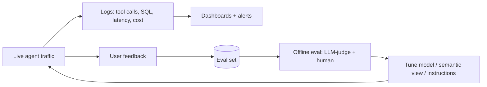

# Security, Governance, Cost & Observability

The operational half of a Cortex system — the part that separates a demo from
something you'd run in production. An interviewer at senior/staff level spends
most of the time here: *how is it governed, what does it cost, how do you know
it's working, and what breaks?*

---

## Governance: you inherit it, but you still design it

Cortex runs inside Snowflake's perimeter, so the controls already exist — your
job is to apply them deliberately to the AI path.

| Control | How it applies to Cortex |
|---------|--------------------------|
| **RBAC / role hierarchy** | Tools run under the caller's role; grant Cortex + object access to roles, not users. Least privilege caps what an agent can do per user. |
| **Dynamic data masking** | Masked columns stay masked when Analyst queries them or Search returns them — masking travels into AI results. |
| **Row-access policies** | Row-level isolation (tenant, region) applies to what Analyst can read and what Search retrieves. |
| **Object tags** | Classify sensitive columns once (PII, confidentiality); pair with tag-based masking so protection follows classification into AI calls. |
| **Access History / audit** | Agent tool calls and queries are logged under the same audit trail as the rest of the account — answers "who asked what, over which data." |
| **Inaccessible-tool handling** | If a role can't use a configured tool, the run continues with the tools it can — so role design shapes agent capability per user. |

!!! danger "The output-handling gap"
    Governance protects the *data going in*. It does **not** guarantee the *answer
    coming out* is correct or safe — Snowflake explicitly says LLM responses and
    citations aren't guaranteed. Validate/review agent output before serving,
    and never feed model output unescaped into SQL/shell/HTML downstream
    (*insecure output handling*). See [AI Security](../AI-Security/index.md).

### The injection surface

An agent that reads unstructured content (Cortex Search, web search, MCP tool
responses) can ingest **indirect prompt injection**. Containment is the same as
any RAG/agent system:

- Treat all retrieved content as **data, not instructions**.
- Keep write-capable **custom tools** least-privileged and gated
  (human-in-the-loop for irreversible actions).
- **Review tool and skill definitions** before enabling them (tool poisoning).
- Validate the **ingestion pipeline** feeding Search (knowledge-base poisoning).

---

## Cost: credit-based, and it can surprise you

Cortex consumes credits like everything else in Snowflake, but the cost drivers
differ from ordinary SQL. Interviewers probe whether you'd notice a runaway bill.

**What drives Cortex cost**

- **Token volume × model tier.** LLM functions bill by tokens processed; a large
  model over a big text column across millions of rows is the classic budget
  blow-up.
- **Warehouse compute** for the SQL Analyst runs and for building/refreshing
  Search indexes (a lower target lag = more frequent refresh = more compute).
- **Agent loops** — multi-step reasoning can fan out into several tool calls per
  question; interactive traffic is less predictable than batch.

**How to control it**

- **Right-size the model.** Use the smallest model that passes your eval; reserve
  large models for the hard cases. Route by difficulty.
- **Filter before you infer.** Cut rows with cheap SQL/keyword filters *before*
  calling an LLM function — don't summarize rows you'll discard.
- **Batch with Streams + Tasks** for set-based enrichment instead of re-running
  ad hoc.
- **Resource monitors** with credit quotas + alerts on the warehouses backing
  Cortex; separate warehouses per workload (ETL vs Search vs interactive agent).
- **Tune Search target lag** to the freshness the use case actually needs, not
  "real-time" by reflex.
- **Cache / reuse.** Persist enrichment results in a table; don't re-infer
  unchanged rows.

!!! tip "Interview soundbite"
    *"AI cost is token volume times model tier. I filter with cheap SQL before
    inference, route easy cases to small models, batch with Tasks, and put
    resource monitors on the Cortex warehouses so a runaway loop trips an alert,
    not a surprise invoice."*

---

## Observability & evaluation

You can't ship an agent you can't measure. Cortex supports **monitoring, end-user
feedback, and evaluations** to refine agent behavior after deployment — build on
that plus Snowflake's native telemetry.

**What to watch**

- **Quality** — is the answer right? Use an **eval set** of representative
  questions with known-good answers; score with LLM-as-judge + human spot-checks.
  Re-run it when you change the model, semantic view, or instructions.
- **Groundedness / citations** — does the answer trace to retrieved sources?
  Flag unsupported claims.
- **Tool behavior** — which tools fire, how often, latency per tool, failure
  rates. `QUERY_HISTORY` / Access History give you the SQL side.
- **Cost per question** — track credits per interaction; alert on drift.
- **Latency** — end-to-end and per tool; agent loops add round-trips.
- **User feedback** — thumbs up/down feeding back into the eval set.

!!! note "Tie it to LLMOps"
    This is the Cortex-flavored version of the vendor-neutral
    [Observability & Eval](../GenAI-Topics/observability/index.md) topic. Same
    discipline — trace, eval set, LLM-as-judge, feedback loop — expressed through
    Cortex's built-in monitoring plus Snowflake telemetry.

---

## Production incidents (and how you'd respond)

Scenario drills interviewers use. For each: **diagnose → mitigate → prevent.**

??? question "The monthly Cortex bill tripled overnight. What happened and what do you do?"
    **Diagnose:** check `QUERY_HISTORY` / warehouse metering for the Cortex
    warehouses — look for a new job calling an LLM function over a large column,
    a lowered Search target lag causing constant re-indexing, or an agent stuck
    looping. **Mitigate:** pause the offending task, cap the warehouse with a
    resource monitor, switch the call to a smaller model. **Prevent:** resource
    monitors with alert thresholds, pre-inference SQL filters, model routing, and
    a cost-per-question dashboard so drift is visible before invoice time.

??? question "Cortex Analyst started returning wrong numbers after a schema change. Fix?"
    **Diagnose:** inspect the SQL Analyst generated — a renamed column, changed
    join key, or altered metric definition likely broke the semantic view.
    **Mitigate:** update the semantic view (relationships, metric formulas,
    synonyms) to match the new schema; add a verified query for the failing
    question. **Prevent:** treat the semantic view as governed code — version it,
    run the eval set in CI on schema changes, and alert when generated SQL
    references dropped objects.

??? question "An agent leaked data one user shouldn't see. How is that possible and how do you contain it?"
    **Diagnose:** almost always a **governance gap**, not a model bug — a role
    with too-broad grants, a missing row-access/masking policy on a column the
    tool reached, or a custom tool running with elevated privileges.
    **Mitigate:** revoke the over-broad grant, apply the missing policy, review
    custom-tool execution context. **Prevent:** least-privilege roles, tag-based
    masking so PII is protected by classification, and audit review via Access
    History. Verify tools run under the caller's context, not a service role that
    sees everything.

??? question "Retrieval quality dropped — the agent cites stale/irrelevant docs. Diagnose."
    **Diagnose:** check the Search service freshness (target lag vs. how fast the
    corpus changes), whether ingestion is failing, and whether attribute filters
    are too broad/narrow. **Mitigate:** tighten target lag, fix ingestion,
    add/adjust attribute filters, curate the corpus. **Prevent:** monitor
    groundedness in the eval set, alert on ingestion failures, and validate
    source trust to prevent knowledge-base poisoning.

??? question "A retrieved document contained hidden instructions and the agent followed them. Root cause?"
    **Indirect prompt injection.** The agent treated retrieved *content* as
    *instructions*. **Mitigate immediately:** gate/disable any write-capable
    tools the injection could trigger, quarantine the source. **Prevent:**
    enforce "retrieved content is data, not instructions," keep write tools
    least-privileged and human-approved, validate outputs, and vet the ingestion
    pipeline. This is the flagship AI-security failure mode — see
    [AI Security](../AI-Security/index.md).

---

## Rapid-fire

| Q | A |
|---|---|
| Does masking apply to Analyst results? | Yes — masking/row-access policies travel into AI results |
| Biggest cost driver? | Token volume × model tier (large model over big columns × many rows) |
| First cost control? | Filter rows with cheap SQL *before* inference; route to smaller models |
| Guardrail against runaway spend? | Resource monitors + alerts on the Cortex warehouses |
| Is agent output guaranteed correct? | No — validate/review before serving |
| Wrong Analyst numbers after schema change? | Fix the semantic view; run eval set in CI |
| Agent leaked data — usual cause? | Governance gap (over-broad role / missing policy / elevated tool), not the model |
| Agent followed hidden doc instructions? | Indirect prompt injection — treat retrieved content as data |

---

**Next:** [System Design + Mock Interview](system-design-mock.md)
