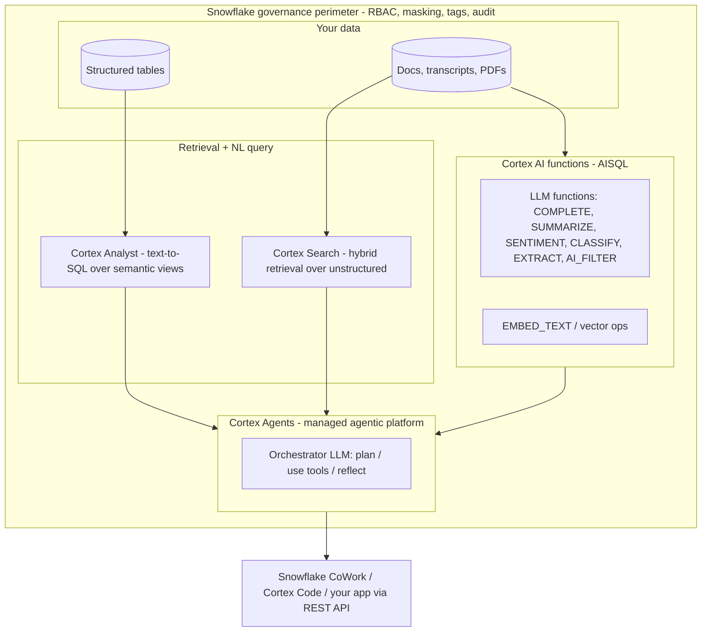

# Snowflake Cortex AI & Agents

A deep, production-focused interview guide for **Snowflake Cortex AI** — the
LLM/ML layer that runs *next to your data*, inside Snowflake's governance
perimeter. This section goes beyond the overview on the
[Snowflake technology page](../Technologies/snowflake/index.md): here we build
mental models for **Cortex Agents**, **Cortex Analyst** (text-to-SQL over
semantic views), **Cortex Search** (native RAG retrieval), the AISQL functions,
and the security / cost / observability story an interviewer will probe.

!!! info "Currency note"
    Cortex features ship fast and names change. The **patterns** here (agentic
    orchestration, semantic models, hybrid retrieval, governed-in-perimeter AI)
    are stable, but treat specific capability claims as "as of current Snowflake
    docs" and verify against Snowflake's official Cortex documentation
    (docs.snowflake.com) before an interview. This guide was checked against
    Snowflake's official Cortex Agents documentation.
    *Content was rephrased for compliance with licensing restrictions.*

!!! abstract "The one-sentence pitch"
    **Cortex lets you run LLM inference, semantic search, and full agentic
    workflows on governed data without moving it out of Snowflake** — the same
    RBAC, masking policies, tags, and audit trail that protect your tables also
    protect every AI call.

---

## The Cortex landscape

Cortex is a stack, not a single product. Interviewers want to see that you know
which layer solves which problem.

| Layer | What it is | When you reach for it |
|-------|-----------|-----------------------|
| **AISQL / LLM functions** | Call LLMs and embeddings directly in SQL (`SNOWFLAKE.CORTEX.COMPLETE`, `SUMMARIZE`, `SENTIMENT`, `EXTRACT_ANSWER`, `AI_FILTER`, `EMBED_TEXT_*`) | Batch enrichment, classification, extraction over columns — set-based AI |
| **Cortex Search** | Managed **hybrid** (vector + keyword) retrieval service over text | The RAG retrieval engine; grounding for chatbots and agents |
| **Cortex Analyst** | Natural language → governed SQL over a **semantic view/model** | Self-serve analytics, "ask your data" over structured tables |
| **Cortex Agents** | Fully managed agentic platform: an orchestrator LLM that plans, calls tools, runs code, and responds | Multi-step questions that mix structured + unstructured data and actions |
| **Snowflake CoWork / Cortex Code** | Chat / notebook surfaces where users interact with agents | The UX layer; you also call agents from your own app via REST API |

### The three questions that pick the layer

1. **Is the answer in structured tables?** → Cortex Analyst (needs a semantic view).
2. **Is the answer in documents/text?** → Cortex Search (native RAG).
3. **Does it need both, plus reasoning, tool calls, or actions?** → a Cortex Agent that uses Analyst *and* Search as tools.

---

## Why "AI next to the data" is the whole story

The differentiator versus bolting an external LLM app onto Snowflake:

- **No data egress.** Inference happens inside the account; sensitive columns
  never leave the perimeter to hit a third-party endpoint.
- **Governance is inherited, not re-implemented.** RBAC roles, dynamic data
  masking, row-access policies, and object tags apply to the data an AI call
  touches. You don't rebuild access control in an app tier.
- **Auditability.** Access History and query history cover AI calls and agent
  tool use, so you can answer "who asked what, over which data."
- **Least data movement = less attack surface + lower cost** (no duplicate
  vector store to secure, sync, and pay for separately).

!!! tip "Interview framing"
    When asked "why Cortex over a LangChain app on top of Snowflake?", lead with
    **governance and data gravity**, not model quality: *"The models are
    comparable; the win is that the security and compliance boundary already
    exists around the data, so I inherit it instead of rebuilding it in an app
    tier — and I avoid egress."* Then acknowledge the trade-off (below).

---

## Honest trade-offs (say these before the interviewer does)

A senior candidate names the limits, not just the benefits:

- **Model / provider choice is curated**, not arbitrary. You pick from the
  models Snowflake offers (or let it auto-select), not any model on the internet.
- **Region / availability** — specific functions and models roll out by region;
  check availability for your account before promising a capability.
- **Cost is credit-based and can surprise you** — large-model calls over big
  columns are expensive; you design for it (batching, cheaper models, filters).
- **You're inside Snowflake's runtime** — great for governance, but heavy custom
  orchestration or non-SQL glue may still want an app tier calling the REST API.

---

## What to read next in this section

-   :material-robot-industrial: **[Cortex Agents — deep dive](agents.md)**

    The plan → use tools → reflect loop, tool types (Analyst, Search, code
    sandbox, custom tools, MCP), Threads, and how to design a governed agent.

-   :material-database-search: **[Analyst, Semantic Models & Search (native RAG)](analyst-search-rag.md)**

    Semantic views, text-to-SQL, hybrid retrieval, Search↔Analyst integration,
    and combining structured + unstructured data.

-   :material-shield-lock: **[Security, Governance, Cost & Observability](governance-cost-observability.md)**

    RBAC in the agent path, inaccessible-tool handling, audit, credit control,
    monitoring/evals, and production incidents with mitigations.

-   :material-account-tie: **[System Design + Mock Interview](system-design-mock.md)**

    A Cortex agentic system-design walkthrough and a timed mock interview.

-   :material-card-text: **[Cheat Sheet + 30-Day Cortex Ramp](cheat-sheet-30-day.md)**

    Rapid-fire facts, SQL snippets, and a focused study plan.

---

## Related pages in this site

- [Snowflake (technology overview)](../Technologies/snowflake/index.md) — architecture, SQL, performance, governance basics.
- [Snowflake Interview Q&A](../Personal-SourceCode/Snowflake_Interview_QA.md) — core warehousing/SQL interview bank.
- [RAG topic](../GenAI-Topics/rag/index.md) and [Agent Engineering](../GenAI-Topics/agent-engineering/index.md) — the vendor-neutral concepts Cortex implements.
- [AI Security](../AI-Security/index.md) — the threat model that the governance story here defends against.
